# 第02章_GPT系列

------

## 2. GPT系列

ChatGPT-3是第一个真正意义上的LLM，它是基于之前的一系列模型演化而来。

### 2.1 GPT系列模型发布时间线


### 2.2 GPT-1

#### 2.2.1 知识储备

##### 2.2.1.1 迁移学习（Transfer Learning）

**定义**

将源领域（Source Domain）或源任务（Source Task）中学到的知识（如模型参数、特征表示（如词嵌入）等），迁移到目标领域（Target Domain）或目标任务（Target Task）中，以提升目标模型的性能或训练效率。

1. 核心思想：利用已有知识解决新问题，减少对目标领域大量标注数据或计算资源的依赖。
2. 关键术语：
   - 领域（Domain）：由数据及其分布组成（如医疗影像 vs. 自然图像）。
   - 任务（Task）：指模型的具体目标（如分类、分割等）。

**迁移学习的典型场景**

1. 预训练+微调（如GPT、BERT）：在大规模无监督数据上预训练，再在小规模标注数据上微调目标任务。
2. 特征提取：固定预训练模型的部分层，仅训练新添加的分类层。
3. 领域自适应（Domain Adaptation）：将源领域（如合成图像）的知识迁移到目标领域（如真实照片）。


##### 2.2.1.2 监督学习（Supervised Learning）

利用标注数据（输入-输出对）训练模型，学习从输入到输出的映射关系。模型通过最小化预测值与真实标签的误差进行优化。

##### 2.2.1.3 无监督学习（Unsupervised Learning）

从无标注数据中挖掘隐藏模式或结构（如聚类、降维、关联规则），无需人工标注指导。具体到NLP领域，无监督学习是通过上文预测下一个词或通过上下文预测中间词等形式实现的。

##### 2.2.1.4 半监督学习（Semi-Supervised Learning）

结合少量标注数据和大量无标注数据进行训练。标注数据成本高昂，通过这种方式节约大量的人力成本，利用海量低成本的无标注数据提升了模型性能。

##### 2.2.1.5 文本蕴含任务（Textual Entailment / Natural Language Inference, NLI）

判断一对句子之间的逻辑关系，主要分为三类：

- 蕴含（Entailment）：前提句可以推导出假设句。
- 矛盾（Contradiction）：前提句与假设句内容相矛盾。
- 中立（Neutral）：前提句与假设句无明显关系，不能确定真假。

示例：

- 前提：“猫坐在垫子上。”
- 假设：“垫子上有动物。”
- 输出：蕴含。

##### 2.2.1.6 问答任务（Question Answering, QA）

让模型根据提供的上下文回答用户提出的问题。类型包括：

- 抽取式问答（Extractive QA）：从文本中直接抽取答案。

- 生成式问答（Generative QA）：基于知识生成新的自然语言答案。

- 开放域问答（Open-domain QA）：不提供上下文，由模型自行查找知识来源回答。

  示例：

  - 上下文：“巴黎是法国的首都。”

  - 问题：“法国的首都是哪里？”

  - 答案：“巴黎”。

##### 2.2.1.7 语义相似性评估（Semantic Similarity）

评估两个句子或文本片段在语义上的相似程度，通常输出一个05或01之间的分值。常用于句子匹配、信息检索、重复检测等任务。

方法：

- 基于词重叠（如TF-IDF）。
- 基于嵌入模型（如BERT、Sentence-BERT）。

示例：

- 句子1：“手机没电了。”
- 句子2：“我的电话需要充电。”
- 相似度：0.9（高度相似）。

##### 2.2.1.8 文档分类（Document Classification）

将文档归入一个或多个预定义的类别中，任务包括：

- 单标签分类：每个文档只属于一个类别。
- 多标签分类：每个文档可能属于多个类别。

应用场景：垃圾邮件检测、新闻分类、情感分类等。

示例：

- 文本：“这款手机电池续航出色！”
- 类别：“正面评价”。

##### 2.2.1.9 情感分析（Sentiment Analysis）

识别文本中表达的情感倾向（如正面、负面、中性）或更细粒度的情绪（如愤怒、高兴）。

方法：

- 基于词典规则（如情感词统计）。
- 基于机器学习（如 LSTM、Transformer）。

示例：

- 评论：“电影剧情糟糕，但特效很棒。”
- 输出：混合情感（负面+正面）。

情感分析是文本分类的一种，但因其独特性和广泛应用，常被单独列为 NLP 核心任务，与文档分类并列（如 GLUE 基准中同时包含主题分类和情感分析任务）。

##### 2.2.1.10 消融实验（Ablation Study）

通过逐步移除模型的某些组件（如层、特征、模块），评估其对性能的影响，以验证这些组件的必要性。

目的：

- 确定关键设计对模型效果的贡献。
- 简化模型结构（如去除冗余部分）。

示例：

- 在 BERT 模型中移除注意力机制后，准确率下降 15%，说明注意力机制至关重要。

##### 2.2.1.11 TF-IDF（Term Frequency-Inverse Document Frequency）

TF-IDF即词频-逆文档频率，它是一种统计方法，用于衡量一个词在文档中的重要性。这种方法认为一个词在单个文档中出现的频率越高、包含该词的文档数越少，它所包含的信息量越大，对应的TF-IDF值越大，后者由两部分组成：

1. 词频（Term Frequency，TF）
   $$
   TF(t, d) = \frac{\text{词t在文档d中出现的次数}}{\text{文档d的总词数}}
   $$

2. 逆文档频率（Inverse Term Frequency，IDF）
   $$
   IDF(t) = \log \left( \frac{\text{总文档数}}{\text{包含词t的文档数}} \right)
   $$

3. TF-IDF 值
   $$
   TF\text{-}IDF(t, d) = TF(t, d) \times IDF(t)
   $$

##### 2.2.1.12 AdamW

1. Adam算法回顾

   1. 计算纯梯度（不含L2）：
      $$
      g_t = \nabla_\theta J(\theta_{t-1})
      $$

   2. 更新一阶矩：
      $$
      m_t = \beta_1 m_{t-1} + (1 - \beta_1) g_t
      $$

   3. 更新二阶矩：
      $$
      v_t = \beta_2 v_{t-1} + (1 - \beta_2) g_t^2
      $$

   4. 偏差修正：
      $$
      \hat{m}_t = \frac{m_t}{1 - \beta_1^t}
      $$

      $$
      \hat{v}_t = \frac{v_t}{1 - \beta_2^t}
      $$

   5. 参数更新：
      $$
      \theta_t = \theta_{t-1} - \eta \left( \frac{\hat{m}_t}{\sqrt{\hat{v}_t} + \epsilon} \right)
      $$
      上式中的 $\epsilon$ 是一个极小值，目的是防止分母为零。

2. L2正则化回顾

   L2 正则化通过修改损失函数实现，修正后的损失函数如下

   $$
   J_{\text{reg}}(\theta) = J(\theta) + \frac{\lambda}{2} \|\theta\|_2^2
   $$
   相应的，梯度如下

   $$
   g_t = \nabla_\theta J(\theta_{t-1}) + \lambda \theta_{t-1}
   $$

3. Adam算法和L2正则化组合使用的问题

   当 L2 正则化和 SGD 组合使用时，参数更新公式如下

   $$
   \theta_t = \theta_{t-1} - \eta \nabla_\theta J(\theta) - \eta \lambda \theta_{t-1}
   $$
   此时等价于对参数直接施加权重衰减 $-\eta \lambda \theta_{t-1}$ 项。

   当 Adam 算法和 L2 正则化组合使用时，正则化项的梯度 $\lambda \theta$ 会被除以梯度二阶矩估计，导致实际的正则化强度随训练动态衰减，无法稳定约束权重。

4. AdamW算法

   为了解决上述问题，Ilya Loshchilov等人提出了改进的L2正则化方法AdamW，英文全称为Adam with Weight Decay，即带有权重衰减的Adam算法。顾名思义，该算法和Adam相比，只是在参数更新阶段添加了权重衰减，其它部分完全相同。需要特别注意的是，AdamW算法的梯度计算和Adam一样，不包含L2正则化项。

   参数更新阶段改进后的公式如下：
   $$
   \theta_t = \theta_{t-1} - \eta \left( \frac{\hat{m}_t}{\sqrt{\hat{v}_t} + \epsilon} + \lambda \theta_{t-1} \right)
   $$
   即

   $$
   \theta_t = \theta_{t-1} - \eta \frac{\hat{m}_t}{\sqrt{\hat{v}_t} + \epsilon} - \eta \lambda \theta_{t-1}
   $$
   **AdamW 算法本质上只是添加了 $-\eta \lambda \theta_{t-1}$，等价于 Adam 算法与解耦权重衰减 $(-\eta \lambda \theta_{t-1}$ 项）相结合。保留了正则化的数学本质，恢复了权重衰减的物理意义（参数收缩）。**

   在 AdamW 中，$\lambda$ 通常被称为权重衰减系数（Weight Decay Coefficient），而不是 L2 正则化强度系数。

   AdamW 通常在实践中（训练基于 Transformer 架构的 LLM 时）比 Adam+L2 表现出的泛化性能，因此在 LLM 的训练中被广泛采用。

#### 2.2.2 概述

##### 2.2.2.1 主要成果及创新

自然语言理解涵盖文本蕴含、问答、语义相似性评估和文档分类等多种任务。尽管无标注文本语料库资源丰富，但这些任务都需要特定的标注数据，大量的无标注数据无法被利用。在GPT-1之前，上述任务都是基于特定的标注数据训练特定的判别式模型完成的，由于标注数据的稀缺和高昂成本，这些判别式模型无法取得良好的表现。

1. GPT-1是**首个完全基于Transformer解码器架构构建的大规模语言模型**

   首次证明纯解码器架构可胜任语言建模，奠定了后来纯解码器大语言模型的基础。

2. GPT-1是**首个自回归语言模型**

   移除编码器-解码器交叉注意力，改为单向自回归。它的训练目标就是基于前面所有的词，预测序列中的下一个词。这种单向性是其生成能力的核心。

3. **首次将Transformer架构与两阶段训练模式（无监督预训练+有监督微调）结合**

   通过在多样化无标注文本上进行生成式预训练，再针对不同的任务使用特定的标注数据微调，可以显著提升大多数自然语言理解任务的性能。这是GPT-1的核心方法论贡献，充分利用了成本低廉的海量无标注文本语料库资源。

   它极大地降低了每个任务对标注数据的依赖，显著提升了任务性能，并成为后续几乎所有大语言模型（LLM）的标准训练范式。需要注意的是，GPT-1的微调通常需要在预训练模型基础上添加一个线性层，有别于未来的prompt tuning。

4. GPT-1是**首个在大规模语言模型中成功应用 AdamW 优化器**（等价于Adam+解耦权重衰减）**的先驱**

   GPT-1首次在大规模语言模型验证了AdamW优化器的可用性，这种设计使GPT-1仅在5GB数据上训练出强大的泛化能力，其正则化方案比模型架构创新影响更为深远，直接塑造了现代LLM的训练范式。后续的BERT（通常不认为是LLM，但和GPT-1在一段时间内是“旗鼓相当的对手”）、GPT-1、GPT-2、GPT-3、Llama系列、Qwen系列、DeepSeek系列的部分或全部模型采用的也都是这种优化器。

##### 2.2.2.2 训练范式

GPT-1采用无监督预训练+监督微调的架构，称为半监督学习方法。采用两阶段训练流程：

1. 首先在未标注数据上使用语言建模（预测下一个词）学习神经网络的初始参数。
2. 随后通过相应的标注数据将初始参数适配至目标任务。

##### 2.2.2.3 数据准备

1. 无监督预训练阶段采用清洗后的BooksCorpus数据集（一个全英文的文本数据集），包含了7000多本未出版的书籍，包含约10亿词（英文一个token约等于一个词），约5GB纯文本数据。

2. 监督微调阶段的数据集如下表所示

   | 任务类别         | 数据集名称                                                 |
   | :--------------- | :--------------------------------------------------------- |
   | **自然语言理解** | SNLI, MultiNLI, Question NLI, RTE, SciTail                 |
   | **问答**         | RACE, Story Cloze                                          |
   | **句子相似度**   | MSR Paraphrase Corpus, Quora Question Pairs, STS Benchmark |
   | **文本分类**     | Stanford Sentiment Treebank-2, CoLA                        |

##### 2.2.2.4 词表构建

词表通过BPE方式经过40000合并，而后添加一些特殊标记构建，大小为40478

关于词表大小可参考openAi开源的GPT-1权重仓库，model/encoder_bpe_40000.json文件给出了完整的词表，仓库链接：https://github.com/openai/finetune-transformer-lm.git。

##### 2.2.2.5 训练和参数更新策略

1. 训练批次为64，上下文长度即`seq_len`为512，共训练100轮（即epoch为100）

2. 通过 $N(0, 0.02)$ 初始化权重

   前馈层的激活函数选用高斯误差线性单元GELU

   位置嵌入采用可学习参数版本

3. 学习率 $\eta$ 在前 2000 次更新中从零线性增长，最大值为 $2.5 \times 10^{-4}$，随后通过余弦调度衰减至 0

4. 采用 AdamW 优化策略更新权重，权重衰减系数为 0.01

5. 对残差连接、嵌入层和注意力层及 FFN 的第一个线性层之后应用比率为 0.1 的 dropout 正则化

#### 2.2.3 GPT-1模型架构

##### 2.2.3.1 GPT-1和Transformer模型架构对照

GPT-1采用了预训练+微调的训练范式，微调阶段的模型完整包含了预训练模型，此处对预训练模型和Transformer原始模型进行对照。

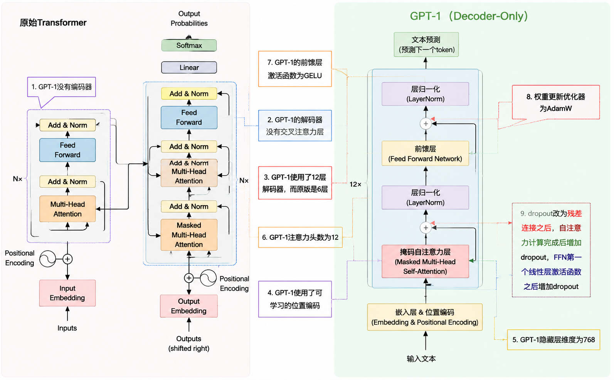

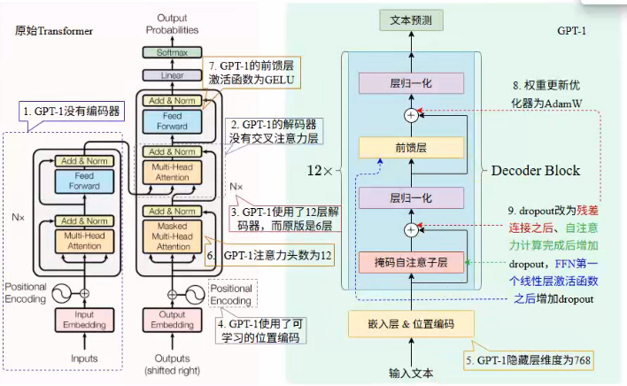

| 组件类型                   | Transformer                                                  | GPT-1                                                        |
| -------------------------- | ------------------------------------------------------------ | ------------------------------------------------------------ |
| 架构                       | 编码器+解码器                                                | 解码器                                                       |
| 解码器层数                 | 6层                                                          | 12层                                                         |
| 解码器内部架构             | 掩码自注意力+交叉注意力+前馈层                               | 掩码自注意力+前馈层                                          |
| 位置编码                   | 正余弦位置编码                                               | 可学习的位置编码                                             |
| 隐藏层维度 $d_{model}$     | 512                                                          | 768                                                          |
| 注意力头数                 | 8                                                            | 12                                                           |
| 前馈层激活函数             | RELU                                                         | GELU                                                         |
| 前馈层中间隐藏层维度       | 4倍 $d_{model}$                                              | 4倍 $d_{model}$                                              |
| 嵌入层和输出线性层权重共享 | 是（需要注意的是，哈佛实现的 The Annotated Transformer 没有共享权重） | 是                                                           |
| 优化器                     | Adam                                                         | AdamW                                                        |
| Dropout 正则化位置         | 1. 嵌入和位置编码之后<br>2. 每个子层输出之后，残差连接之前   | 1. 嵌入和位置编码之后<br>2. 残差连接之后<br>3. FFN 第一个线性层激活函数之后<br>4. 注意力计算完成后，和 V 做矩阵乘法之前 |
| 层归一化                   | Post-LayerNorm                                               | Post-LayerNorm                                               |

>Transformer原始论文未明确提及在FFN内部（特别是第一个线性层激活函数后）应用Dropout。然而，由于FFN中间层维度（4 * d_model）远大于输入维度，极易过拟合，因此在实践中（如The Annotated Transformer等主流实现），在FFN第一个线性层激活函数后应用Dropout已成为提升泛化能力的**标准且必要的做法**。
>
>GPT-1论文声称“Our model largely follows the original transformer work”，但未明确说明是否在FFN内部应用了Dropout。鉴于目前官方实现未公开模型定义细节，无法确定。
>
>考虑到标准实践和模型设计对正则化的需求，普遍认为GPT-1在FFN子层的第一个线性层激活函数后也应用了Dropout正则化。本文档后续分析采用此观点。

##### 2.2.3.2 预训练阶段

1. 模型架构

   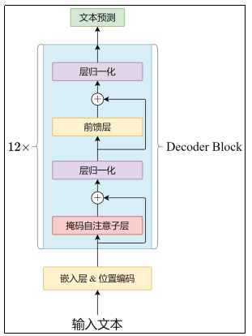

   1. GPT-1使用12层仅含解码器的Transformer模型
   2. 使用掩码自注意力机制（也叫因果自注意力，Causal Self-Attention）
   3. 隐藏状态为 768 维 ($d_{model}$)，12 个注意力头，$d_k = d_q = d_v = d_{model} \div 12 = 64$
   4. 前馈层采用 $4 \times d_{model} = 3072$ 维内部状态

2. 训练数据的输入和目标构造

   以“万丈高楼平地起”为例：

   1. 原始文本输入模型后首先分词，分词结果取决于分词器，假设分词结果为

      ```python
      ["万丈", "高楼", "平地", "起"]
      ```

      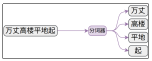

   2. 根据词表将文本转换为索引序列

      需要注意的是，不同于BERT等模型，GPT-1在预训练阶段没有添加特殊的起始和结束标记如`<SOS>`、`<EOS>`，而是直接对原始文本建模。这是因为这一阶段的主要目的是训练语言理解能力，而不是生成连续文本，因此不需要知道何时开始和终止输出。

      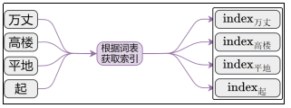

   3. 截取最后一个词之前的部分作为**输入**

      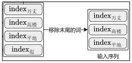

   4. 截取第一个词之后的部分作为**目标序列**

      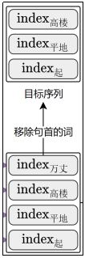

3. 目标函数和损失函数

   对于输入的 token 序列 $u = \{u_1, \dots, u_n\}$，预训练阶段的目标是最大化似然函数，如下

   $$
   L_1(u) = \sum_i \log P(u_i | u_{i-k}, \dots, u_{i-1}; \Theta)
   $$
   这就是目标函数。

   对上述取负值就是基于独热编码的交叉熵损失函数，如下

   $$
   J_1(u) = -\sum_i \log P(u_i | u_{i-k}, \dots, u_{i-1}; \Theta)
   $$

4. 输出线性层权重优化

   在哈佛大学实现的The Annotated Transformer实现中，最后一层解码器的输出经过一个独立的线性层，再通过softmax归一化，最终生成下一个token的概率分布。

   而在原版Transformer论文中，编码器、解码器的嵌入矩阵和上面的输出线性层共享相同的权重矩阵，GPT-1使用了类似原版Transformer的方式，即输出线性层复用了解码层的嵌入矩阵，通过这种方式缩减了参数量。

   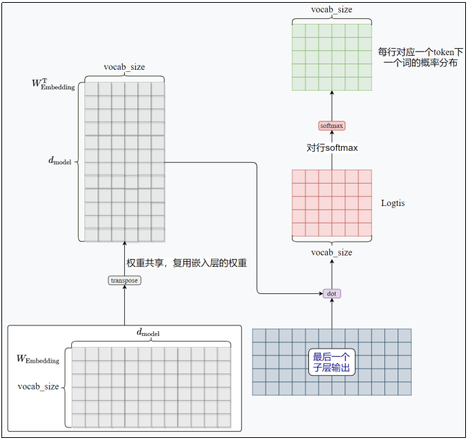

5. 总结

   综上，预训练阶段的目标是预测连续序列中的下一个词。

   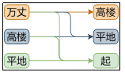

   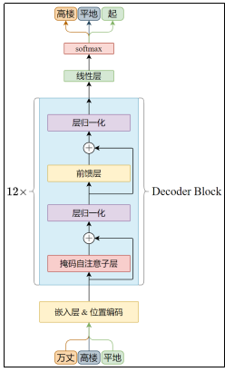

##### 2.2.3.3 微调阶段

1. 模型架构.

   针对不同的下游任务，添加相应的线性层。

   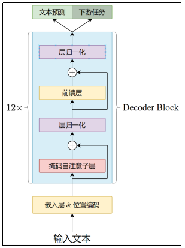

2. 训练数据的输入构造

   文本蕴含、文本相似度判断等任务的标注数据都是结构化文本，如有序的句子对、问答组合等，GPT-1将这些数据全部处理为连续的文本序列。

   所有任务的原始输入首尾都要添加特殊的Start和Extract，用于标记任务的开始和结束。

   **Start和Extract是随机初始化的。**

   1. **文本分类任务**

      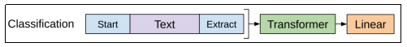

      上图中的Transformer表示预训练阶段的模型主体（不包含最终的线性层），Linear是任务特定的输出层。下同。

   2. **文本蕴含任务**

      文本蕴含任务的输入由前提（Premise）和假设（Hypothesis）构成，通过特殊的分隔符$拼接在一起。

      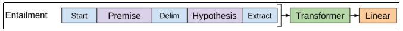

   3. **语义相似度评估任务**

      文本相似度的输入是两个被比较句子，同样用分隔符（具体形式官方没有提及）连接。

      需要注意的是，二者没有先后顺序，因此调整输入序列以包含两种可能的句子排列，分别经过预训练模型的处理生成两个序列表示 $m^m$，后者逐元素相加后输入任务特定的线性层。

      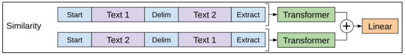

   4. **问答任务**

      问答任务的结构化输入由上下文文档 $z$、问题 $q$ 和一系列可能的答案 $a_k$ 构成。$z$ 和 $q$ 共同构成上下文，通过分隔符依次与每个答案组合，得到和答案数量相同的 $[z; q; a_k]$ 序列，如下图所示。

      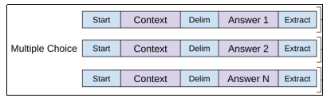

      每个组合输入模型，经过任务特定的线性层计算得分，多个答案的得分拼接在一起，通过softmax得到归一化的分数，这就是最终的输出。

      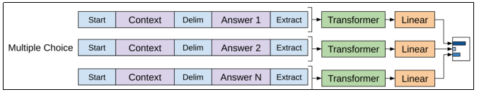

3. 目标函数和损失函数

   监督微调阶段的目标函数有两个：

   1. 基于标注数据

      假设有一个带标签的数据集 $C$，其中每个实例由输入标记序列 $x^1, ..., x^m$ 和标签 $y$ 组成。按照上文介绍的方式构造输入，经过预训练模型处理后的隐藏层输出为 $h^m$，随后嵌入新增的线性输出层（权重为 $W_y$）以预测 $y$
      $$
      P(y|x^1, ..., x^m) = \text{softmax}(h^m W_y)
      $$
      上述中的 $l$ 表示最后一层 Decoder Block 的编号，此处为 12。

      目标是最大化以下似然函数
      $$
      L_2(C) = \sum_{(x,y)} \log P(y|x^1, ..., x^m)
      $$

   2. 基于语言建模

      研发团队发现，在微调时将语言建模作为辅助目标有助于提升模型的泛化能力并加速收敛。因此，在监督微调阶段同时要进行语言建模，目标函数与上文提到的 $L_1(U)$ 一致，因为是基于监督微调的数据集建模，因此符号更改为 $L_1(C)$。

      需要注意，语言建模只针对输入的 token 序列，而不针对输出序列，并且通常在计算损失时，会屏蔽 token 序列末尾的 `<E>` 的损失计算。

   3. 最终的目标函数

      最终的目标函数为 $L_1$ 和 $L_2$ 的组合，如下：

      $$
      L_3(C) = L_2(C) + \lambda * L_1(C)
      $$
      其中 $\lambda$ 是超参数，用于平衡监督目标和语言建模辅助目标的重要性。

   4. 损失函数

      计算交叉熵损失，最终的损失函数刚好是 $L_3(C)$ 的相反数。
      $$
      J_3(C) = -L_3(C)
      $$

#### 2.2.4 微调阶段数据处理流程

微调阶段包含了特定任务训练和语言建模，预训练阶段只有语言建模，只要清楚微调的数据处理流程，预训练的流程自然就懂了。

>说明：为了降低复杂度，调整如下
>
>① 不考虑批次维度  
>
>② 忽略偏置项  
>
>③ 在掩码自注意力阶段只绘制了 3 个头  
>
>④ $d_{model}$ 和 $d_k$

##### 2.2.4.1 微调任务及标注数据

###### 结构化输入：我喜欢学习

###### 目标：[索引：0，名称：“积极”，独热编码：(1, 0, 0)]

| 类别索引 | 类别名称 | 独热编码  |
| -------- | -------- | --------- |
| 0        | 积极     | (1, 0, 0) |
| 1        | 中立     | (0, 1, 0) |
| 2        | 消极     | (0, 0, 1) |

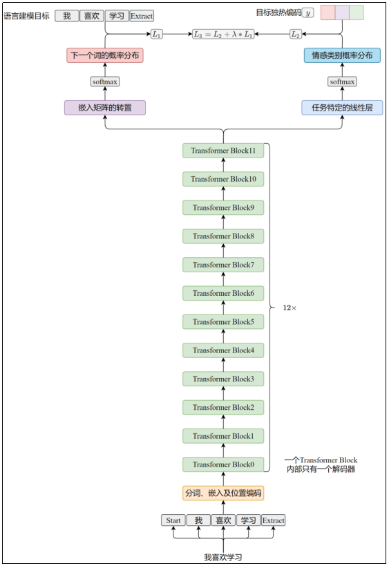

##### 2.2.4.2 流程概览

##### 2.2.4.3 分词和嵌入

###### 分词后添加起始和结束标记

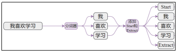

###### 将token映射为索引

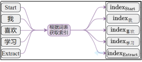

###### 基于词表索引从嵌入矩阵和位置矩阵获取向量

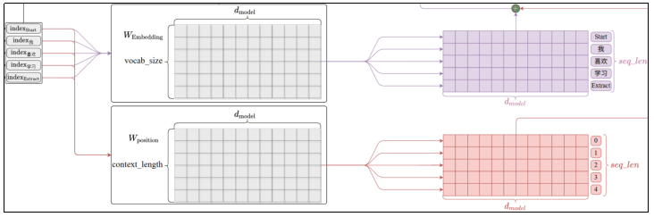

上图中

- 用 $W_{\text{Embedding}}$ 表示嵌入矩阵
  - 用 vocab_size 表示词表大小，GPT-1 的实际值为 40478。
  - 用 $d_{model}$ 表示嵌入维度大小，GPT-1 的实际值为 768。

- 用 $W_{\text{position}}$ 表示可学习的位置矩阵
  - 用 context_length 表示上下文长度，GPT-1 为 512。不同序列的位置编码单独计算，因此位置编码矩阵的行数等于上下文长度即可。

- seq_len 表示序列长度，GPT-1 的序列长度即上下文长度为 512。

###### 嵌入向量和位置向量相加得到最终的token表示

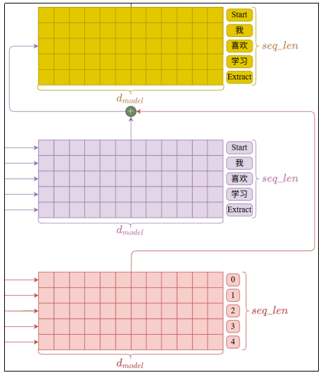

###### dropout正则化

对上一步的输出应用比例为0.1的dropout正则化

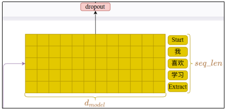

##### 2.2.4.4 Transformer Block

GPT-1只有解码器，因此，Transformer Block等价于Decoder Block。

解码器由掩码自注意力层和前馈层构成

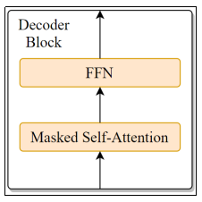

##### 2.2.4.5 Masked Self-Attention

掩码自注意力，也叫（因果自注意力，Causal Self-Attention）通过引入掩码屏蔽 token  对于未来的依赖，前面的课程已有详细介绍。  

GPT-1 的掩码自注意力层有 12 个自注意力头，每个头有独立的 Q、K、V 矩阵，它们的  形状都是 $d_{model} \times d_k$，其中，  
$$
d_k = \frac{d_{model}}{h} = \frac{768}{12} = 64
$$
如下图所示：

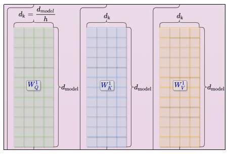

为了便于展示，此处只绘制了三个头：

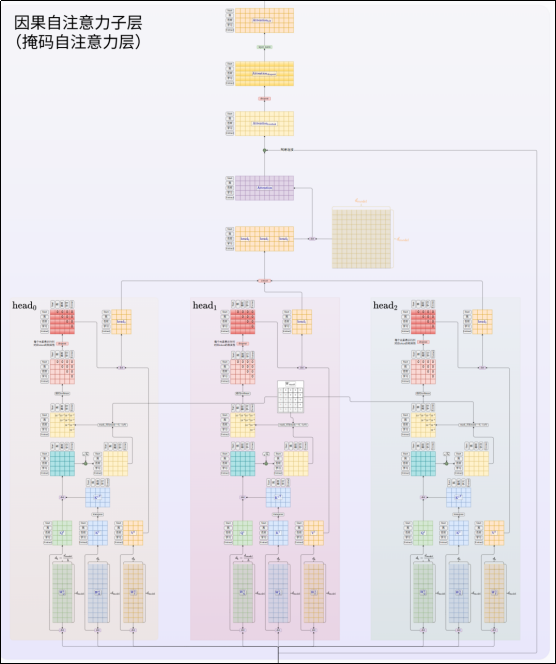

###### 投影Q、K、V

嵌入层输出的数据分别取 $W_Q^0$、$W_K^0$、$W_V^0$ 做矩阵乘法，得到投影矩阵 $Q^0$、$K^0$、$V^0$

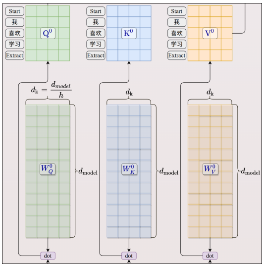

###### 计算注意力并缩放

$$
\frac{Q^0 \cdot K^0}{d_k}
$$

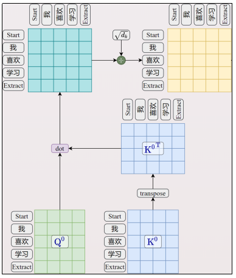

###### 掩码

根据掩码矩阵，将注意力矩阵对角线以上的部分置为 $10^{-9}$

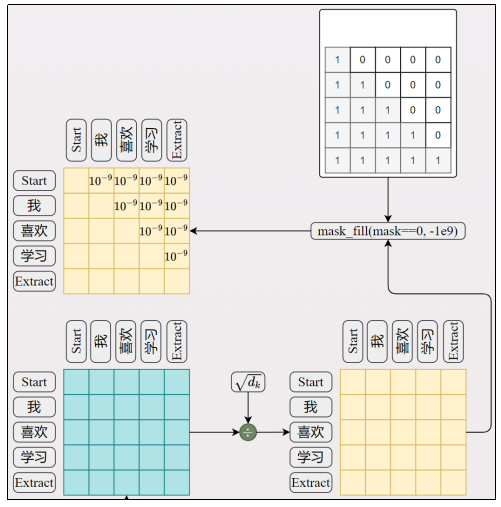

###### 逐行softmax

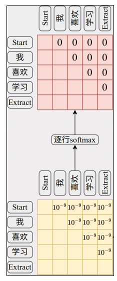

经过softmax，上一步被置为极小值的部分归零。

此时每个单元格表示行对应token和列对应token的相关性，并经过归一化。

###### 按照0.1的比例dropout正则化

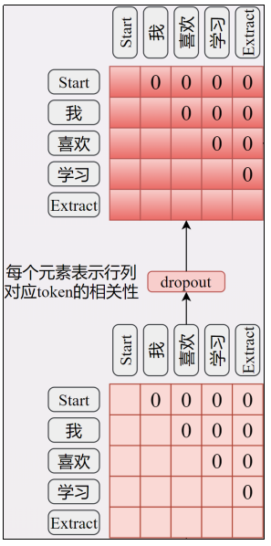

###### 对 $v^0$ 加权得到 head$_0$

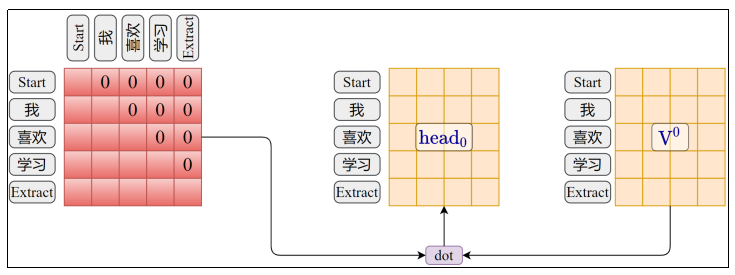

###### 通过concat合并所有头的输出

注意：此处仅绘制三个头，实际上GPT-1有12头。

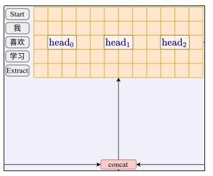

###### 经过线性层投影

所有头的输出合并后经过大小为 $d_{model} \times d_{model}$ 的权重矩阵转换得到 Attention 矩阵。

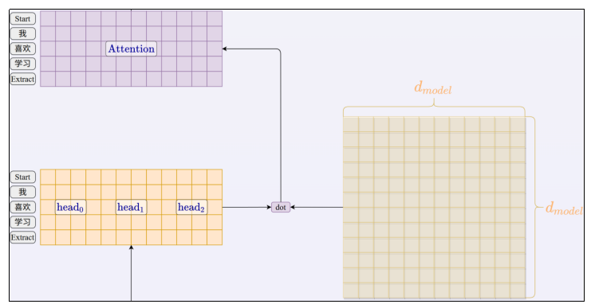

>此处省略**偏置项。**

###### 残差连接

将自注意力层的输入和此处的Attention矩阵逐元素相加。

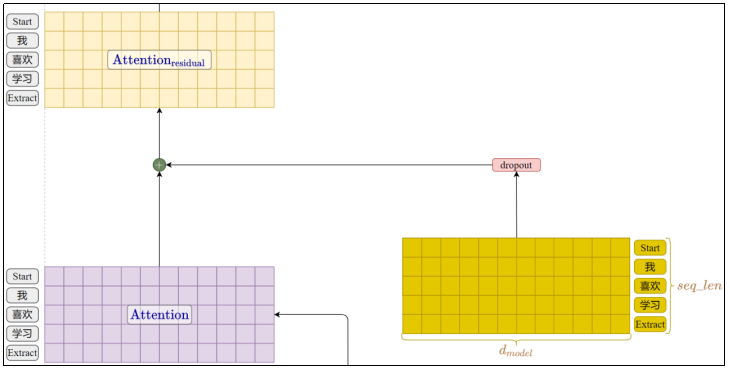

###### 按照0.1的比例dropout正则化

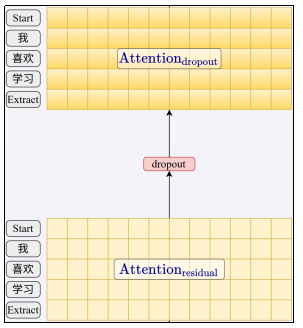

###### 层归一化

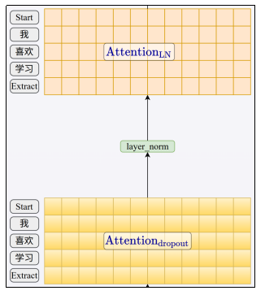

##### 2.2.4.6 FFN（Feed-Forward Network）

这一层由两个线性层构成。

###### 第一个线性层

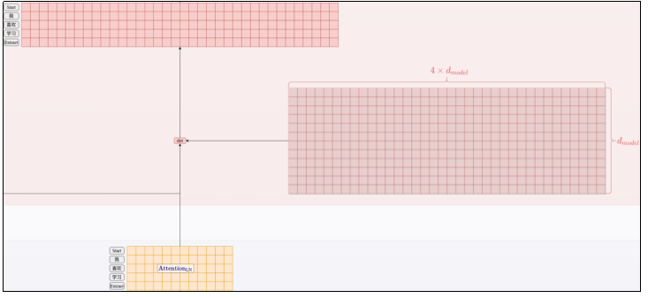

中间层的维度为 $4 \times d_{model}$，即 3072。

此处省略偏置项。

###### 激活函数

GPT-1使用了不同于原始架构（RELU）的激活函数GLUE。

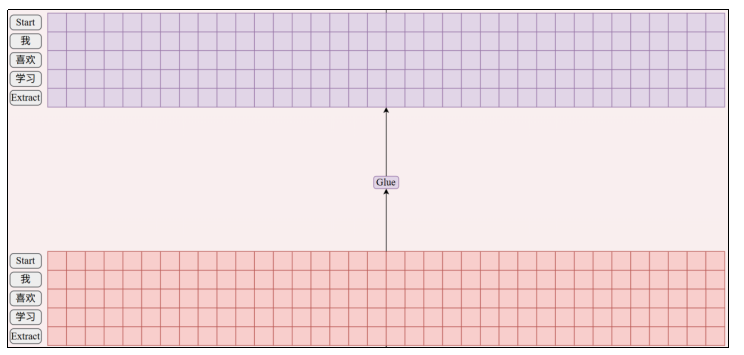

###### 按照0.1的比例dropout正则化

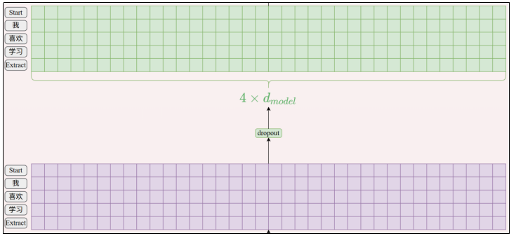

###### 第二个线性层

向量维度映射回 $d_{model}$

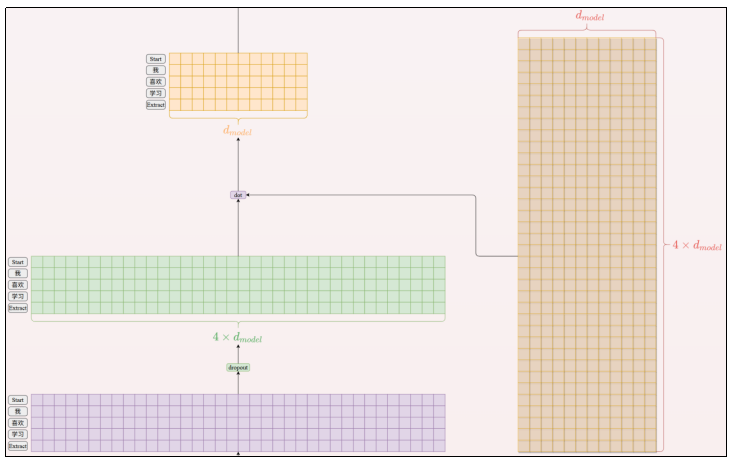

###### 残差连接

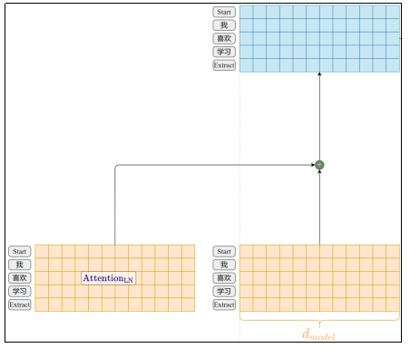

###### 按照0.1的比例dropout正则化

###### 层归一化

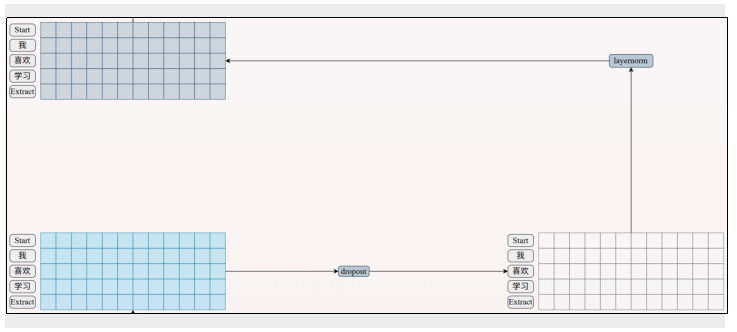

##### 2.2.4.7 语言建模线性层

经过 12 个 Decoder Block 的处理，我们得到了最终的隐藏层输出 $h^m_i$。**同时进入语言建模线性层和特定任务线性层**。

###### 复用嵌入矩阵计算logits

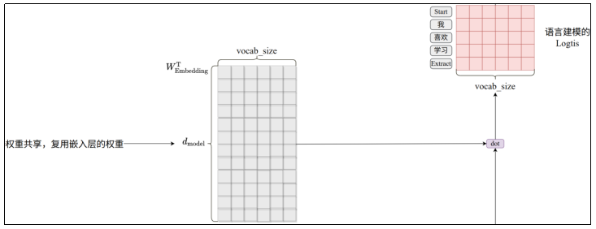

###### 逐行softmax得到概率分布

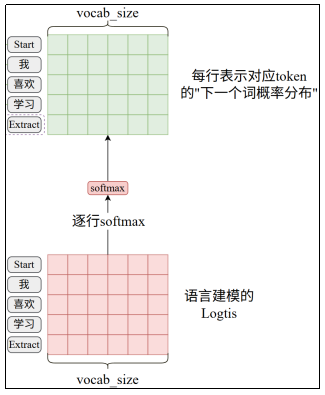

###### 目标序列

目标序列由输入序列左移一位得到，其中，末尾的Extract是没有目标的。

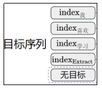

###### 交叉熵计算损失 $J_1$

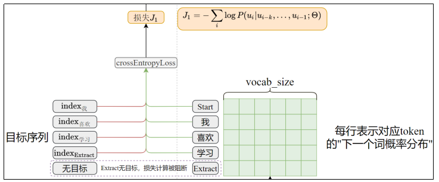

Extract没有目标，计算损失时通过掩码阻断，反向传播的更新也不会考虑其输出。

##### 2.2.4.8 特定任务线性层

###### $h^m$ 经过 $W_y$ 矩阵处理得到情感分析的 Logits

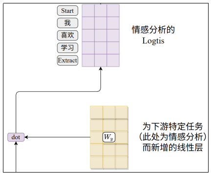

###### 逐行softmax计算概率分布

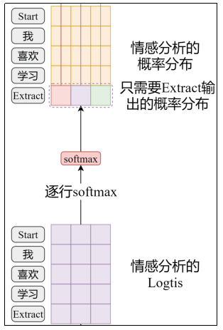

Extract对应的输出向量包含了序列的所有信息，只有它是我们需要的概率分布，是模型判定的情感类别。

###### 交叉熵计算损失

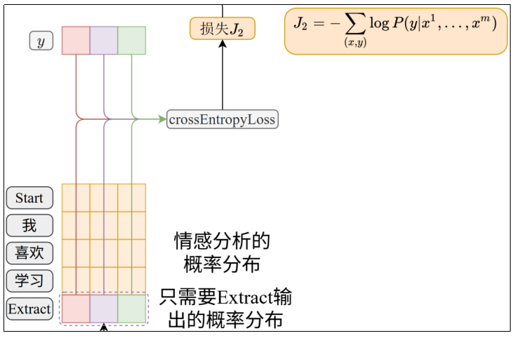

上式中，$y$ 标注数据中的目标，为独热编码形式，实际通常是索引，基于索引交叉熵的计算和上述过程在数学上是等价的。

###### 最终的损失函数 $J_3$

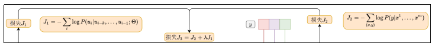

##### 2.2.4.9 完整架构图


#### 2.2.5 参数量估算

偏置和监督微调阶段额外的线性层权重可以忽略不计，此处只计算预训练阶段的参数量。

GPT-1的权重分为以下几个部分

##### 2.2.5.1 嵌入矩阵和位置编码矩阵

###### 嵌入矩阵

参数量为 vocab_size × $d_{model}$

###### 可学习的位置编码矩阵

参数量为 context_length × $d_{model}$

##### 2.2.5.2 Decoder Block

先计算单个Decoder Block的参数量。

###### 因果自注意力

1. 首先计算单个头的参数量

   三个投影矩阵的形状均为 $d_{model} \times d_k$ 

   所以一个注意力头的参数量为 $3 \cdot d_{model} \cdot d_k$  

2. 十二个头的参数量 

   $12 \cdot 3 \cdot d_{model} \cdot d_k$  

3. 多头合并后的投影矩阵

   $d_{model} \times d_{model}$  

4. 单个因果自注意力子层的参数量

   十二个头参数量 + 投影矩阵的参数量：

    $$12 \cdot 3 \cdot d_{model} \cdot d_k + d_{model} \cdot d_{model}$$  

   $$= 3 \cdot d_{model} \cdot (12 \cdot d_k) + d_{model} \cdot d_{model}$$  

   $$= 3 \cdot d_{model} \cdot d_{model} + d_{model} \cdot d_{model}$$

   $$= 4 \times d_{model}^2$$

###### FFN

1. 第一个线性层的参数量  

   $$4 \times d_{model} \times d_{model}$$

2. 第二个线性层的参数量
   $$4 \times d_{model} \times d_{model}$$

3. FFN 的总参数量
   $$8 \times d_{model} \times d_{model} = 8 \times d_{model}^2$$

###### 单个Decoder Block的参数量

$$4 \times d_{model}^2 + 8 \times d_{model}^2 = 12 \times d_{model}^2$$

###### 总的Decoder Block参数量

$$12 \times 12 \times d_{model}^2$$

##### 2.2.5.3 总的参数量

$$\text{vocab\_size} \times d_{model} + \text{context\_length} \times d_{model} + 12 \times 12 \times d_{model}^2$$

$$= 40478 \times 768 + 512 \times 768 + 144 \times 768 \times 768$$

$$= 31,087,104 + 393,216 + 84,934,656$$

$$= 116,414,976$$

约为 1.16 亿，官方声称 GPT-1 的参数量为 1.17 亿，细微的差异可能来源于偏置项和监督微调阶段任务特定的线性层。

### 2.3 GPT-2

#### 2.3.1 概述

##### BERT和GPT的较量

GPT-1 和 BERT 代表了 Transformer 架构早期两个关键的分支。GPT-1 基于纯 Transformer 解码器架构（使用掩码自注意力），在许多 NLP 任务上表现优异。然而，其单向注意力机制无法同时利用 token 前后的完整上下文信息。

BERT 为了克服这一限制，采用了纯 Transformer 编码器架构（使用无掩码/双向自注意力），推出了 BERT$_{\text{BASE}}$（参数规模与 GPT-1 相同）和 BERT$_{\text{LARGE}}$（约 3.4 亿参数）两种模型。实验证明，得益于双向上下文表示，BERT 在众多需要深度上下文理解的任务上显著超越了 GPT-1。

面对 BERT 的成功，OpenAI 团队首先尝试在他们坚持的解码器架构路线上，通过增加参数量来提升 GPT-1 的性能（例如训练一个类似 BERT$_{\text{LARGE}}$ 规模的 GPT 模型）。虽然更大的规模带来了性能提升，但相对于 BERT 架构革新带来的巨大飞跃，这种仅靠规模增长的提升显得相对有限，未能全面反超 BERT。

这促使 OpenAI 团队思考如何更充分地挖掘生成式预训练模型的潜力。他们并未改变核心架构（仍然是纯解码器），而是提出了一个更激进的目标：**验证当模型规模和数据量足够大时，单一的自回归语言模型能否通过 Zero-Shot 方式直接执行多种任务，而无需特定任务的微调**。为此，他们推出了 GPT-2。

作者在 GPT-2 论文第六章的末尾说道：“GPT-2 的训练数据与模型容量足以克服 BERT 所展示的单向表征效率不足问题”。

##### 主要成果及创新

1. **巨量扩展**：模型参数（最大 15 亿）和训练数据（WebText）大幅增加。
2. **Zero-Shot 能力**：重点研究并展示了模型在未经任何下游任务微调（Zero-shot）的情况下，直接执行多种任务的能力。
3. **架构延续**：保持了与 GPT-1 相同的 Transformer 解码器架构。

GPT-2 的诞生并非因为架构创新（它沿用了 GPT-1 架构），而是 OpenAI 为了最大化展现其坚持的生成式预训练路线的潜力，在规模和训练数据上的一次大胆跃进，并以此作为主要“新意”。GPT-2 的成功证明了这一方向的可行性，为后续的 GPT-3 及更大模型铺平了道路。

##### BERT和GPT对LLM发展的意义

BERT 并非生成式大模型，其本质是一个基于 Transformer 编码器的深度双向语言表示模型，核心优势在于语言理解。而 GPT 则是基于解码器的生成式语言模型，二者代表了截然不同的技术路线。

当今主流的大语言模型（LLM）普遍沿用了 GPT 的纯解码器架构，均属于生成式语言模型。若非 GPT 核心团队在当时 BERT 巨大成功压力下的坚持与探索（如推出 GPT-2/GPT-3），LLM 的蓬勃发展很可能会来得更晚一些。

当然，BERT 绝非 LLM 发展的障碍。它革命性地证明了双向上下文建模对于深度语言理解的巨大价值，在需要精准语义理解的任务上实现了质的飞跃。它的成功促使 GPT 路线进行了更激进的探索（如大规模参数扩展、Zero-shot 能力验证）。二者相辅相成，共同确立并巩固了大规模预训练 Transformer 模型作为现代 NLP/AI 基石的地位。

##### 数据准备

1. 构建新的网络爬取系统，从 Reddit 上所有获得至少 3 颗星的外链开始抓取。共计抓取了 **4500 万个** 链接。不包含 2017.12 之后创建的链接。

2. 结合使用 Dragnet 和 NewsPaper 内容提取器从抓取的原始数据中提取有价值的文本，并移除了所有维基百科文档。因为后者是其他数据集的常见来源，可能导致训练集和测试集的重复，从而影响分析。

3. 经过去重和基于启发式（基于经验）的清理后，得到的数据集称为 WebText，包含 800 多万个文档，总计 **40GB** 文本数据。

>Reddit 是国外一个大型的社交新闻聚合、讨论平台，用户可以在不同的主题板块中发布内容、投票、讨论和交流，它被称为“互联网的首页”，许多热门新闻都从这里传播到其它社交媒体。Reddit 的投票系统（Upvote/Downvote）本质上是社区共识的体现，高质量、有趣或有用的内容通常能获得更多点赞，通过限制点赞数可以筛选出质量较高的内容。

##### 词表构建

1. 和 GPT-1 采用相同的 BPE 词表。

2. 禁止 BPE 跨字符类别合并（即字模不能和标点符号合并），仅对空格例外处理。

   BPE 基于贪心启发式方法构建词汇表，研究团队观察到 BPE 会为常见词如 dog 生成多个版本：dog、dog!、dog?，浪费了词表槽位。因此做出了上述改进。

3. 词表扩展至 50257 个 token。

>BPE: Byte Pair Encoding, 它解决的是：一个词到底应该切成多大的 token？通过统计语料中经常一起出现的字符/子词，把它们合并成一个 token。

#### 2.3.2 模型架构


##### 2.3.2.1 和GPT-1的差别


GPT-2 模型基本沿用 GPT-1 的预训练架构，但做出以下修改：

1. 将层归一化移至每个子块（因果自注意力层和 FFN 层）的输入之前，并在最终的隐藏层输出后添加额外的层归一化。

2. 上下文长度由 512 个 token 增加到 1024 个 token。

3. GPT-2 不再是单个模型，而是一个系列，共有四个不同参数数量的模型，如下：

| 参数量   | 层数 | $d_{model}$ |
| -------- | ---- | ----------- |
| 1.17 亿  | 12   | 768         |
| 3.45 亿  | 24   | 1024        |
| 7.62 亿  | 36   | 1280        |
| 15.42 亿 | 48   | 1600        |

##### 2.3.2.2 Pre-LayerNorm vs Post-LayerNorm

在GPT-1和原版Transformer中使用的都是Post-LayerNorm，即后归一化。GPT-2转而使用Pre-LayerNorm，这是为了解决训练深层Transformer模型时的梯度不稳定和收敛困难问题。


###### Post-LN的问题

$$
x = \text{layernorm}(x_{in} + \text{sublayer}(x_{in}))
$$

在深层 Transformer 中（层数很多时），原始的 Post-LN 结构会导致梯度在反向传播时变得非常不稳定，尤其是在靠近输入侧的层。这是因为：

1. 我们知道，残差连接的目的是在深层 Transformer 中提供一条“高速公路”，使得接近输入侧的层不会因为层级过多产生的梯度消失或梯度爆炸而无法更新参数。

2. LayerNorm 被放在残差连接之后，那么反向传播时，这条“高速公路”就要经过 LayerNorm，而它的操作会限制梯度的范围，尤其是在深层堆叠时，这种限制会被放大。

这导致了靠近输入的层接收到的梯度可能非常小（梯度消失）或者异常大（梯度爆炸），使得深层模型难以收敛。通常需要谨慎的学习率预热策略（训练初期逐步提高学习率）和极其精细的超参数调优来防止发散。

###### Pre-LN的解决方案

$$
x = x_{in} + \text{sublayer}(\text{layernorm}(x_{in}))
$$

将归一化移至传入子层之前。

梯度反向传播时，首先通过残差连接近乎无损地传递到上一层的输出。残差连接提供的“高速公路”不必再通过 LayerNorm 或其它步骤，可以将梯度直接、不受阻碍地流向更早的层。

###### Pre-LN的效果

实践证明，Pre-LN显著改善了深层训练模型的稳定性，梯度在整个网络中流动得更加顺畅和平稳，降低了训练难度，使得训练非常深的模型（如GPT-2、GPT-3）成为可能。

由于梯度更稳定，信息流动更高效，使用 Pre-LN 的模型通常在相同训练步数下能达到比 Post-LN 模型更低的损失或更高的性能。或者说，要达到相同的性能水平，Pre-LN 模型需要的训练步数更少。

Pre-LN 结构降低了对学习率预热策略的依赖，并且对学习率大小的选择通常比 Post-LN 更宽容。

###### Pre-LN的潜在缺点

一些研究（如《On Layer Normalization in the Transformer Architecture》）指出，Pre-LN 改变了每一层输入信号的分布。在Post-LN中，LayerNorm保证了输入到下一子层的信号具有稳定的均值和方差（这是LayerNorm的设计初衷）。而在Pre-LN中，输入到子层的信号是归一化后的，但输出到下一层整个块的信号（即经过Add之后的信号）没有被立即归一化。理论上，这可能导致信号在深层传播时分布发生偏移。

然而，实践压倒性地证明，Pre-LN带来的训练稳定性和收敛速度的提升，远远超过了这个潜在的理论劣势。对于现代大型模型，训练可行性是第一位的。

##### 2.3.2.3 训练数据的输入和目标构造

和[GPT-1预训练阶段](#GPT1目标构造)完全相同，不再赘述。

##### 2.3.2.4 下游任务的输入构造

对于所有的下游任务，将上下文和问题全部处理为连续的token序列，然后输入模型。将所有任务都转换为了预测下一个词的任务。

### 2.4 GPT-3

#### 2.4.1 概述

##### 2.4.1.1 主要成果及创新

###### GPT-3的由来

近年来，基于Transformer模型的“预训练+微调”范式在众多 NLP 任务上取得了显著进展。然而，要在特定目标任务上获得优异性能，通常需要大量标注数据进行微调，这不仅成本高昂，也限制了模型的普适性。此外，在微调过程中，模型暴露于相对窄域（或特定领域）的数据分布，可能导致其在预训练阶段从海量语料中习得的泛化能力下降。相比之下，人类学习多数语言任务并不需要大量监督数据，通常仅需简单指令或少量示例即可掌握。

为了提升模型的普适性，GPT-2 尝试直接利用无监督预训练模型执行下游任务，取得了令人鼓舞的效果。

OpenAI 团队观察到，Transformer 语言模型参数规模的每次扩大都伴随着下游 NLP 任务性能的提升。更重要的是，（如Scaling Laws for Neural Language Models [Kaplan et al., 2020] 所示）与多项下游任务性能相关的损失函数，随着模型规模扩大呈现出平滑的改进趋势。这表明更大规模的模型可能具备更强的能力。因此，他们在 GPT-2 的基础上，将模型参数规模扩大了两个数量级（约百倍），由此诞生了 GPT-3。

###### 前所未有的规模

1. 拥有 1750 亿个参数，在其发布时是世界上最大的公开语言模型，比前身 GPT-2（15 亿参数）大两个数量级。

2. 训练数据集极其庞大且多样化，包含了 Common Crawl、WebText2、书籍、维基百科等多种来源的文本，数据量高达近 5000 亿 token。

3. 支持更长的上下文窗口（2048 个 token），能处理和理解更长的文本片段。

###### 强大的少样本/零样本学习能力

1. 它通过简单的提示工程（Prompt Engineering），在不更新模型参数（即不进行微调）的情况下，就能在众多 NLP 任务上取得非常好的效果。

2. 模型能够理解并执行仅通过几个示例（Few-Shot Learning）甚至仅通过任务描述（Zero-Shot Learning）定义的新任务，展现了极强的泛化能力和上下文理解能力。

3. 涵盖的任务范围极广，包括但不限于：机器翻译、问答、文本摘要、完形填空、代码生成、简单推理、角色扮演对话等。

###### 展示了语言模型的通用潜力

GPT-3的成功有力地证明了通过大规模无监督预训练，结合提示工程，单一模型可以成为一个通用的“任务无关”系统。这挑战了传统“一个任务一个特定模型”的范式，为通用人工智能（AGI）的探索提供了重要实证。

##### 2.4.1.2 数据准备

数据集由两部分构成：

1. **Common Crawl 数据集** 

   基于 2016 至 2019 年的 41 个 Common Crawl 月度分片构建，通过以下方式清洗：

   - 基于与高质量参考语料库的相似度过滤

   - 在文档级别实施跨数据集模糊去重 

     清洗前压缩纯文本达 45TB，过滤后为 570GB，大致相当于 4000 亿（BPE）token。

2. **在训练数据中混入已知高质量参考语料**

   包括基于 GPT-2 使用的数据集 WebText 的扩展 WebText2，两个基于互联网的书籍语料库（Books1 和 Books2）以及英文维基百科。

   最终数据集构成如下：

   | 数据集                | Token 数量 | 训练混合权重 |
   | --------------------- | ---------- | ------------ |
   | 过滤后的 Common Crawl | 4100 亿    | 60%          |
   | WebText2              | 190 亿     | 22%          |
   | Books1                | 120 亿     | 8%           |
   | Books2                | 550 亿     | 8%           |
   | 维基百科              | 30 亿      | 3%           |

##### 2.4.1.3 GTP-3的元学习

###### 定义

元学习（Meta-Learning），又称“学会学习”（Learning to Learn），是机器学习的一个分支，旨在让模型具备快速适应新任务的能力。其核心思想是通过从多个任务中学习共享的经验或模式，从而在面对新任务时，只需少量样本或调整即可高效解决。

###### GPT3的元学习

GPT-3论文通过下图介绍元学习


1. **Outer Loop（外循环）**  

   从左到右的紫色箭头是**外循环**，表示模型在无监督预训练时通过 SGD 学习的过程，在这一阶段，模型培养出广泛的技能和模式识别能力。

2. **Inner Loop（内循环）** 

   自上而下的三个蓝色箭头表示**内循环**，是指模型在推理阶段利用预训练阶段学习到的能力快速适应或识别目标任务，这一过程被称为 **“in-context learning”**，即上下文学习。具体来说，研究人员将下游任务转换为自然语言描述，再提供一些示例，作为上下文输入模型，后者从这些上下文中快速识别目标任务，预测后续内容即可完成任务实例。

###### zero-shot、one-shot和few-shot

为了评估GPT-3的上下文学习能力，研究团队在超过24个NLP数据集及多个新颖任务上评估GPT-3，这些任务专门用于测试模型对训练集中未直接包含任务的快速适应能力。

每个任务通过三种方式评估：

- few-shot（少样本学习）：在模型上下文窗口内提供尽可能多的示例（受限于上下文窗口，通常为10-100个）

  

- one-shot（单样本学习）：提供一个示例

  

- zero-shot（零样本学习）：不提供示例，仅根据自然语言描述预测答案。

  

  需要注意的是，GPT-3的shot是指推理阶段为下游任务准备的示例，它的zero-shot是指不提供示例。而GPT-2的zero-shot强调的是不进行监督微调，二者是不一样的。

###### 模型在42个基准测试上的平均表现


从上图可以得到以下结论：

1. 沿横轴，随着模型参数规模的增长，平均准确率稳步提升。

2. 对比不同颜色的曲线，对于大多数模型而言，Few-Shot 性能优于 One-Shot，优于 Zero-Shot，Zero-Shot

###### Prompt

GPT-3对于Prompt定义非常混乱，前后矛盾。

1. 广义

   泛指提供给模型的一切输入，包括任务描述、示例和最终需要模型完成的部分。

2. 狭义

   即3中所示，指的是需要模型回答的问题或补全的内容。

###### 一个简单任务上的上下文学习性能

任务要求模型从单词中移除随机符号。


论文中给出了这样一张图。我们可以从三个角度获取信息：

1. 沿横轴，随着示例的增加，三种规模的模型准确性都在增加。

2. 横向对比不同颜色的曲线，可以看到随着参数规模的增加，准确性显著提升。

3. 对比同色的实线和虚线，可以发现在参数规模不变的前提下，增加了自然语言提示，在零样本和少样本的情况下，准确率提升较为明显。

那么，上图中的 Prompt 指的是 Natural Language Prompt，结合上下文分析，是指除了问题和示例之外的自然语言描述。这里的 Prompt 显然既不是狭义的，也不是广义的，所以我们认为 **GPT-3 对于 Prompt 的定义非常混乱，前后没有统一**。

可以看到尤其是对于最大的模型，示例足够多时，自然语言描述已变得可有可无了。

##### 2.4.1.4 词表构建

与GPT-2完全相同。

#### 2.4.2 模型架构

##### 2.4.2.1 和GPT-2的差别

1. **架构上的差异**：和GPT-2的唯一区别在于各个Transformer Block中交替使用稠密注意力（传统的注意力机制）和局部带状稀疏注意力模式，大幅降低了时间复杂度和空间复杂度，使得模型上下文可以更大。

   GPT-3架构如下：

   

2. 参数规模显著增加

   GPT-3是一系列模型的统称，最小模型参数量为1.25亿，最大模型参数量为1750亿，当提到GPT-3而不加后缀时，通常指的是最大的模型。

   | 模型名称     | $n_{params}$ | $n_{layers}$ | $d_{model}$ | $n_{heads}$ | $d_{head}$ |
   | ------------ | ------------ | ------------ | ----------- | ----------- | ---------- |
   | GPT-3 Small  | 125M         | 12           | 768         | 12          | 64         |
   | GPT-3 Medium | 350M         | 24           | 1024        | 16          | 64         |
   | GPT-3 Large  | 760M         | 24           | 1536        | 16          | 96         |
   | GPT-3 XL     | 1.3B         | 24           | 2048        | 24          | 128        |
   | GPT-3 2.7B   | 2.7B         | 32           | 2560        | 32          | 80         |
   | GPT-3 6.7B   | 6.7B         | 32           | 4096        | 32          | 128        |
   | GPT-3 13B    | 13.0B        | 40           | 5140        | 40          | 128        |
   | GPT-3 175B   | 175.0B       | 96           | 12288       | 96          | 128        |

所有模型的 FFN 中间层维度均为 $d_{model}$ 的四倍。

所有模型的**上下文长度均为 2048** 个 token。

#### 2.4.3 稀疏自注意力机制

##### 2.4.3.1 稠密因果自注意力机制和上下文长度的关系

传统的因果自注意力机制中，每个token需要和之前的所有token计算注意力，时间复杂度和空间复杂度都很高。

###### 时间复杂度

用 $N$ 表示序列长度（即上下文长度）

1. **计算 $Q/KV$ 投影** 

   输入矩阵 $X \in \mathbb{R}^{N \times d}$ 通过三个线性层（权重 $W_Q, W_K, W_V \in \mathbb{R}^{d \times d}$）生成 $Q, K, V$。 

   复杂度：$O(3 \times N \times d \times d) = O(3Nd^2)$

2. **计算注意力分数** 

   $QK^T$ 得到注意力分数矩阵 $A \in \mathbb{R}^{N \times N}$。 

   复杂度：$O(N \times N \times d) = O(N^2d)$

3. **因果掩码** 

   对角线以上的部分置为极小值，复杂度 $O(N^2)$

4. **Softmax 计算** 

   对 $A$ 逐行 softmax（指数、求和、归一化），复杂度 $O(N^2)$（逐元素计算）

5. **加权求和** 

   用 softmax 输出 $P$ 乘以 $V$ 得到输出 $O$。 

   复杂度：$N \times N \times d = O(N^2d)$

6. **输出投影** 

   $O$ 经过线性层（权重 $W_O \in \mathbb{R}^{d \times d}$）生成最终输出。 

   复杂度：$N \times d \times d = O(Nd^2)$

7. **总时间复杂度** 
   $$
   O(N^2d + Nd^2)
   $$

   - 当 $N \gg d$ 时，$N^2d$ 主导（序列长度敏感）
   - 当 $N \ll d$ 时，$Nd^2$ 主导（特征维度敏感）

---

**注释：**
- 图中标注的复杂度均为 $O$。
- 图中标注的时间复杂度均为 $O$。

###### 空间复杂度

1. 参数存储

   投影矩阵 $W_Q, W_K, W_V, W_O$ 共 $4 \times d \times d = 4d^2$ 个参数，复杂度 $O(d^2)$

2. 中间激活值（训练时需要缓存用于计算梯度）

   - $Q, K, V$：三个矩阵，共 $3 \times N \times d$
   - 注意力分数矩阵 $A: N \times N$
   - Softmax 输出 $P: N \times N$
   - 加权输出 $O: N \times d$

3. 总空间复杂度
   $$
   O(N^2 + Nd + d^2)
   $$

- 当 $N \gg d$ 时，$N^2$ 主导（序列长度敏感）
- 当 $N \ll d$ 时，$d^2$ 主导（特征维度敏感）

###### 结论

时间复杂度和空间复杂度都随序列长度二次增长，当上下文长度较大时，注意力计算会成为瓶颈。

传统的因果自注意力机制下，每个token都可以关注到之前的所有token，因此也叫**稠密因果自注意力机制**。限制了模型上下文长度的增长。

##### 2.4.3.2 稀疏因果自注意力机制

GPT-3使用了稀疏因果自注意力机制，这种方法是OpenAI的研究团队在《Generating Long Sequences with Sparse Transformers》中提出的。

###### 核心思想

稀疏注意力的核心思想是让每个token只关注之前的一部分token。


###### 分解式自注意力机制

这是 OpenAI 提出的稀疏自注意力机制的具体实现。

1. **实现形式**

   自注意力层将输入 $x$ 转换为输出，接收额外的参数 $S$，$S = \{S_1, S_2, \dots, S_n\}$，其中 $S_i$ 表示第 $i$ 个查询向量所关注的输入向量索引集合，公式如下：
   $$
   \text{Attend}(X, S) = (a(x_i, S_i))
   $$

   $$
   a(x_i, S_i) = \text{softmax} \left( \frac{(W_q x_i) K_{S_i}^T}{\sqrt{d}} \right) V_{S_i}
   $$

   $$
   K_{S_i} = (W_k x_j)_{j \in S_i}, \quad V_{S_i} = (W_v x_j)_{j \in S_i}
   $$

   对于稀疏自注意力，$S_i = \{j: j \leq i\}$，即允许每个 token 关注其之前所有的位置。

2. **$S_i$ 的选择**

   OpenAI 提出的因子分解自注意力机制采用 $p$ 个独立的注意力头，其中第 $m$ 个头定义了一个索引子集 $A_i^{(m)} \subset \{j: j \leq i\}$，并让 $S_i = A_i^{(m)}$，其中 $|A_i^{(m)}| \propto \sqrt{N}$。需要关注的 token 数量从 $N$ 变成了 $\sqrt{N}$，时间复杂度中的 $O(N^2)$ 项也变为 $O(N \sqrt{N})$。

3. **$A$ 的选择**

   $\forall j \leq i$，$A$ 的设置要保证 $i$ 能够通过最长路径为 $p+1$ 的位置路径关注到 $j$。具体来说，如果 $(j, a, b, i)$ 是索引路径，那么 $j \in A_i^{(1)}, a \in A_i^{(2)}, b \in A_i^{(3)}$。**简而言之，$A$ 的选择要求每个 token 经过至少 $p+1$ 次跳转即可关注到之前的所有 token。**

   这里比较抽象，可以参考下文的具体的实现“二维分解注意力”辅助理解。

4. **总结**

   因子分解自注意力机制通过限制每个 token 可以关注的序列范围（直接关注），降低了时间复杂度，还要通过合理的 $A$ 保证至多经过 $p+1$ 次跳转即可关注到之前的所有 token（间接关注）。

   从而在保持 Transformer 将信号从任意输入位置传播到任意输出位置能力的同时，大幅降低时间复杂度。

###### 二维分解注意力

这是因子分解注意力在 $p=2$ 时的实现方式。

论文提供了两种方式：

1. 步长注意力（Strided Attention）
2. 固定注意力（Fixed Attention）

###### 方式一：步长注意力

这种方式由两种注意力构成：

1. **局部注意力**：第一个注意力头关注前 $l$ 个位置。
   $$
   A_i^{(1)} = \{t, t+1, \dots, i\}, \text{ 其中， } t = \max(0, i-l)
   $$
   

   相应的掩码矩阵如下，其中深色的部分表示可以关注的位置，浅色表示不能关注的位置。第 $i$ 行表示第 $i$ 个 token，和因果自注意力的掩码矩阵表示法相同。

   

2. **步长注意力**：第二个注意力头关注每隔 1 个位置。

   
   $$
   A_i^{(2)} = \{j : (i - j) \bmod l = 0\}
   $$
   掩码矩阵如下：

   

###### 如何确保经过p+1步可以关注到所有token？

每个token都可以经过至多p+1步关注到之前的所有token，即确保每个token都有全局感受野（感受野是指元素可以依赖的所有元素构成的集合，即逻辑上可以“看到”的token的范围），是通过空间上Transformer的多层堆叠实现的。


由上图我们可以看到，全局感受野的实现是通过 BLOCK 层间跳转实现的，这是一个树结构，跳转的步数就是层高（$p+1$），而最终的全局感受野是由最底层元素构成的（$N$）。

而已知最底层元素和层高，求第一层的元素，公式就是 $\sqrt[N]{N}$，因此每个 token 需要直接关注的元素就由 $N$ 缩减为了 $\sqrt[N]{N}$。

###### 多个注意力头的协作方式

通常一部分注意力头采用局部注意力、另一部分注意力头采用步长注意力。


多个注意力头共同作用，如果把方式一的两种稀疏注意力方式整合在一起，掩码矩阵是这样的。


相比之下，稠密因果自注意力的掩码矩阵是这样的：


###### 方式二：固定注意力

1. 这种方式首先要将序列分块

   

2. **块内注意力**：第一个注意力头关注同一个块内的元素

   形式上 $A_i^{(1)} = \{[U/I] = [I/U]\}$，方括号表示向下取整

   

   掩码矩阵如下：

   

3. **固定注意力**：第二个注意力头关注每个块内末尾的 $c$ 个元素

   形式上，$A_i^{(2)} = \{j : j \bmod l \in \{t, t+1, \dots, l-1\}\}$，其中 $t = l - c$。

   

   掩码矩阵如下：

   

   整合后的掩码矩阵如下：

   

##### 2.4.3.3 稀疏因果自注意力机制的优化

我们以二维分解注意力为例进行计算，此时 $p = 2$。每个 token 可以关注的元素数量和 $\sqrt{N}$ 是相同数量级的，此处按照 $\sqrt{N}$ 处理。

###### 时间复杂度

用 $N$ 表示序列长度（即上下文长度）

1. **计算 $QK^T$ 投影**  

   输入矩阵 $X \in \mathbb{R}^{N \times d}$ 通过三个线性层（权重 $W_Q, W_K, W_V \in \mathbb{R}^{d \times d}$）生成 $Q, K, V$。

   复杂度：$$O(3 \times N \times d \times d) = O(3Nd^2)$$

2.  **计算稀疏注意力分数**

   $QK^T$ 得到注意力分数矩阵 $A \in \mathbb{R}^{N \times \sqrt{N}}$。 

   复杂度：$$O(N \times \sqrt{N} \times d) = O(N\sqrt{N}d)$$

3.  **Softmax 计算**

   对每个查询的 $\sqrt{N}$ 个注意力分数进行 softmax（指数、求和、归一化），复杂度 $O(N\sqrt{N})$

4. **加权求和** 

   用 softmax 输出 $P$ 乘以 $V_s$ 得到输出 $O$。 

   复杂度：  $$N \times \sqrt{N} \times d = O(N\sqrt{N}d)$$

5. **输出投影**

   $O$ 经过线性层（权重 $W_O \in \mathbb{R}^{d \times d}$）生成最终输出。

   复杂度：$$N \times d \times d = O(Nd^2)$$

6. **总时间复杂度**
   $$
   O(N\sqrt{N}d + Nd^2)
   $$

###### 空间复杂度

1. **参数存储**  

   投影矩阵 $W_Q, W_K, W_V, W_O$ 共 $4 \times d \times d = 4d^2$ 个参数，复杂度 $O(d^2)$

2. **中间激活值**（训练时需要缓存用于计算梯度）  

   - $Q, K, V$：三个矩阵，共 $3 \times N \times d$  
   - 注意力分数矩阵 $A: N \times \sqrt{N}$  
   - Softmax 输出 $P: N \times \sqrt{N}$  
   - 加权输出 $O: N \times d$

3. **总空间复杂度** 
   $$
   O(N\sqrt{N} + Nd + d^2)
   $$

###### 结论

当上下文长度很大时 $O(N\sqrt{N})$ 占主导，稀疏注意力将原先的 $O(N^2)$ 降到 $O(N\sqrt{N})$，使更长的上下文成为可能。

##### 2.4.3.4 GPT-3中应用的稀疏注意力

GPT-3中只应用了最简单的稀疏带状注意力，起始就是步长注意力中的局部注意力。

### 2.5 Instruct GPT

#### 2.5.1 概述

##### 2.5.1.1 Instruct GPT的由来

单纯扩大语言模型的规模并不能有效提升其理解并遵循用户意图的能力。研究表明，未经优化的大型语言模型可能会产生包含虚假信息、有害内容或对用户缺乏实际价值的输出。

为解决这一关键问题，OpenAI研发团队创新性地提出了“**监督微调+人类反馈强化学习（RLHF）**”的综合优化方案。该方法通过人类反馈数据对模型进行精细调整，显著提升了模型输出与用户意图的对齐程度。基于这一技术路径，研究团队在GPT-3的基础上成功开发出了性能更优的Instruct GPT模型。

##### 2.5.1.2 数据准备

此处不考虑预训练模型的数据集。

OpenAI通过Upwork和ScaleAI平台雇佣了约40人的标注团队。

###### 由标注员生成初始化的提示词

这部分提示词用于训练首批 Instruct GPT 模型，由标注员自行编写。提示分为三种类型：

1. **基础型**：仅要求标注员构思任意任务，同时确保任务具有足够多样性。

2. **少样本型**：要求标注员设计一条指令，并为该指令提供多组查询响应对。

3. **基于用户**：在 OpenAI API 的候补申请中有大量用例场景，要求标注人员根据这些用例编写相应的提示语。 

###### 有了早期Instruct GPT版本后，通过playground用户的调用收集更多提示词

OpenAI playground: [https://platform.openai.com/playground](https://platform.openai.com/playground)，是一个基于网页的交互式平台，主要面向开发者。

1. 通过检查具有长公共前缀的提示进行启发式去重，并将每个用户 ID 的提示数量限制在 200 条以内。

2. 为防止模型学习潜在敏感客户信息，对训练集中的所有提示进行了个人身份信息（PII）过滤。

3. 基于用户 ID 划分训练集、验证集和测试集，确保验证集和测试集中不包含训练集用户的数据。

###### 基于API及标注员撰写的提示词生成数据集

最终的提示数据集主要包含提交至OpenAI API的用户Prompt。

从这些Prompt中，生成了用于微调的三个不同数据集：

1. **SFT 数据集** 

   这部分数据约含 13k 用于训练的 Prompt（来自 API 及标注员撰写），由标注员撰写回答，用于监督微调。

2. **RM 数据集** 

   包含 33k 用于训练的 Prompt（和 SFT 来源相同），每个 Prompt 提供 K（取值在 4-9 之间）个响应，标注员对这些响应进行全排序，用于训练奖励模型。

3. **PPO 数据集** 

   有 31k 用于训练的 Prompt（仅来自 API），不含人工标注，用作 RLHF 微调的输入。

#### 2.5.2 模型架构

Instruct GPT只是GPT-3基础上更改了权重，架构并无区别。

#### 2.5.3 训练流程

Instruct GPT将GPT-3作为预训练模型，在此基础上对模型权重进行优化，训练分为三步。

##### 监督微调

以GPT-3模型为起点，使用SFT数据集进行监督微调。


##### 训练奖励模型（Reward Model，RM）

以上一步获得的 SFT 模型为起点，移除最终线性层，添加额外的线性层，使得模型可以输出标量分数。

研究团队发现 1750 亿的奖励模型训练不稳定，不适合作为强化学习中的价值函数。因此，此处仅使用了 60 亿参数的 RM 模型，大幅节省算力。

奖励模型基于 RM 数据集中的偏好样本训练，输入为单条拼接后的 Prompt 和响应，输出为标量分数。这部分的细节，官方没有过多说明，我们给出一种可能的方案：

1. **模型输入构造**

   每个偏好样本包含 K（4-9）个全排序的响应，为便于展示，假设 K=4。

   示例：

   提示 x：解释牛顿定律

   响应排序（根据质量降序排列）：$y_1 > y_2 > y_3 > y_4$

   我们的目标是将 Prompt 和每个响应组合为一个样本，然后这些样本两两组合，计算二元交叉熵损失。那么 K 个响应需要构造 $\binom{K}{2}$ 组样本，并且每个响应会出现 $K-1$ 次。研究团队发现，直接将这样的数据用于训练会导致过拟合，并且一个包含 K 个响应的 Prompt 就需要 $\binom{K}{2}$ 次前向传播，消耗大量的计算资源。**费力不讨好。**

   所以他们将 Prompt 和每个响应的拼接单独输入模型，这样每个 Prompt 只需要 K 次前向传播即可得到所有响应的评分。然后再对评分两两组合计算二元交叉熵损失。这样就避免了过拟合，实测表明，这种可以在验证集上获得更高的预测准确率和更低的损失。

   此外，同一个 Prompt 的所有样本在同一批次内，前向传播和反向传播都是统一完成的，没有必要重复处理 Prompt，一种可能的优化是所有响应复用 Prompt 的 KV 缓存。

2. **对于每个 Prompt，其 K 个响应的评分两两组合计算二元交叉熵损失**

   $$
   loss_{response}(\theta) = - \log \left( \sigma(r_{\theta}(x, y_w)) - r_{\theta}(x, y_w) \right)
   $$
   其中，$r_{\theta}(x, y)$ 表示奖励模型对于 Prompt x 和响应 y 给出的得分，$y_w$ 是标注员认为更优的响应，$y_l$ 是更差的响应。$\sigma$ 是 Sigmoid 函数的导数，$loss_{response}(\theta)$ 表示相同 Prompt 的两个响应的二元交叉熵损失。$\theta$ 表示可训练的奖励模型参数。

3. **对于每个 Prompt，归一化多个组合的二元交叉熵损失**

   每个 Prompt 的响应组合数量为 $\binom{K}{2}$，即 $C^K_2 = \frac{K(K-1)}{2}$

   那么归一化后每个 Prompt 的损失函数为
   $$
   loss_{prompt}(\theta) = -\frac{1}{K} \sum_{(x,y_w,y_l) \in D_x} \log \left( \sigma(r_\theta(x,y_w) - r_\theta(x,y_l)) \right)
   $$
   $D_x$ 表示 Prompt x 的所有三元组 $(x,y_w,y_l)$ 的集合。

   $loss_{prompt}(\theta)$ 表示 Prompt 的归一化损失，实际上是对所有三元组 $(x,y_w,y_l)$ 的损失求均值。

4. **最终损失函数**
   $$
   loss(\theta) = -\frac{1}{K} \sum_{(x,y_w,y_l) \in D} \log \left( \sigma(r_\theta(x,y_w) - r_\theta(x,y_l)) \right)
   $$
   $D$ 表示一个批次中所有三元组 $(x,y_w,y_l)$ 的集合，$loss(\theta)$ 是单个批次的损失函数。实际上是对所有 Prompt 归一化后的损失求均值。

   原文中的表示为

   $$
   loss(\theta) = -\frac{1}{K} \sum_{(x,y_w,y_l) \in D} \left[ \log \left( \sigma(r_\theta(x,y_w) - r_\theta(x,y_l)) \right) \right]
   $$
   和上面的表示是等价的。

   RM 的训练目标就是最小化这个损失函数，即最小化所有 $loss_{prompt}(\theta)$ 的均值。

   

##### 使用PPO算法针对奖励模型优化策略

1. **模型准备**

   ① 初始化 PPO 策略模型：创建 SFT 模型的可训练副本作为 PPO 的初始策略（Policy Model）。

   ② 冻结参考模型：另存一个完全冻结的 SFT 模型副本作为参考模型（Reference Model）。

2. **环境交互**

   ① 提示输入：随机采样用户提示 $x$

   ② 策略响应：PPO 策略模型生成响应 $y$

   ③ 参考响应：冻结的参考模型生成参考响应 $y_{\text{ref}}$（仅用于 KL 散度计算，不参与训练）

3. **奖励计算**

   ① 奖励模型：输入 $(x, y)$ 输出标量奖励 $r_{\text{RM}}$

   ② KL 惩罚项：计算策略响应 $y$ 与参考响应 $y_{\text{ref}}$ 的 KL 散度

   $$
   r_{\text{KL}} = -\beta \cdot \text{KL}[\pi_{\theta}(y|x) \parallel \pi_{\text{ref}}(y_{\text{ref}}|x)]
   $$
   其中，$\beta$ 是惩罚系数（如 0.1~0.5）

   ③ 总奖励：

   $$
   r_{\text{total}} = r_{\text{RM}} + r_{\text{KL}}
   $$

4. **PPO 优化**

   目标函数：最大化总奖励 $r_{\text{total}}$。

##### PPO-ptx

为了修复在公开NLP数据集上的性能退化问题，研究人员在强化学习阶段同时计算了预测下一个token任务的损失，和上面的总奖励按照一定比例加在一起，得到最终的目标函数，取反即损失函数。研究人员将这些模型称为PPO-ptx。

基于损失函数反向传播更新模型n次，完成训练。


### 2.6 小结

#### 2.6.1 模型

- **GPT-3.5（2022年）**：引入 RLHF 优化对话能力，成为初代 ChatGPT 的底层模型。

- **GPT-4（2023年3月）**：首个多模态模型（支持图像输入），专业考试表现接近人类水平。

- **GPT-4 Turbo（2023年11月）**：提速降成本，上下文窗口扩展至 128K token，适合长文档处理。

- **GPT-4o（Omni，2024年5月）**：全模态支持（文本/图像/音频/视频），实现实时跨模态交互，响应速度极快。

- **GPT-4.5（2025年2月）**：纯文本专家模型，显著降低幻觉率，回答更人性化。

- **o1/o3/o4-mini 系列（2024-2025年）**：专注深度推理与工具调用，解决编程、数学等复杂问题。