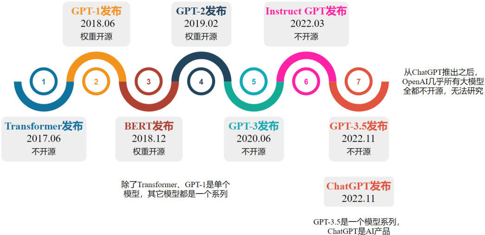

## 第02章_GPT系列

------

### 2. GPT系列

ChatGPT-3是第一个真正意义上的LLM，它是基于之前的一系列模型演化而来。

#### 2.1 GPT系列模型发布时间线

#### 2.2 GPT-1

##### 2.2.1 知识储备

###### 2.2.1.1 迁移学习（Transfer Learning）

**定义**

将源领域（Source Domain）或源任务（Source Task）中学到的知识（如模型参数、特征表示（如词嵌入）等），迁移到目标领域（Target Domain）或目标任务（Target Task）中，以提升目标模型的性能或训练效率。

1. 核心思想：利用已有知识解决新问题，减少对目标领域大量标注数据或计算资源的依赖。
2. 关键术语：
   - 领域（Domain）：由数据及其分布组成（如医疗影像 vs. 自然图像）。
   - 任务（Task）：指模型的具体目标（如分类、分割等）。

**迁移学习的典型场景**

1. 预训练+微调（如GPT、BERT）：在大规模无监督数据上预训练，再在小规模标注数据上微调目标任务。
2. 特征提取：固定预训练模型的部分层，仅训练新添加的分类层。
3. 领域自适应（Domain Adaptation）：将源领域（如合成图像）的知识迁移到目标领域（如真实照片）。

###### 2.2.1.2 监督学习（Supervised Learning）

利用标注数据（输入-输出对）训练模型，学习从输入到输出的映射关系。模型通过最小化预测值与真实标签的误差进行优化。

###### 2.2.1.3 无监督学习（Unsupervised Learning）

从无标注数据中挖掘隐藏模式或结构（如聚类、降维、关联规则），无需人工标注指导。具体到NLP领域，无监督学习是通过上文预测下一个词或通过上下文预测中间词等形式实现的。

###### 2.2.1.4 半监督学习（Semi-Supervised Learning）

结合少量标注数据和大量无标注数据进行训练。标注数据成本高昂，通过这种方式节约大量的人力成本，利用海量低成本的无标注数据提升了模型性能。

###### 2.2.1.5 文本蕴含任务（Textual Entailment / Natural Language Inference, NLI）

判断一对句子之间的逻辑关系，主要分为三类：

- 蕴含（Entailment）：前提句可以推导出假设句。
- 矛盾（Contradiction）：前提句与假设句内容相矛盾。
- 中立（Neutral）：前提句与假设句无明显关系，不能确定真假。

示例：

- 前提：“猫坐在垫子上。”
- 假设：“垫子上有动物。”
- 输出：蕴含。

###### 2.2.1.6 问答任务（Question Answering, QA）

让模型根据提供的上下文回答用户提出的问题。类型包括：

- 抽取式问答（Extractive QA）：从文本中直接抽取答案。

- 生成式问答（Generative QA）：基于知识生成新的自然语言答案。

- 开放域问答（Open-domain QA）：不提供上下文，由模型自行查找知识来源回答。

  示例：

  - 上下文：“巴黎是法国的首都。”

  - 问题：“法国的首都是哪里？”

  - 答案：“巴黎”。

###### 2.2.1.7 语义相似性评估（Semantic Similarity）

评估两个句子或文本片段在语义上的相似程度，通常输出一个05或01之间的分值。常用于句子匹配、信息检索、重复检测等任务。

方法：

- 基于词重叠（如TF-IDF）。
- 基于嵌入模型（如BERT、Sentence-BERT）。

示例：

- 句子1：“手机没电了。”
- 句子2：“我的电话需要充电。”
- 相似度：0.9（高度相似）。

###### 2.2.1.8 文档分类（Document Classification）

将文档归入一个或多个预定义的类别中，任务包括：

- 单标签分类：每个文档只属于一个类别。
- 多标签分类：每个文档可能属于多个类别。

应用场景：垃圾邮件检测、新闻分类、情感分类等。

示例：

- 文本：“这款手机电池续航出色！”
- 类别：“正面评价”。

###### 2.2.1.9 情感分析（Sentiment Analysis）

识别文本中表达的情感倾向（如正面、负面、中性）或更细粒度的情绪（如愤怒、高兴）。

方法：

- 基于词典规则（如情感词统计）。
- 基于机器学习（如 LSTM、Transformer）。

示例：

- 评论：“电影剧情糟糕，但特效很棒。”
- 输出：混合情感（负面+正面）。

情感分析是文本分类的一种，但因其独特性和广泛应用，常被单独列为 NLP 核心任务，与文档分类并列（如 GLUE 基准中同时包含主题分类和情感分析任务）。

###### 2.2.1.10 消融实验（Ablation Study）

通过逐步移除模型的某些组件（如层、特征、模块），评估其对性能的影响，以验证这些组件的必要性。

目的：

- 确定关键设计对模型效果的贡献。
- 简化模型结构（如去除冗余部分）。

示例：

- 在 BERT 模型中移除注意力机制后，准确率下降 15%，说明注意力机制至关重要。

###### 2.2.1.11 TF-IDF（Term Frequency-Inverse Document Frequency）

TF-IDF即词频-逆文档频率，它是一种统计方法，用于衡量一个词在文档中的重要性。这种方法认为一个词在单个文档中出现的频率越高、包含该词的文档数越少，它所包含的信息量越大，对应的TF-IDF值越大，后者由两部分组成：

1. 词频（Term Frequency，TF）
   $$
   TF(t, d) = \frac{\text{词t在文档d中出现的次数}}{\text{文档d的总词数}}
   $$

2. 逆文档频率（Inverse Term Frequency，IDF）
   $$
   IDF(t) = \log \left( \frac{\text{总文档数}}{\text{包含词t的文档数}} \right)
   $$

3. TF-IDF 值
   $$
   TF\text{-}IDF(t, d) = TF(t, d) \times IDF(t)
   $$

###### 2.2.1.12 AdamW

1. Adam算法回顾

   1. 计算纯梯度（不含L2）：
      $$
      g_t = \nabla_\theta J(\theta_{t-1})
      $$

   2. 更新一阶矩：
      $$
      m_t = \beta_1 m_{t-1} + (1 - \beta_1) g_t
      $$

   3. 更新二阶矩：
      $$
      v_t = \beta_2 v_{t-1} + (1 - \beta_2) g_t^2
      $$

   4. 偏差修正：
      $$
      \hat{m}_t = \frac{m_t}{1 - \beta_1^t}
      $$

      $$
      \hat{v}_t = \frac{v_t}{1 - \beta_2^t}
      $$

   5. 参数更新：
      $$
      \theta_t = \theta_{t-1} - \eta \left( \frac{\hat{m}_t}{\sqrt{\hat{v}_t} + \epsilon} \right)
      $$
      上式中的 $\epsilon$ 是一个极小值，目的是防止分母为零。

2. L2正则化回顾

   L2 正则化通过修改损失函数实现，修正后的损失函数如下

   $$
   J_{\text{reg}}(\theta) = J(\theta) + \frac{\lambda}{2} \|\theta\|_2^2
   $$
   相应的，梯度如下

   $$
   g_t = \nabla_\theta J(\theta_{t-1}) + \lambda \theta_{t-1}
   $$

3. Adam算法和L2正则化组合使用的问题

   当 L2 正则化和 SGD 组合使用时，参数更新公式如下

   $$
   \theta_t = \theta_{t-1} - \eta \nabla_\theta J(\theta) - \eta \lambda \theta_{t-1}
   $$
   此时等价于对参数直接施加权重衰减 $-\eta \lambda \theta_{t-1}$ 项。

   当 Adam 算法和 L2 正则化组合使用时，正则化项的梯度 $\lambda \theta$ 会被除以梯度二阶矩估计，导致实际的正则化强度随训练动态衰减，无法稳定约束权重。

4. AdamW算法

   为了解决上述问题，Ilya Loshchilov等人提出了改进的L2正则化方法AdamW，英文全称为Adam with Weight Decay，即带有权重衰减的Adam算法。顾名思义，该算法和Adam相比，只是在参数更新阶段添加了权重衰减，其它部分完全相同。需要特别注意的是，AdamW算法的梯度计算和Adam一样，不包含L2正则化项。

   参数更新阶段改进后的公式如下：
   $$
   \theta_t = \theta_{t-1} - \eta \left( \frac{\hat{m}_t}{\sqrt{\hat{v}_t} + \epsilon} + \lambda \theta_{t-1} \right)
   $$
   即

   $$
   \theta_t = \theta_{t-1} - \eta \frac{\hat{m}_t}{\sqrt{\hat{v}_t} + \epsilon} - \eta \lambda \theta_{t-1}
   $$
   **AdamW 算法本质上只是添加了 $-\eta \lambda \theta_{t-1}$，等价于 Adam 算法与解耦权重衰减 $(-\eta \lambda \theta_{t-1}$ 项）相结合。保留了正则化的数学本质，恢复了权重衰减的物理意义（参数收缩）。**

   在 AdamW 中，$\lambda$ 通常被称为权重衰减系数（Weight Decay Coefficient），而不是 L2 正则化强度系数。

   AdamW 通常在实践中（训练基于 Transformer 架构的 LLM 时）比 Adam+L2 表现出的泛化性能，因此在 LLM 的训练中被广泛采用。

##### 2.2.2 概述