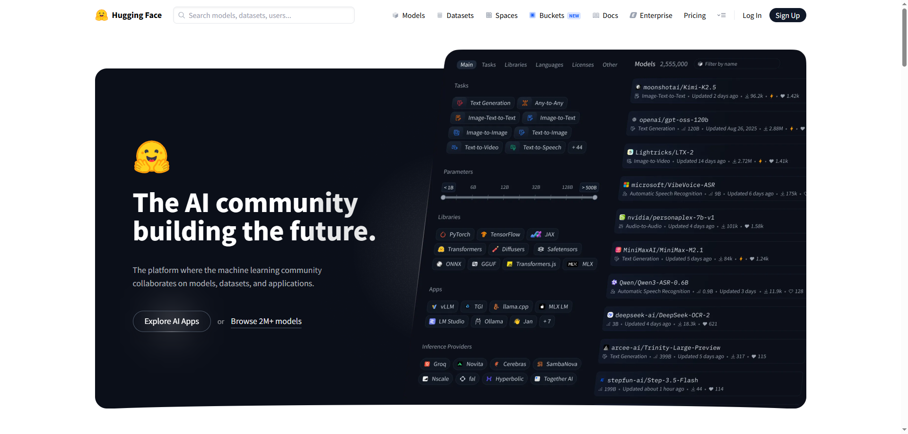

## Hugging Face

------

### 1. 认识 Hugging Face 生态

#### 1.1 Hugging Face简介

Hugging Face 是一家总部位于纽约的科技公司，致力于为机器学习应用开发通用的计算工具。它最为人所熟知的产品是 **Transformers** 库，该库广泛应用于自然语言处理任务。

除了工具库，Hugging Face 还提供一个平台——[Hugging Face Hub](https://huggingface.co/docs/transformers/model_doc/bert)，用户可以在平台上共享机器学习模型与数据集，并展示自己的相关成果。这个平台已经发展成为机器学习领域最活跃的开源社区之一，为研究与工程实践提供了丰富的资源与工具支持。



#### 1.2 核心组件概览

Hugging Face 提供了一套围绕预训练模型构建的工具库。这些组件彼此独立，又可以协同工作，覆盖了从数据处理到模型训练与推理的完整流程。以下是其中最核心的几个组件：

- TransFormers

  Transformers 是 Hugging Face 最核心的库，用于加载、使用和微调各种预训练模型。该库统一了模型接口，支持数百种模型结构，如 BERT、GPT 等，用户可以通过一行代码 `from_pretrained()`直接加载公开模型，快速用于推理或训练。

- Datasets

  Datasets 是用于加载和处理数据集的工具库。支持从在线仓库或本地文件（如 CSV、JSON）加载文本数据，并支持清洗、编码、切分等预处理操作。处理后的数据可直接用于模型训练，是连接原始数据与模型输入的重要桥梁。

- Tokenizers

  Tokenizers 是用于将文本转换为模型输入的工具。它支持文本分词、编码为 token ID，同时自动处理特殊符号、填充（padding）、attention mask 和句子对标记（token type ID）。分词器通常与模型配套使用，可通过统一接口加载。

- 其他组件简介

  除了核心的 Transformers、Datasets 和 Tokenizers，Hugging Face 还提供了一些辅助工具，用于扩展模型训练和部署流程：

  Accelerate：用于简化分布式训练设置，支持多卡训练和混合精度；

  Evaluate：提供常见的评估指标（如准确率、F1、BLEU 等），可与模型训练过程集成。

  这些组件可按需使用，帮助在更复杂的实验或部署场景中提升效率。

### 2. 预训练模型与Tokenizer

#### 2.1 概述

在使用 Hugging Face 提供的预训练模型时，通常需要同时加载 Tokenizer 和模型本体。它们是成对设计、配套使用的，确保文本输入经过正确处理后能被模型准确理解。

#### 2.2 加载预训练模型与Tokenizer

Hugging Face 提供了一套统一的类，称为 **AutoClass**，用于自动加载预训练模型和分词器。常用的类包括：

- AutoModel：加载基础的预训练模型（不包含任务头）
- AutoTokenizer：加载与模型结构配套的分词器

下面是一个加载中文 BERT 模型及其分词器的最简示例：

1. 安装依赖库

   - transformers

     ```shell
     pip install transformers
     ```

   - tokenizers

     可选，在下载transformers时会一并下载tokenizers

     ```shell
     pip install tokenizers
     ```

2. 完整代码

   ```python
   from transformers import AutoTokenizer, AutoModel
   
   # 加载分词器和模型
   tokenizer = AutoTokenizer.from_pretrained("bert-base-chinese")
   model = AutoModel.from_pretrained("bert-base-chinese")
   ```

   这段代码将自动从 Hugging Face Hub 下载模型权重、配置文件和词表等资源。下载后的文件会被缓存，默认路径通常为：`~/.cache/huggingface/hub/`。下次加载同一模型时将自动读取本地缓存，无需重复联网。

   除了通过模型名称在线加载，也可以提前下载模型文件并从本地路径加载，适用于离线使用的场景，具体操作步骤如下：

   1. 安装命令行工具，用于下载模型和tokenizer

      ```shell
      pip install huggingface_hub
      ```

   2. 下载模型到指定目录

      ```shell
      huggingface-cli download bert-base-chinese --local-dir ./pretrained/bert-base-chinese
      ```

   3. 从本地加载模型和分词器

      ```python
      from transformers import AutoTokenizer, AutoModel
      
      tokenizer = AutoTokenizer.from_pretrained("./pretrained/bert-base-chinese")
      model = AutoModel.from_pretrained("./pretrained/bert-base-chinese")
      ```

      只要目录中包含完整的模型配置和权重文件（如 config.json、pytorch_model.bin、vocab.txt等），即可成功加载。

#### 2.3 使用Tokenizer

##### 2.3.1 概述

Tokenizer 是将原始文本转换为模型输入的核心工具，其功能包括：

- 将文本切分为子词（subword）单元；
- 将子词映射为整数 ID（即 input_ids）；
- 自动添加特殊符号（如 [CLS]、[SEP]）；
- 对输入进行截断、补齐（padding）；
- 生成 attention mask 和 token type ids（如果需要）；

##### 2.3.2 基本用法

Tokenizer 提供了一系列接口，来实现上述功能，下面以bert-base-chinese的Tokenizer为例；

###### 分词（tokenize）

```python
from transformers import AutoTokenizer

# 加载分词器和模型
tokenizer = AutoTokenizer.from_pretrained("./pretrained/bert-base-chinese")

tokens = tokenizer.tokenize("我爱自然语言处理")

print(tokens)
# ['我', '爱', '自', '然', '语', '言', '处', '理']
```

###### token转ID（convert_tokens_to_ids）

```python
from transformers import AutoTokenizer

# 加载分词器和模型
tokenizer = AutoTokenizer.from_pretrained("./pretrained/bert-base-chinese")

tokens = tokenizer.tokenize("我爱自然语言处理")

ids = tokenizer.convert_tokens_to_ids(tokens)

print(ids)
# [2769, 4263, 5632, 4197, 6427, 6241, 1905, 4415]
```

###### ID转token（convert_ids_to_tokens）

```python
from transformers import AutoTokenizer

# 加载分词器和模型
tokenizer = AutoTokenizer.from_pretrained("./pretrained/bert-base-chinese")

ids = [2769, 4263, 5632, 4197, 6427, 6241, 1905, 4415]

tokens = tokenizer.convert_ids_to_tokens(ids)

print(tokens)
# ['我', '爱', '自', '然', '语', '言', '处', '理']
```

###### 编码（encode）

编码是将 tokenize + convert_tokens_to_ids 合并后的结果，通常还会自动添加特殊符号（如 [CLS] 和 [SEP]），除此之外，还支持padding、truncate等功能；

```python
from transformers import AutoTokenizer

# 加载分词器和模型
tokenizer = AutoTokenizer.from_pretrained("./pretrained/bert-base-chinese")

ids = tokenizer.encode("我爱自然语言处理")

print(ids)
# [101, 2769, 4263, 5632, 4197, 6427, 6241, 1905, 4415, 102]
```

>注：可通过add_special_tokens=False参数禁止添加特殊符号

###### 解码（decode）

解码会将一个 token ID 序列还原为对应的原始文本（或接近的文本）

```python
from transformers import AutoTokenizer

# 加载分词器和模型
tokenizer = AutoTokenizer.from_pretrained("./pretrained/bert-base-chinese")

ids = [101, 2769, 4263, 5632, 4197, 6427, 6241, 1905, 4415, 102]

string = tokenizer.decode(ids)

print(string)
# [CLS] 我 爱 自 然 语 言 处 理 [SEP]
```

>可通过skip_special_tokens=True参数跳过特殊符号

###### tokenizer() 方法（即 __call__）

这是最推荐的接口，用于直接构造模型所需的输入，其基本用法如下：

```python
from transformers import AutoTokenizer

tokenizer = AutoTokenizer.from_pretrained("./pretrained/bert-base-chinese")
text = "我爱自然语言处理"

# 编码文本为模型输入格式
inputs = tokenizer(text)

print(inputs)
# {'input_ids': [101, 2769, 4263, 5632, 4197, 6427, 6241, 1905, 4415, 102], 'token_type_ids': [0, 0, 0, 0, 0, 0, 0, 0, 0, 0], 'attention_mask': [1, 1, 1, 1, 1, 1, 1, 1, 1, 1]}
```

- `input_ids`：每个中文字词在 BERT 词表中的对应 ID，首尾的 101 和 102 分别是 [CLS] 和 [SEP] 特殊标记
- `token_type_ids`：区分不同句子的标记，单句时全为 0；双句时第一句为 0，第二句为 1
- `attention_mask`：标识哪些位置是真实 token（1）哪些是 padding（0），让模型忽略填充部分

除去text，tokenizer还提供了多个重要参数：

```python
inputs = tokenizer(
    text,
    padding=True,
    truncation=True,
    max_length=128,
    return_tensors="pt"
)
```

| 参数           | 默认值 | 说明                                                |
| -------------- | ------ | --------------------------------------------------- |
| padding        | False  | 是否补齐长度                                        |
| truncation     | False  | 是否截断超过最大长度的输入                          |
| max_length     | None   | 设定统一最大长度（如 128）                          |
| return_tensors | None   | 返回类型，设为 "pt"（PyTorch）或 "tf"（TensorFlow） |

此外，tokenizer()方法还支持直接对多个文本组成的列表进行**批量**处理，非常适合用于模型训练或推理；

```python
from transformers import AutoTokenizer

# 加载分词器和模型
tokenizer = AutoTokenizer.from_pretrained("./pretrained/bert-base-chinese")

texts = ["我爱自然语言处理", "我爱人工智能", "我们一起学习"]
inputs = tokenizer(
    texts,
    padding=True, # 自动补齐
    truncation=True, # 自动截断
    max_length=10, # 统一最大长度
    return_tensors="pt" # 返回 PyTorch 张量格式
)

print(inputs)
```

输出内容是一个包含三个字段的字典，每个字段是形状为 (batch_size, seq_len) 的张量：

```txt
{'input_ids': tensor([[ 101, 2769, 4263, 5632, 4197, 6427, 6241, 1905, 4415,  102],
        [ 101, 2769, 4263,  782, 2339, 3255, 5543,  102,    0,    0],
        [ 101, 2769,  812,  671, 6629, 2110,  739,  102,    0,    0]]), 'token_type_ids': tensor([[0, 0, 0, 0, 0, 0, 0, 0, 0, 0],
        [0, 0, 0, 0, 0, 0, 0, 0, 0, 0],
        [0, 0, 0, 0, 0, 0, 0, 0, 0, 0]]), 'attention_mask': tensor([[1, 1, 1, 1, 1, 1, 1, 1, 1, 1],
        [1, 1, 1, 1, 1, 1, 1, 1, 0, 0],
        [1, 1, 1, 1, 1, 1, 1, 1, 0, 0]])}
```

#### 2.4 使用预训练模型

##### 2.4.1 输入与输出结构

不同的预训练模型有不同的输入输出结构，下面以BERT模型为例：

1. 输入结构

   BERT 模型的输入通常由多个张量组成，主要包括以下字段：

   | 字段名         | 说明                                                         |
   | -------------- | ------------------------------------------------------------ |
   | input_ids      | 文本经过分词和编码后的 token ID 序列                         |
   | attention_mask | 指示哪些位置是有效的 token（1 表示有效，0 表示 padding）     |
   | token_type_ids | 用于区分句子对中的两个句子（如句子对分类任务），单句任务中可省略 |

   这些张量通常由 tokenizer 自动生成，用户无需手动构造；

2. 输出结构

   BERT模型的输出为一个包含多个字段的对象，常见字段如下：

   | 字段名            | 说明                                                         |
   | ----------------- | ------------------------------------------------------------ |
   | last_hidden_state | 每个 token 对应的隐藏状态表示，形状为 (batch_size, seq_length, hidden_size) |
   | pooler_output     | （可选）整体句子级别表示，通常对应 [CLS] 位置的输出，形状为 (batch_size, hidden_size) |

   不同任务使用的输出字段不同：

   - **文本分类任务**：通常使用 pooler_output（整体句子表示）
   - **序列标注任务**：（如命名实体识别）通常使用 last_hidden_state（逐 token 表示）

##### 2.4.2 具体用法流程

从文本输入到模型输出的完整流程如下：

```python
from transformers import AutoTokenizer, AutoModel
import torch

# 1. 加载模型和分词器
model_name = "bert-base-chinese"
tokenizer = AutoTokenizer.from_pretrained(model_name)
model = AutoModel.from_pretrained(model_name)

# 2. 准备批量文本
texts = ["我爱自然语言处理", "我爱人工智能", "我们一起学习"]

# 3. 编码文本为模型输入格式
encoded = tokenizer(
    texts,
    padding=True,
    truncation=True,
    max_length=10,
    return_tensors="pt"
)

# 5. 模型推理（不计算梯度）
with torch.no_grad():
    outputs = model(
        input_ids=encoded["input_ids"],
        attention_mask=encoded["attention_mask"],
        token_type_ids=encoded["token_type_ids"]
    )

# 6. 查看输出张量结构
print(outputs.keys())
print("last_hidden_state:", outputs.last_hidden_state.shape)
print("pooler_output:", outputs.pooler_output.shape)

# odict_keys(['last_hidden_state', 'pooler_output'])
# last_hidden_state: torch.Size([3, 10, 768])
# pooler_output: torch.Size([3, 768])
```

### 3. Datasets库

#### 3.1 概述

#### 3.2 加载数据集

##### 3.2.1 加载本地数据

##### 3.2.2 查看数据集

##### 3.2.3 加载在线数据

#### 3.3 预处理数据集

##### 3.3.1 删除列

##### 3.3.2 过滤行

##### 3.3.3 划分数据集

##### 3.3.4 编码数据

#### 3.4 保存数据集

##### 3.4.1 Arrow格式

##### 3.4.2 CSV和JSON格式

#### 3.5 集成Dataloader