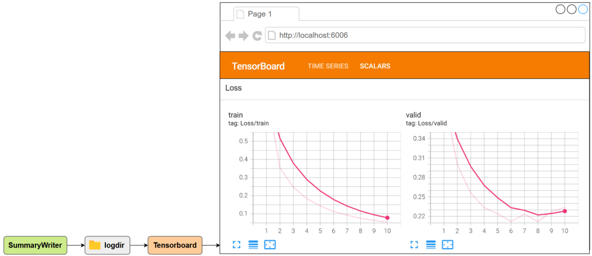
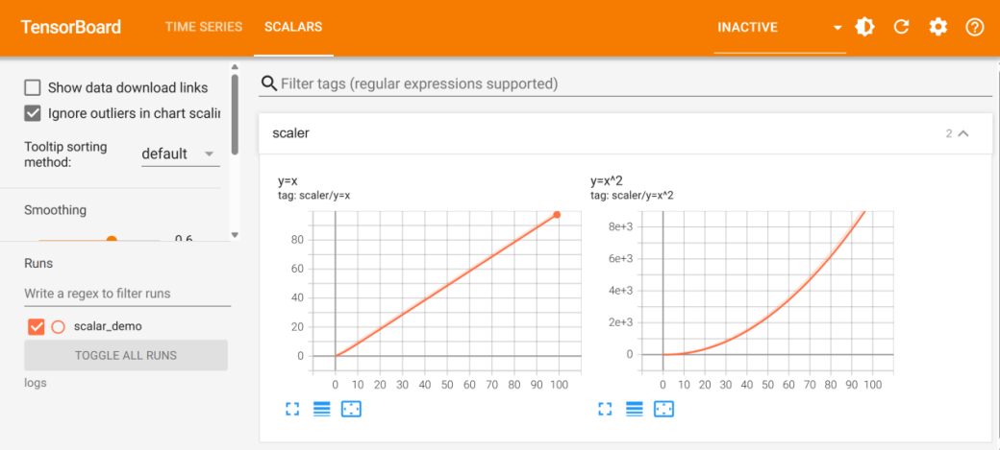

## Tensorboard

------

### 1. 简介

TensorBoard 是 TensorFlow 提供的可视化工具，用于监控和调试深度学习模型的训练过程。尽管它最初是为 TensorFlow 设计的，但 PyTorch 通过 torch.utils.tensorboard 模块也能轻松集成 TensorBoard，实现训练过程的可视化。

其功能包括：

- 标量可视化（如 loss、accuracy）
- 张量分布直方图（如权重、梯度）
- 图像/文本/音频可视化
- 高维数据降维投影（如词嵌入）

### 2. 安装Tensorboard

安装命令如下

```shell
pip install tensorboard
```

### 3. 基础使用

#### 3.1 概述

在 PyTorch 中使用 TensorBoard 的基本流程如下：

1. 使用 torch.utils.tensorboard.SummaryWriter 将数据写入日志文件
2. 启动 TensorBoard 服务，让其监听指定日志目录
3. 使用浏览器访问 TensorBoard 页面，查看可视化结果，如标量曲线、直方图等

完整流程如下图所示：



#### 3.2 创建 SummaryWriter

SummaryWriter由Pytorch提供，用于将数据写入日志文件中。其创建语法为：

```python
from torch.utils.tensorboard import SummaryWriter

# 创建写入器，指定日志保存目录
writer = SummaryWriter(log_dir="./logs")
```

上述代码表示：

- 创建一个名为 `writer` 的写入器对象
- 所有写入的数据都会保存在当前目录下的 `logs/` 文件夹中
- 如果该目录不存在，在写入数据时会自动创建

#### 3.3 记录标量数据

在深度学习中，训练过程通常会产生一些 **随时间变化的单个数值**，例如损失函数值（loss），这些数值被称为 **标量（scalar）**，适合使用曲线图展示其随时间或迭代次数的变化趋势。

TensorBoard 提供了专门的 **Scalars 面板** 来展示这些数值，帮助我们判断模型是否正在学习，训练是否稳定，参数调整是否有效等。

在 PyTorch 中，可以使用 `SummaryWriter.add_scalar()` 方法记录标量数据，具体语法为：

```python
writer.add_scalar(tag, scalar_value, global_step)
```

参数说明如下：

| 参数         | 说明                                         |
| ------------ | -------------------------------------------- |
| tag          | 标量的名称（可用路径形式组织分组）           |
| scalar_value | 要记录的数值（float/int）                    |
| global_step  | 当前步数（x 轴），常用作 epoch 或 batch 索引 |

示例代码：

```python
from torch.utils.tensorboard import SummaryWriter

writer = SummaryWriter(log_dir="./logs/scalar_demo")

for step in range(100):
    writer.add_scalar("scaler/y=x", step, step)
    writer.add_scalar("scaler/y=x^2", step ** 2, step)

writer.close()
```

#### 3.4 启动Tensorboard服务

完成数据写入后，可以通过以下命令启动 TensorBoard 服务：

```shell
tensorboard --logdir ./logs
```

>说明：--logdir 参数指定日志文件所在的目录。TensorBoard 会递归遍历该目录下所有子文件夹，加载其中的日志文件。每个子文件夹将作为一个标签（run），在网页界面中可以选择查看对应数据。

启动成功后，你将看到类似如下提示：

```shell
TensorFlow installation not found - running with reduced feature set.
Serving TensorBoard on localhost; to expose to the network, use a proxy or pass --bind all
TensorBoard 2.19.0 at http://localhost:6006/ (Press CTRL+C to quit)
```

访问上述地址 http://localhost:6006/，即可查看图像，如下图所示



### 4. 参考资料

其他图表，可直接参考Pytorch官方文档，地址如下：

[https://docs.pytorch.org/docs/stable//tensorboard.html#module-torch.utils.tensorboard](#module-torch.utils.tensorboard)