## 第03章_传统序列模型

------

### 3.1 RNN

#### 3.1.1 概述

在自然语言中，词语的顺序对于理解句子的含义至关重要。虽然词向量能够表示词语的语义，但它本身并不包含词语之间的顺序信息。

为了解决这一问题，研究者提出RNN（Recurrent Neural Network，循环神经网络）。

RNN 会逐个读取句子中的词语，并在每一步结合当前词和前面的上下文信息，不断更新对句子的理解。通过这种机制，RNN 能够持续建模上下文，从而更准确地把握句子的整体语义。因此RNN曾是序列建模领域的主流模型，被广泛应用于各类NLP任务。

>随着技术的发展，RNN已经逐渐被结构更灵活、计算效率更高的Transformer 模型所取代，后者已经成为当前自然语言处理的主流方法。
>
>尽管如此，RNN 仍然具有重要的学习价值。它所体现的“循环建模上下文”的思想，不仅为 LSTM 和 GRU 等改进模型奠定了基础，也有助于我们更好地理解 Transformer 等更复杂的架构。

#### 3.1.2 基础结构

RNN（循环神经网络）的核心结构是一个具有循环连接的隐藏层，它以时间步（time step）为单位，依次处理输入序列中的每个 token。

RNN（循环神经网络）的核心结构是一个具有循环连接的隐藏层，它以时间步（time step）为单位，依次处理输入序列中的每个 token。

具体结构如下图所示：

<video src="./images/Rnn基本结构.mp4" width="60%" controls></video>

其中隐藏层的计算公式为 $h_t = \tanh \left( x_t W_x + h_{t-1} W_h + b \right)$，计算细节如下图所示：

<video src="./images/20260708_230436.mp4" controls></video>

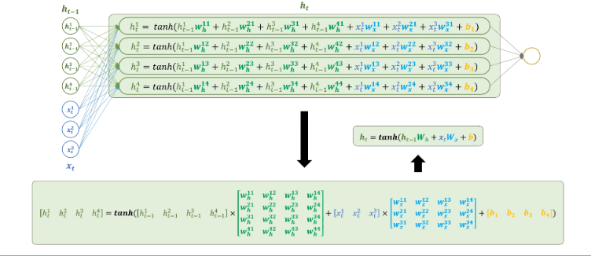

>前面详细展示了基础 RNN 的内部结构，但 RNN还存在更复杂的结构形式。为了更清晰地展示这些结构的连接方式，接下来将使用简化的示意图来表示，省略内部细节，突出整体结构。

基础RNN的示意图如下：

<video src="./images/20260708_230556.mp4" width="60%" controls></video>

#### 3.1.3 多层结构

为了让模型捕捉更复杂的语言特征，可以将多个 RNN 层按层次堆叠起来，使不同层学习不同层次的语义信息。

这种设计的核心假设是：底层网络更容易捕捉局部模式（如词组、短语），而高层网络则能学习更抽象的语义信息（如句子主题或语境）。

多层RNN结构中，每一层的输出序列会作为下一层的输入序列，最底层RNN接收原始输入序列，顶层 RNN的输出作为最终结果用于后续任务。

<video src="./images/20260708_230755.mp4" controls></video>

#### 3.1.4 双向结构

基础的 RNN 在每个时间步只输出一个隐藏状态，该状态仅包含来自上文的信息，而无法利用当前词之后的上下文。

对于一些任务而言，这是一个明显的限制。比如在序列标注任务中，模型需要为每个 token 预测一个标签，如果只能参考前文信息，往往难以做出准确判断。

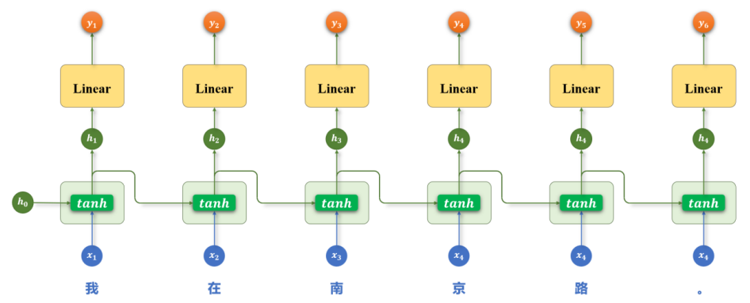

而使用双向 RNN（Bidirectional RNN），模型可以在每个时间步同时利用前文和后文的信息，从而获得更全面的上下文表示，有助于提升序列标注等任务的预测效果。

双向RNN同时使用两层 RNN：

正向 RNN：按照时间顺序（从前到后）处理序列；

反向 RNN：按照逆时间顺序（从后到前）处理序列。

每个时间步的输出，是正向和反向隐藏状态的组合（例如拼接或求和）。具体结构如下图所示：

<video src="./images/20260708_230858.mp4" controls></video>

#### 3.1.5 多层+双向结构

多层结构和双向结构还可组合使用，每层都是一个双向RNN，如下图所示

<video src="./images/20260708_2327111.mp4" controls></video>

#### 3.1.6 API使用

PyTorch 提供了 [torch.nn.RNN](https://pytorch.org/docs/stable/generated/torch.nn.RNN.html) 模块用于构建循环神经网络（Recurrent Neural Network, RNN）。该模块支持单层或多层结构，也可通过设置参数启用双向 RNN（bidirectional），适用于处理序列建模相关任务。

##### 3.1.6.1 参数说明

构造RNN层所需的参数如下：

```python
torch.nn.RNN(
    input_size,
    hidden_size,
    num_layers=1,
    nonlinearity="tanh",
    bias=True,
    batch_first=False,
    dropout=0.0,
    bidirectional=False,
    device=None,
    dtype=None,
)
```

各参数含义如下

| 参数名            | 类型                | 说明                                                         |
| ----------------- | ------------------- | ------------------------------------------------------------ |
| **input_size**    | int                 | 每个时间步输入特征的维度（词向量维度）                       |
| **hidden_size**   | int                 | 隐藏状态的维度                                               |
| **num_layers**    | int                 | RNN 层数，默认为 1                                           |
| nonlinearity      | str                 | 激活函数，'tanh'（默认）或 'relu'                            |
| bias              | bool                | 是否使用偏置项，默认 True                                    |
| **batch_first**   | bool                | 输入张量是否是 (batch, seq, feature)，默认 False 表示 (seq, batch, feature) |
| dropout           | float               | 除最后一层外，其余层之间的 dropout 概率                      |
| **bidirectional** | bool                | 是否为双向 RNN，默认 False                                   |
| device            | torch.device or str | 模块的初始化设备，如 'cuda', 'cpu'                           |
| dtype             | torch.dtype         | 模块初始化时的默认数据类型，如 torch.float32                 |

##### 3.1.6.2 输入输出

示例代码如下：

```python
rnn = torch.nn.RNN()
output, h_n = rnn(input, h_0)
```

输入输出内容如下：

| 参数名 | 说明                                                         |
| ------ | ------------------------------------------------------------ |
| input  | 输入序列，形状为 (**seq_len, batch_size**, input_size)，如果 batch_first=True，则为 (**batch_size, seq_len**, input_size) |
| h_0    | 可选，初始隐藏状态，形状为 (num_layers × num_directions, batch_size, hidden_size) |
| output | RNN 层的输出，包含最后一层每个时间步的隐藏状态，形状为 (seq_len, batch_size, num_directions × hidden_size)，如果 batch_first=True，则为 (batch_size, seq_len, num_directions × hidden_size) |
| h_n    | 最后一个时间步的隐藏状态，包含每一层的每个方向，形状为 (num_layers × num_directions, batch_size, hidden_size) |

输入输出形状如下：

- 单层单向

  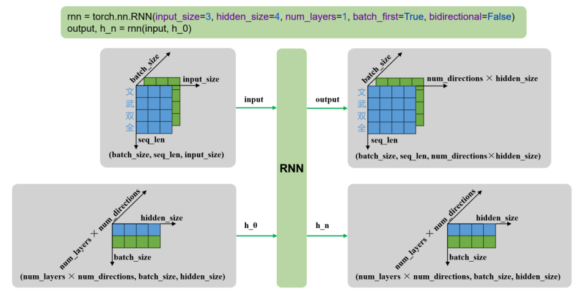

- 多层单向

  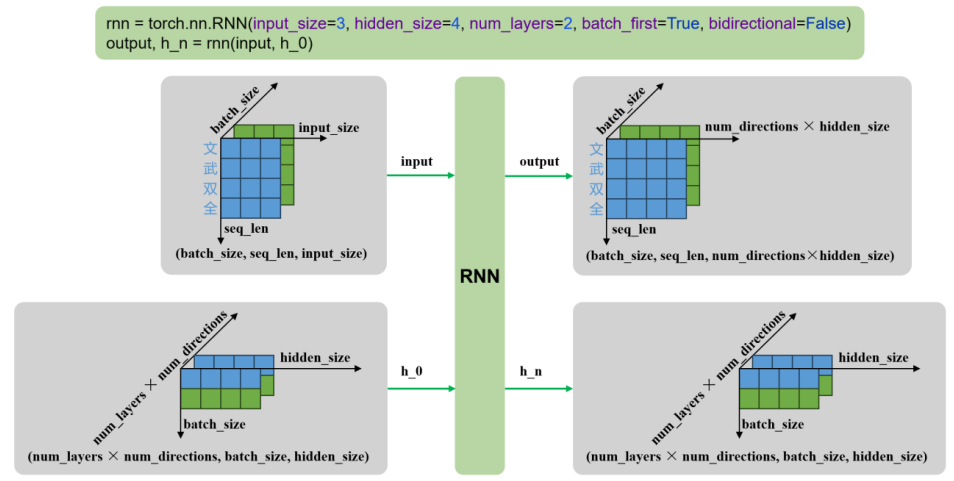

- 单层双向

  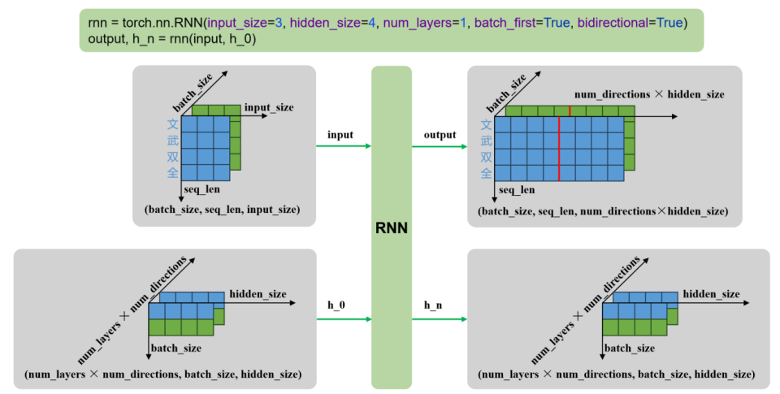

- 多层双向

  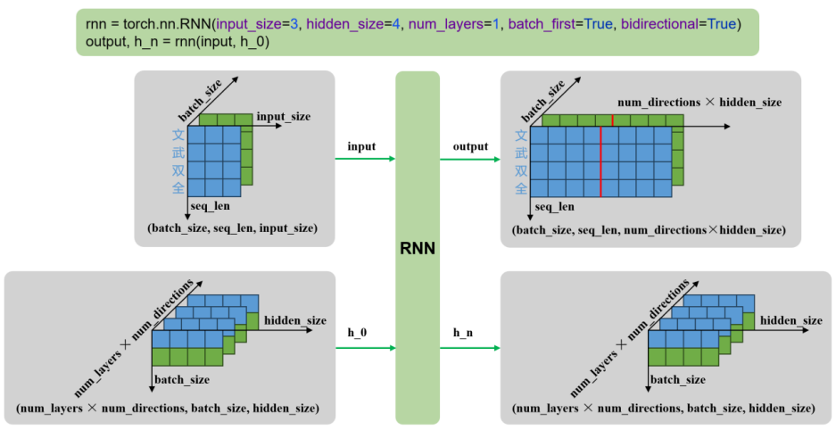

#### 3.1.7 案例实操（智能输入法）

##### 3.1.7.1 需求说明

本案例旨在实现一个用于手机输入法的**智能词语联想模型**。

具体需求为：根据用户当前已输入的文本内容，预测下一个可能输入的词语，要求返回概率最高的 5 个候选词供用户选择。例如：向模型输入“自然语言”，模型输出[“处理”、“理解”、“的”、“描述”、“生成”] ，如下图所示：


##### 3.1.7.2 需求分析

1. 数据集处理

   在本任务中，模型需要根据用户已输入的文本预测下一个可能输入的词语，因此训练数据应具备自然语言上下文连续性和贴近真实使用场景的特点。

   可选数据来源包括：

   - 用户真实输入内容：如聊天记录、搜索历史、输入法日志等。这类数据最能反映真实输入场景，有助于模型学习用户输入习惯和上下文联想模式。
   - 开放领域对话语料：如论坛回复、社交平台评论、闲聊对话等。这类语料具有较强的口语化特征，能够提升模型在真实输入场景中的泛化能力。

   本任务使用的数据集为https://huggingface.co/datasets/Jax-dan/HundredCV-Chat

   为了构造适用于“下一词预测”任务的训练样本，首先需要对原始语料进行分词。随后，采用**滑动窗口**的方式，从分词后的序列中提取连续的上下文片段，并以每个窗口的下一个词作为预测目标，构成输入-输出对，如下图所示：

   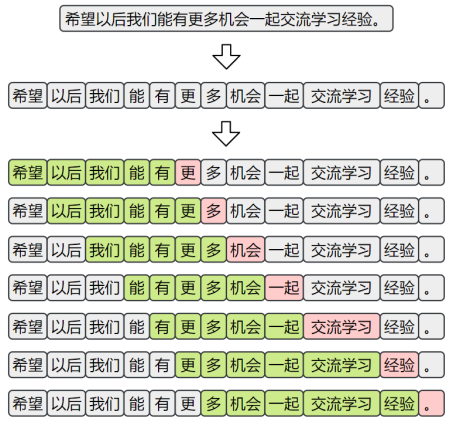

2. 模型结构设计

   本任务采用基于循环神经网络（RNN）的语言模型结构来实现“下一词预测”功能。模型整体由以下三个主要部分组成：

   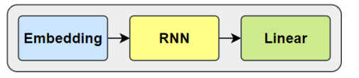

   - 嵌入层（Embedding）

     将输入的词或字索引映射为稠密向量表示，便于后续神经网络处理。

   - 循环神经网络层（RNN）

     用于建模输入序列的上下文信息，输出最后一个时间步的隐藏状态作为上下文表示。

   - 输出层（Linear）

     将隐藏状态映射到词表大小的维度，生成对下一个词的概率预测。

3. 训练方案

   - 损失函数

     下一个词的预测本质为多分类问题，所以损失函数采用 CrossEntropyLoss，其结合了softmax和交叉熵计算。

   - 优化器

     使用 Adam 优化器，具有较强的收敛能力和稳定性。

##### 3.1.7.3 需求实现

1. 项目结构

   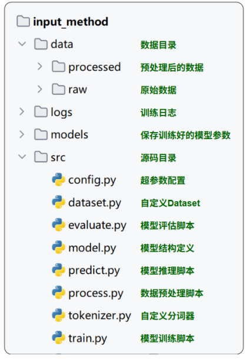

2. 完整代码

   - 数据预处理

     本模块负责将原始数据进行清洗、分词、编码与划分，最终生成模型可直接读取的标准格式数据集，并保存到jsonl文件中，如下图所示：

     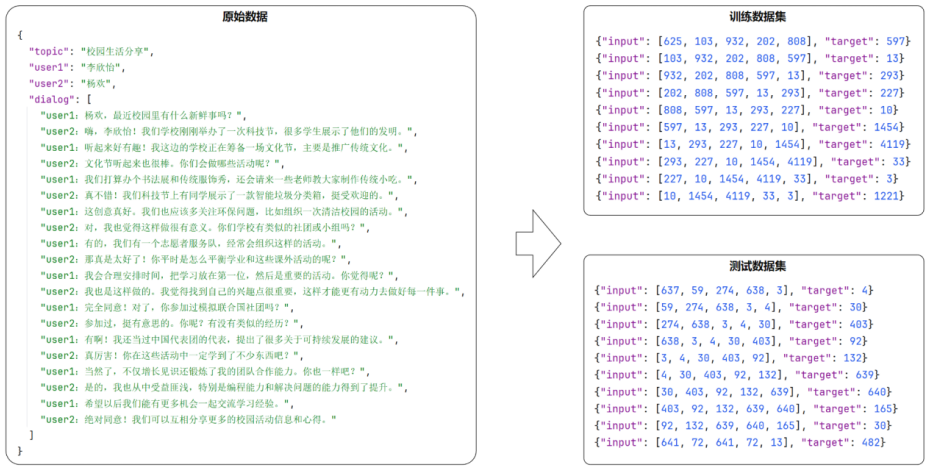

     ```python
     # process.py
     
     import time
     
     import torch
     from torch import nn
     from torch.utils.tensorboard import SummaryWriter
     from tqdm import tqdm
     
     from dataset import get_dataloader
     from model import InputMethodModel
     from tokenizer import JiebaTokenizer
     import config
     
     def train_one_epoch(model, dataloader, loss_function, optimizer, device):
         """
         训练一个 epoch。
     
         :param model: 输入法模型。
         :param dataloader: 数据加载器。
         :param loss_function: 损失函数。
         :param optimizer: 优化器。
         :param device: 设备。
         :return: 平均损失。
         """
         total_loss = 0
         model.train()
     
         for inputs, targets in tqdm(dataloader, desc='训练'):
             # 将数据移到设备
             inputs, targets = inputs.to(device), targets.to(device)
     
             optimizer.zero_grad()
     
             # 前向传播
             outputs = model(inputs)
     
             # 计算损失
             loss = loss_function(outputs, targets)
     
             # 反向传播
             loss.backward()
     
             # 更新参数
             optimizer.step()
     
             total_loss += loss.item()
     
         avg_loss = total_loss / len(dataloader)
         return avg_loss
     
     def train():
         """
         模型训练主函数。
         """
         device = torch.device('cuda' if torch.cuda.is_available() else 'cpu')
         print('设备:', device)
     
         # 获取数据加载器
         dataloader = get_dataloader()
     
         # 加载 tokenizer 和模型
         tokenizer = JiebaTokenizer.from_vocab(config.PROCESSED_DATA_DIR / 'vocab.txt')
         model = InputMethodModel(vocab_size=tokenizer.vocab_size).to(device)
     
         loss_function = nn.CrossEntropyLoss()
         optimizer = torch.optim.Adam(model.parameters(), lr=config.LEARNING_RATE)
     
         # TensorBoard 日志
         writer = SummaryWriter(log_dir=config.LOG_DIR / time.strftime('%Y-%m-%d_%H-%M-%S'))
     
         best_loss = float('inf')
     
         for epoch in range(1, config.EPOCHS + 1):
             print(f'========== Epoch: {epoch} ==========')
     
             # 训练一个 epoch
             avg_loss = train_one_epoch(model, dataloader, loss_function, optimizer, device)
             print(f'Loss: {avg_loss:.4f}')
     
             # 记录到 TensorBoard
             writer.add_scalar('Loss/train', avg_loss, epoch)
     
             # 保存最优模型
             if avg_loss < best_loss:
                 best_loss = avg_loss
                 torch.save(model.state_dict(), config.MODELS_DIR / 'model.pt')
                 print('模型保存成功！')
     
     if __name__ == '__main__':
         train()
     ```

   - 自定义分词器

     ```python
     # tokenizer.py
     
     import jieba
     from tqdm import tqdm
     
     jieba.setLogLevel(jieba.logging.WARNING)
     
     class JiebaTokenizer:
         """
         基于 jieba 的分词器，用于分词、编码和词表管理。
         """
     
         unk_token = '<unk>'
     
         @staticmethod
         def tokenize(sentence):
             """
             对句子进行分词。
     
             :param sentence: 输入句子。
             :return: 分词后的 token 列表。
             """
             # 调用 jieba 分词
             return jieba.lcut(sentence)
     
         @classmethod
         def build_vocab(cls, sentences, vocab_file):
             """
             构建词表并保存到文件。
     
             :param sentences: 句子列表。
             :param vocab_file: 保存词表的文件路径。
             """
             unique_words = set()
             for sentence in tqdm(sentences, desc='分词'):
                 # 收集所有唯一词
                 for word in cls.tokenize(sentence):
                     unique_words.add(word)
     
             # 将 <unk> 放在词表首位
             vocab_list = [cls.unk_token] + list(unique_words)
     
             # 保存词表到文件
             with open(vocab_file, 'w', encoding='utf-8') as f:
                 for word in vocab_list:
                     f.write(word + '\n')
     
         @classmethod
         def from_vocab(cls, vocab_file):
             """
             从文件加载词表。
     
             :param vocab_file: 词表文件路径。
             :return: JiebaTokenizer 实例。
             """
             with open(vocab_file, 'r', encoding='utf-8') as f:
                 vocab_list = [line.strip() for line in f.readlines()]
             return cls(vocab_list)
     
         def __init__(self, vocab_list):
             """
             初始化 tokenizer。
     
             :param vocab_list: 词表列表。
             """
             self.vocab_list = vocab_list
             self.vocab_size = len(vocab_list)
             # 建立词到索引映射
             self.word2index = {word: index for index, word in enumerate(vocab_list)}
             # 建立索引到词的映射
             self.index2word = {index: word for index, word in enumerate(vocab_list)}
             # 获取未知词索引
             self.unk_token_index = self.word2index[self.unk_token]
     
         def encode(self, sentence):
             """
             将句子编码为索引列表。
     
             :param sentence: 输入句子。
             :return: 索引列表。
             """
             tokens = self.tokenize(sentence)
             # 将 token 转为索引，未知词用 unk 索引替代
             return [self.word2index.get(token, self.unk_token_index) for token in tokens]
     ```

   - 自定义数据集

     ```python
     # dataset.py
     
     import torch
     from torch.utils.data import Dataset, DataLoader
     import pandas as pd
     
     import config
     
     class InputMethodDataset(Dataset):
         """
         输入法数据集类，用于加载 JSONL 文件并生成张量。
         """
     
         def __init__(self, file_path):
             """
             初始化数据集。
     
             :param file_path: 数据文件路径（JSONL 格式）。
             """
             self.data = pd.read_json(file_path, lines=True).to_dict(orient='records')
     
         def __len__(self):
             """
             获取数据集样本数量。
     
             :return: 样本数量。
             """
             return len(self.data)
     
         def __getitem__(self, index):
             """
             获取指定索引的数据样本。
     
             :param index: 数据索引。
             :return: (input_tensor, target_tensor)
             """
             input_tensor = torch.tensor(self.data[index]['input'], dtype=torch.long)
             target_tensor = torch.tensor(self.data[index]['target'], dtype=torch.long)
             return input_tensor, target_tensor
     
     def get_dataloader(train=True):
         """
         获取数据加载器。
     
         :param train: 是否加载训练集（True 加载训练集，False 加载测试集）。
         :return: DataLoader 对象。
         """
         file_name = 'indexed_train.jsonl' if train else 'indexed_test.jsonl'
         dataset = InputMethodDataset(config.PROCESSED_DATA_DIR / file_name)
         return DataLoader(dataset, batch_size=config.BATCH_SIZE, shuffle=True)
     
     if __name__ == '__main__':
         dataloader = get_dataloader()
         for input_tensor, target_tensor in dataloader:
             print(input_tensor.shape, target_tensor.shape)
             break
     ```

   - 模型定义

     ```python
     # model.py
     
     import torch
     from torch import nn
     from torchinfo import summary
     
     import config
     
     class InputMethodModel(nn.Module):
         """
         输入法预测模型，基于 RNN 的序列模型。
         """
     
         def __init__(self, vocab_size):
             """
             初始化模型。
     
             :param vocab_size: 词表大小。
             """
             super().__init__()
             # 嵌入层：将 token 索引映射为稠密向量
             self.embedding = nn.Embedding(num_embeddings=vocab_size, embedding_dim=config.EMBEDDING_DIM)
             # RNN：处理序列数据，提取上下文特征
             self.rnn = nn.RNN(
                 input_size=config.EMBEDDING_DIM,
                 hidden_size=config.HIDDEN_SIZE,
                 batch_first=True
             )
             # 全连接层：将隐藏状态映射到词表大小的概率分布
             self.linear = nn.Linear(in_features=config.HIDDEN_SIZE, out_features=vocab_size)
     
         def forward(self, x):
             """
             前向传播。
     
             :param x: 输入张量，形状 (batch_size, seq_len)。
             :return: 模型输出，形状 (batch_size, vocab_size)。
             """
             # 嵌入层处理输入序列
             embed = self.embedding(x)  # (batch_size, seq_len, embedding_dim)
     
             # RNN 处理嵌入向量序列
             output, _ = self.rnn(embed)  # (batch_size, seq_len, hidden_size)
     
             # 取最后一个时间步的输出进行分类
             result = self.linear(output[:, -1, :])  # (batch_size, vocab_size)
     
             return result
     
     if __name__ == '__main__':
         model = InputMethodModel(vocab_size=20000).to('cuda')
     
         # 创建随机 dummy 输入用于展示模型结构
         dummy_input = torch.randint(
             low=0,
             high=20000,
             size=(config.BATCH_SIZE, config.SEQ_LEN),
             dtype=torch.long,
             device='cuda'
         )
     
         # 打印模型摘要
         summary(model, input_data=dummy_input)
     ```

   - 模型训练

     ```python
     # train.py
     
     import time
     
     import torch
     from torch import nn
     from torch.utils.tensorboard import SummaryWriter
     from tqdm import tqdm
     
     from dataset import get_dataloader
     from model import InputMethodModel
     from tokenizer import JiebaTokenizer
     import config
     
     def train_one_epoch(model, dataloader, loss_function, optimizer, device):
         """
         训练一个 epoch。
     
         :param model: 输入法模型。
         :param dataloader: 数据加载器。
         :param loss_function: 损失函数。
         :param optimizer: 优化器。
         :param device: 设备。
         :return: 平均损失。
         """
         total_loss = 0
         model.train()
     
         for inputs, targets in tqdm(dataloader, desc='训练'):
             # 将数据移到设备
             inputs, targets = inputs.to(device), targets.to(device)
     
             optimizer.zero_grad()
     
             # 前向传播
             outputs = model(inputs)
     
             # 计算损失
             loss = loss_function(outputs, targets)
     
             # 反向传播
             loss.backward()
     
             # 更新参数
             optimizer.step()
     
             total_loss += loss.item()
     
         avg_loss = total_loss / len(dataloader)
         return avg_loss
     
     def train():
         """
         模型训练主函数。
         """
         device = torch.device('cuda' if torch.cuda.is_available() else 'cpu')
         print('设备:', device)
     
         # 获取数据加载器
         dataloader = get_dataloader()
     
         # 加载 tokenizer 和模型
         tokenizer = JiebaTokenizer.from_vocab(config.PROCESSED_DATA_DIR / 'vocab.txt')
         model = InputMethodModel(vocab_size=tokenizer.vocab_size).to(device)
     
         loss_function = nn.CrossEntropyLoss()
         optimizer = torch.optim.Adam(model.parameters(), lr=config.LEARNING_RATE)
     
         # TensorBoard 日志
         writer = SummaryWriter(log_dir=config.LOG_DIR / time.strftime('%Y-%m-%d_%H-%M-%S'))
     
         best_loss = float('inf')
     
         for epoch in range(1, config.EPOCHS + 1):
             print(f'========== Epoch: {epoch} ==========')
     
             # 训练一个 epoch
             avg_loss = train_one_epoch(model, dataloader, loss_function, optimizer, device)
             print(f'Loss: {avg_loss:.4f}')
     
             # 记录到 TensorBoard
             writer.add_scalar('Loss/train', avg_loss, epoch)
     
             # 保存最优模型
             if avg_loss < best_loss:
                 best_loss = avg_loss
                 torch.save(model.state_dict(), config.MODELS_DIR / 'model.pt')
                 print('模型保存成功！')
     
     if __name__ == '__main__':
         train()
     ```

   - 模型预测

     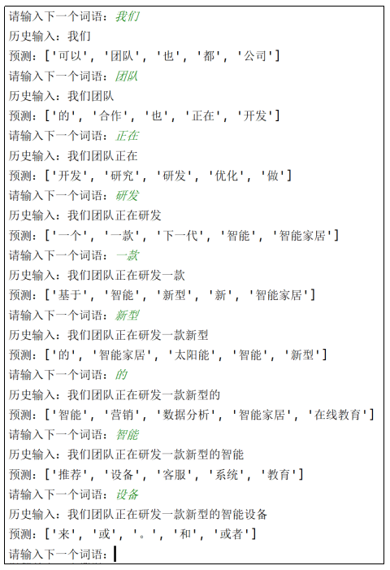

     ```python
     # predict.py
     
     import torch
     from model import InputMethodModel
     from tokenizer import JiebaTokenizer
     import config
     
     def predict_batch(input_tensor, model):
         """
         对一个 batch 的输入进行预测。
     
         :param input_tensor: 输入张量，形状 (batch_size, seq_len)。
         :param model: 输入法模型。
         :return: 每个样本 top-5 的索引列表。
         """
         model.eval()
         with torch.no_grad():
             # 前向传播获取输出 logits
             output = model(input_tensor)  # (batch_size, vocab_size)
     
             # 选取 top-5 概率最高的 token 索引
             predict_ids = torch.topk(output, k=5, dim=-1).indices  # (batch_size, 5)
     
         return predict_ids.tolist()
     
     def predict(text, model, tokenizer, device):
         """
         对单条文本进行预测。
     
         :param text: 用户输入文本。
         :param model: 输入法模型。
         :param tokenizer: 分词器。
         :param device: 设备。
         :return: top-5 预测结果词汇列表。
         """
         # 编码文本为 token 索引
         input_ids = tokenizer.encode(text)
     
         # 转换为张量并移动到设备
         input_tensor = torch.tensor([input_ids], dtype=torch.long, device=device)
     
         # 调用 batch 预测
         topk_ids = predict_batch(input_tensor, model)[0]
     
         # 索引映射回词语
         return [tokenizer.index2word[topk_id] for topk_id in topk_ids]
     
     def run_predict():
         """
         启动预测交互程序。
         """
         device = torch.device('cuda' if torch.cuda.is_available() else 'cpu')
     
         # 加载 tokenizer
         tokenizer = JiebaTokenizer.from_vocab(config.PROCESSED_DATA_DIR / 'vocab.txt')
     
         # 创建并加载模型
         model = InputMethodModel(vocab_size=tokenizer.vocab_size).to(device)
         model.load_state_dict(torch.load(config.MODELS_DIR / 'model.pt'))
     
         print('请输入词语：（输入q或者quit退出系统）')
     
         text = ''
         while True:
             user_input = input('> ')
             if user_input in ['q', 'quit']:
                 print('感谢使用！')
                 break
     
             if not user_input:
                 print('请输入词语！')
                 continue
     
             # 更新历史输入
             text += user_input
             print('历史输入：', text)
     
             # 获取预测结果
             topk_tokens = predict(text, model, tokenizer, device)
             print('预测结果：', topk_tokens)
     
     if __name__ == '__main__':
     run_predict()
     ```

   - 模型评估

     本模块用于评估模型效果，评估指标为Top-1准确率和Top-5准确率。

     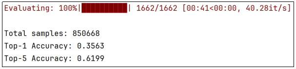

     ```python
     # evaluate.py
     
     import torch
     from tqdm import tqdm
     
     from tokenizer import JiebaTokenizer
     import config
     from model import InputMethodModel
     from dataset import get_dataloader
     from predict import predict_batch
     
     def evaluate(model, dataloader, device):
         """
         评估模型。
     
         :param model: 输入法模型。
         :param dataloader: 数据加载器。
         :param device: 设备。
         :return: (top1_acc, topk_acc)
         """
         total_count = 0
         top1_correct = 0
         topk_correct = 0
     
         model.eval()
         for inputs, targets in tqdm(dataloader, desc='评估'):
             inputs = inputs.to(device)
             targets = targets.tolist()
     
             # 获取 top-5 预测结果
             predicted_ids = predict_batch(inputs, model)
     
             # 统计 top-1 和 top-5 正确率
             for pred, target in zip(predicted_ids, targets):
                 if pred[0] == target:
                     top1_correct += 1
                 if target in pred:
                     topk_correct += 1
                 total_count += 1
     
         top1_acc = top1_correct / total_count
         topk_acc = topk_correct / total_count
         return top1_acc, topk_acc
     
     def run_evaluate():
         """
         运行评估流程。
         """
         device = torch.device('cuda' if torch.cuda.is_available() else 'cpu')
     
         tokenizer = JiebaTokenizer.from_vocab(config.PROCESSED_DATA_DIR / 'vocab.txt')
     
         model = InputMethodModel(vocab_size=tokenizer.vocab_size).to(device)
         model.load_state_dict(torch.load(config.MODELS_DIR / 'model.pt'))
     
         dataloader = get_dataloader(train=False)
     
         # 执行评估
         top1_acc, topk_acc = evaluate(model, dataloader, device)
     
         # 输出评估结果
         print("======= 评估结果 =======")
         print(f"Top-1 准确率: {top1_acc:.4f}")
         print(f"Top-5 准确率: {topk_acc:.4f}")
         print("========================")
     
     if __name__ == '__main__':
         run_evaluate()
     ```

   - 配置文件

     ```python
     # config.py
     
     from pathlib import Path
     
     # 项目根目录
     ROOT_DIR = Path(__file__).parent.parent
     
     # 数据路径
     RAW_DATA_DIR = ROOT_DIR / 'data' / 'raw'
     PROCESSED_DATA_DIR = ROOT_DIR / 'data' / 'processed'
     
     # 模型和日志路径
     MODELS_DIR = ROOT_DIR / 'models'
     LOG_DIR = ROOT_DIR / 'logs'
     
     # 训练参数
     SEQ_LEN = 5  # 输入序列长度
     BATCH_SIZE = 64  # 批大小
     EMBEDDING_DIM = 64  # 嵌入层维度
     HIDDEN_SIZE = 128  # RNN 隐藏层维度
     LEARNING_RATE = 1e-3  # 学习率
     EPOCHS = 30  # 训练轮数
     ```

#### 3.1.8 存在问题

##### 3.1.8.1 概述

尽管循环神经网络（RNN）在处理序列数据方面具有天然优势，但它在实际应用中面临一个非常严重的问题：长期依赖建模困难。这指的是：在训练过程中，当输入序列很长时，模型难以有效学习早期输入对最终输出的影响。


##### 3.1.8.2 问题分析

上述问题的根本原因在于训练过程中存在的**梯度消失**或**梯度爆炸**问题。

在训练RNN时，采用的是时间反向传播（Backpropagation Through Time, BPTT）方法，在反向传播过程中，梯度需要在每个时间步上不断链式传递，下图为RNN在训练过程中的计算图：

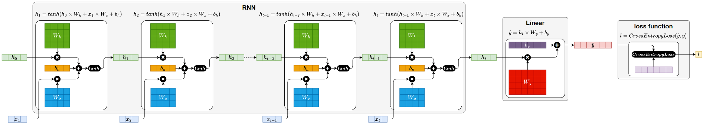

根据上述计算图，可以得出：

$\frac{\partial l}{\partial W_h} = \frac{\partial l}{\partial h_t} \cdot \frac{\partial h_t}{\partial W_h} + \frac{\partial l}{\partial h_{t-1}} \cdot \frac{\partial h_{t-1}}{\partial W_h} + \cdots + \frac{\partial l}{\partial h_2} \cdot \frac{\partial h_2}{\partial W_h} + \frac{\partial l}{\partial h_1} \cdot \frac{\partial h_1}{\partial W_h}$

其中每一项表示每条路径对 $\frac{\partial l}{\partial W_h}$ 贡献。

展开早期时间步的某一条路径（例如 $\frac{\partial l}{\partial h_1} \cdot \frac{\partial h_1}{\partial W_h}$）可以得到

$\frac{\partial l}{\partial h_1} \cdot \frac{\partial h_1}{W_h} = \frac{\partial l}{\partial h_t} \cdot \frac{\partial h_t}{\partial h_{t-1}} \cdot \frac{\partial h_{t-1}}{\partial h_{t-2}} \cdots \frac{\partial h_3}{\partial h_2} \cdot \frac{\partial h_2}{\partial h_1} \cdot \frac{\partial h_1}{\partial W_h}$

展开其中一环 $\frac{\partial h_t}{\partial h_{t-1}}$（为简单起见，按照标量推导）

现有 $h_t = \tanh \left( x_t W_x + h_{t-1} W_h + b \right)$，令 $u_t = x_t W_x + h_{t-1} W_h + b$

则有 $h_t = \tanh \left( u_t \right)$

可得 $\frac{\partial h_t}{\partial h_{t-1}} = \frac{\partial h_t}{\partial u_t} \cdot \frac{\partial u_t}{\partial h_{t-1}} = \tanh' \left( u_t \right) \cdot W_h$


所以，早期路径的展开可以写为：

$\frac{\partial l}{\partial h_1} \cdot \frac{\partial h_1}{\partial W_h} = \frac{\partial l}{\partial h_t} \cdot \tanh' \left( u_t \right) \cdot W_h \cdot \tanh' \left( u_{t-1} \right) \cdot W_h \cdot \tanh' \left( u_{t-2} \right) \cdot W_h \cdot \cdots \cdot \tanh' \left( u_3 \right)$

$\cdot W_h \cdot \tanh' \left( u_2 \right) \cdot W_h \cdot \frac{\partial h_1}{\partial W_h}$


可以看到上述公式中有很多次的 $\tanh'(u_t) \cdot W_h$ 连乘，其中 $\tanh'(u_t)$ 的范围是 $(0,1]$，如下图所示：

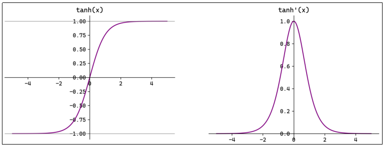

所以若 $W_h$ 也小于 1，那么经过 $\tanh'(u_t) \cdot W_h$ 的多次连乘，早期路径（例如 $\frac{\partial l}{\partial h_1} \cdot \frac{\partial h_1}{\partial W_h}$）的值就会指数级衰减，并迅速接近于 0，这个现象称为梯度消失。

由于早期时间步的梯度值几乎为 0，所以总梯度 $\frac{\partial l}{\partial W_h}$ 几乎只会受到最近时间步的输入影响，换句话说，在权重参数 $W_h$ 更新（$W_h = W_h - \eta \cdot \frac{\partial l}{\partial W_h}$）时，早期输入的信息几乎不会对 $W_h$ 的更新产生贡献。

这就导致模型只能学到短期依赖，而无法学到长期依赖。

另外，若 $W_h$ 大于 1（大到 $\tanh'(u_t) \cdot W_h$ 大于 1），那么经过 $\tanh'(u_t) \cdot W_h$ 的多次连乘，早期路径（例如 $\frac{\partial l}{\partial h_1} \cdot \frac{\partial h_1}{\partial W_h}$）的值就会指数级增长，这个现象称为梯度爆炸，梯度爆炸又会使参数更新极不稳定。

这两个问题是制约 RNN 学习长期依赖的主要瓶颈。

### 3.2 LSTM

#### 3.2.1 概述

为了缓解RNN梯度消失或者梯度爆炸的问题，Hochreiter 和 Schmidhuber 于 1997 年提出了长短期记忆网络（Long Short-Term Memory, LSTM）。

#### 3.2.2 基础结构

LSTM 通过引入特殊的记忆单元（Memory Cell，图中的 $c_t$），有效提升了模型对长序列依赖关系的建模能力。其沿时间步展开后的结构如下图所示：

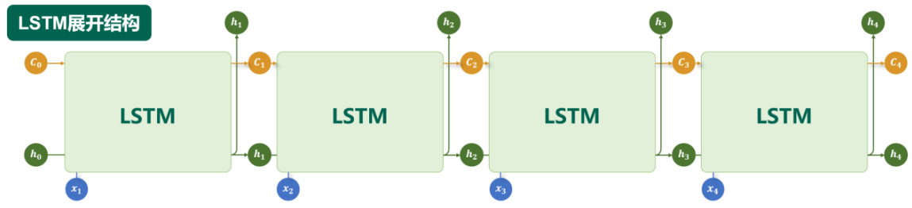

其内部结构如下图所示，核心结构是三个“门”，分别是遗忘门、输入门和输出门

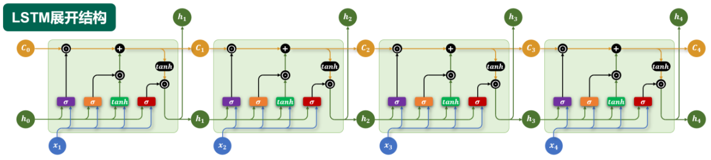

各部分具体说明如下：

- **记忆单元（Memory Cell）**

  记忆单元负责在序列中长期保存关键信息。它相当于一条“信息通道”，在多个时间步之间直接传递信息（记忆单元是缓解梯度消失和梯度爆炸问题的核心），如下图中的 $c_{t-1} \rightarrow c_t$。

  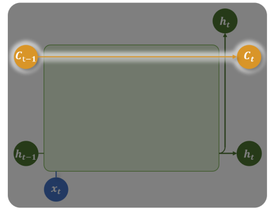

- **遗忘门（Forget Gate）**

  遗忘门决定当前时间步要忘记多少过去的记忆。

  例如在上一节的输入法智能提示案例中，假如历史输入为："小帅是一名程序员，他每天都加班；"，然后当前时间步的输入为"小美"，意味着当前的主语变为了"小美"，后续应该生成和"小美"相关的内容，所以此时记忆单元就应该忘记之前的主语信息"小帅"。

  遗忘门会根据上一个时间步的隐藏状态 $h_{t-1}$ 和当前时间步的输入 $x_t$，生成一个 0 到 1 之间的控制系数，然后与上一个时间步的记忆单元状态 $C_{t-1}$ 相乘，从而动态调整哪些信息应该被遗忘。

  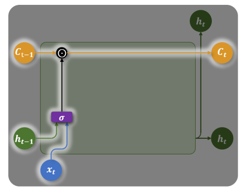

  遗忘门的计算公式为：

  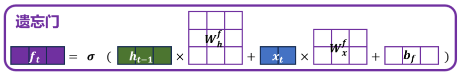

  图中的 $\circ$ 符号为阿达玛乘积（Hadamard product），表示逐元素相乘。

- 输入门（Input Gate）

  输入门控制要从当前时间步的输入向记忆单元存入多少新的信息。例如上述案例中，当前时间步的输入为"小美"，所以此时记忆单元就应该存入新的主语信息"小美"。

  当前时间步的信息由当前输入 $x_t$ 和上一个隐藏状态 $h_{t-1}$ 计算而成，同时输入门也由当前输入 $x_t$ 和上一个隐藏状态 $h_{t-1}$ 计算而成，然后新的信息和输入门相乘得到需要存入记忆单元的信息，如下图所示。

  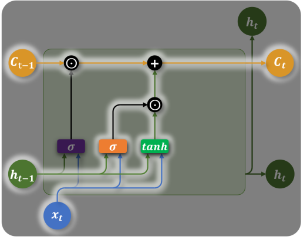

  当前时间步的信息计算公式为：

  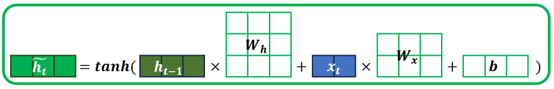

  输入门的计算公式为：

  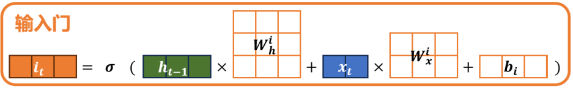

  综上所述可以得到记忆单元更新的完整公式为：

  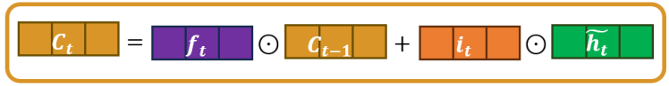

- 输出门（Output Gate）

  输出门控制从记忆单元中读取多少信息作为当前时间步的隐藏状态进行输出。例如上述输入法智能提示案例中，记忆单元中存入新主语信息"小美"之后，当前时间步就应该从记忆单元中提取该主语信息，生成与"小美"相关的内容。

  输出门同样由当前时间步的输入 $x_t$ 和上一个时间步 $h_{t-1}$ 的隐藏状态计算而成，如下图所示。

  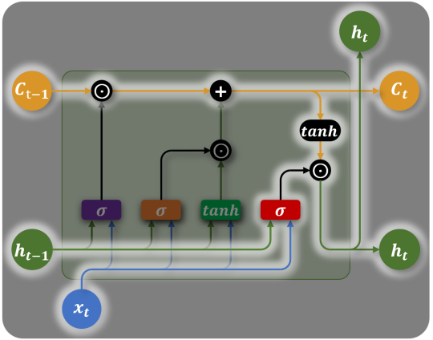

  输出门的计算公式为：

  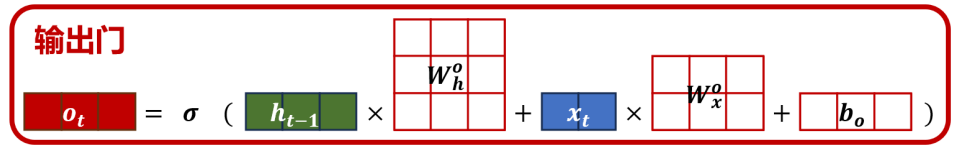

  当前时间步输出的隐藏状态计算公式为：

  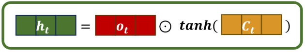

LSTM的完整结构如下图所示：

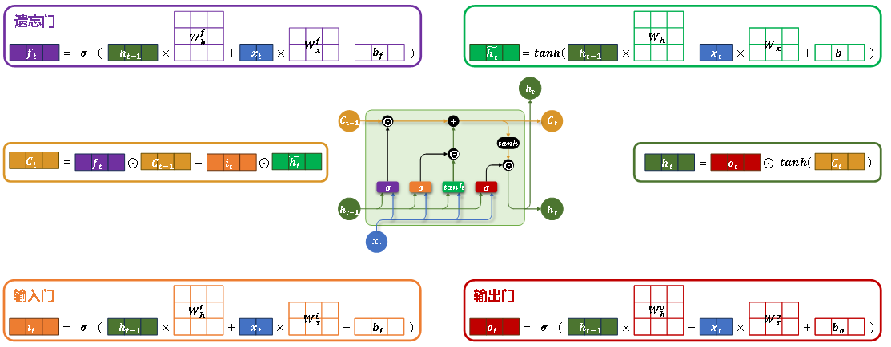

**LSTM为何能缓解梯度消失和梯度爆炸？**

LSTM的计算图如下：


LSTM 通过引入记忆单元（Memory Cell），在时间步之间提供了一条稳定的梯度传播路径。

记忆单元的更新公式为  $$C_t = f_t \odot C_{t-1} + i_t \odot \tilde{h}_t$$

所以  $$\frac{\partial C_t}{\partial C_{t-1}} = f_t$$（简单起见，按照标量推导）

在反向传播时，沿记忆单元路径，梯度传播实际上是多个 $f_t$ 连乘的结果。虽然每个 $f_t$ 的取值小于 1，但通常较接近于 1。这是因为 $f_t$ 由遗忘门生成，在一般任务中，遗忘门倾向于"记得多、忘得少"，因此 $f_t$ 的值通常较大。

由于乘积中的每一项 $f_t$ 较接近 1，整体衰减速度远小于传统 RNN 中隐藏状态链式传播时的指数衰减。这使得早期时间步的输入，能够通过记忆单元路径稳定地影响到最终的总梯度，从而有效参与参数的更新，保证了模型对长序列依赖的学习能力。

#### 3.2.3 多层结构

与RNN类似，LSTM 也可以通过堆叠多个层来构建更深的网络，以增强模型对序列特征的建模能力。

在多层 LSTM 中，每一层 LSTM 的输出隐藏状态，会作为下一层 LSTM 的输入，同时每一层都维护独立的记忆单元。通过层层传递和提取信息，多层结构能够捕捉更复杂、更抽象的时序特征。

具体结构如下图所示：

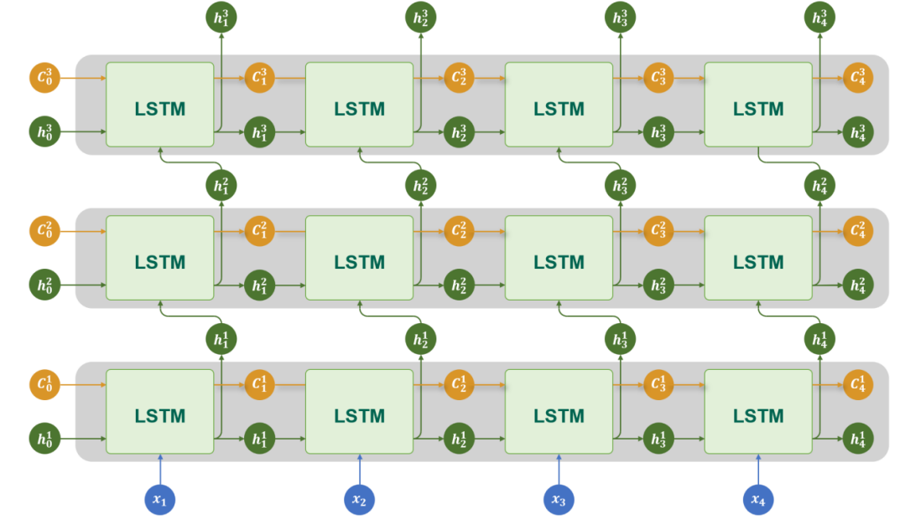

#### 3.2.4 双向结构

对于 LSTM，同样可以通过双向机制，利用序列中的过去信息和未来信息，进一步提升模型的建模能力。

在双向 LSTM 中，使用两套独立的 LSTM 网络：

正向 LSTM 按时间顺序处理输入序列；

反向 LSTM 按逆时间顺序处理输入序列。

每个时间步同时得到两个隐藏状态，通常将它们进行拼接，形成最终的输出，具体结构如下图所示：

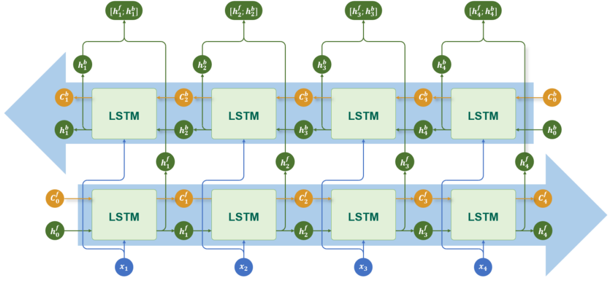

#### 3.2.5 多层+双向结构

对于LSTM而言，多层结构和双向结构也可组合使用，每层都是一个双向LSTM，如下图所示

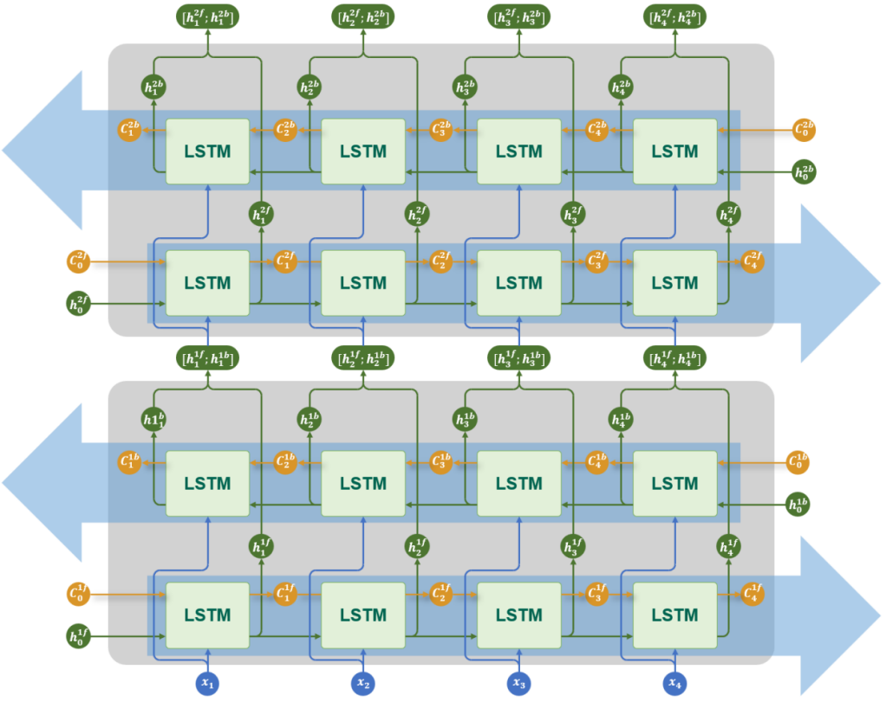

#### 3.2.6 API使用

torch.nn.LSTM 是 PyTorch 中实现长短期记忆网络（Long Short-Term Memory, LSTM）的模块。它用于对序列数据建模，在自然语言处理（NLP）、时间序列预测等任务中广泛使用。该模块支持单层或多层 LSTM，可选择是否使用双向结构（bidirectional）。

torch.nn.LSTM 与 torch.nn.RNN 的 API 十分相似，主要区别在于相较于 RNN，多了一个记忆单元需要处理。

##### 3.2.6.1 参数说明

构造RNN层所需的参数如下：

```python
torch.nn.LSTM(input_size, hidden_size, num_layers=1, bias=True, batch_first=False, dropout=0.0, bidirectional=False, proj_size=0, device=None, dtype=None)
```

各参数含义如下：

| 参数名        | 类型                | 说明                                                         |
| ------------- | ------------------- | ------------------------------------------------------------ |
| input_size    | int                 | 每个时间步输入特征的维度（词向量维度）                       |
| hidden_size   | int                 | 隐藏状态的维度                                               |
| num_layers    | int                 | RNN 层数，默认为 1                                           |
| nonlinearity  | str                 | 激活函数，'tanh'（默认）或 'relu'                            |
| bias          | bool                | 是否使用偏置项，默认 True                                    |
| batch_first   | bool                | 输入张量是否是 (batch, seq, feature)，默认 False 表示 (seq, batch, feature) |
| dropout       | float               | 除最后一层外，其余层之间的 dropout 概率                      |
| bidirectional | bool                | 是否为双向 RNN，默认 False                                   |
| proj_size     | int                 | 隐藏状态的投影输出维度；若为 0，则不使用 projection。（详见官方文档） |
| device        | torch.device or str | 模块的初始化设备，如 'cuda', 'cpu'                           |
| dtype         | torch.dtype         | 模块初始化时的默认数据类型，如 torch.float32, torch.float64  |

##### 3.2.6.2 输入输出

示例代码如下

```python
lstm = torch.nn.LSTM()
output, (h_n, c_n) = lstm(input, (h_0, c_0))
```

输入输出内容如下

| 参数   | 形状                                                   | 描述                                                         |
| ------ | ------------------------------------------------------ | ------------------------------------------------------------ |
| input  | (seq_len, batch_size, input_size)                      | 输入序列，如果 `batch_first=True`，则为 (batch_size, seq_len, input_size) |
| h_0    | (num_layers × num_directions, batch_size, hidden_size) | 可选，初始隐藏状态                                           |
| c_0    | (num_layers × num_directions, batch_size, hidden_size) | 可选，初始细胞状态                                           |
| output | (seq_len, batch_size, num_directions × hidden_size)    | LSTM层的输出，包含最后一层每个时间步的隐藏状态，如果 `batch_first=True`，则为 (batch_size, seq_len, num_directions × hidden_size) |
| h_n    | (num_layers × num_directions, batch_size, hidden_size) | 最后一个时间步的隐藏状态，包含每一层的每个方向               |
| c_n    | (num_layers × num_directions, batch_size, hidden_size) | 最后一个时间步的细胞状态，包含每一层的每个方向               |

输入输出形状如下

- 单层单向

  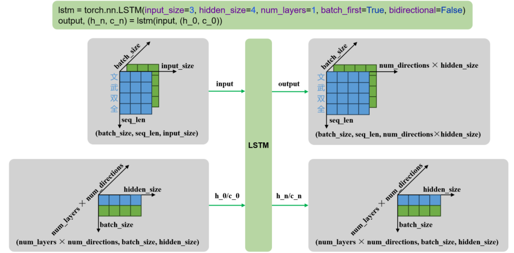

- 多层单向

  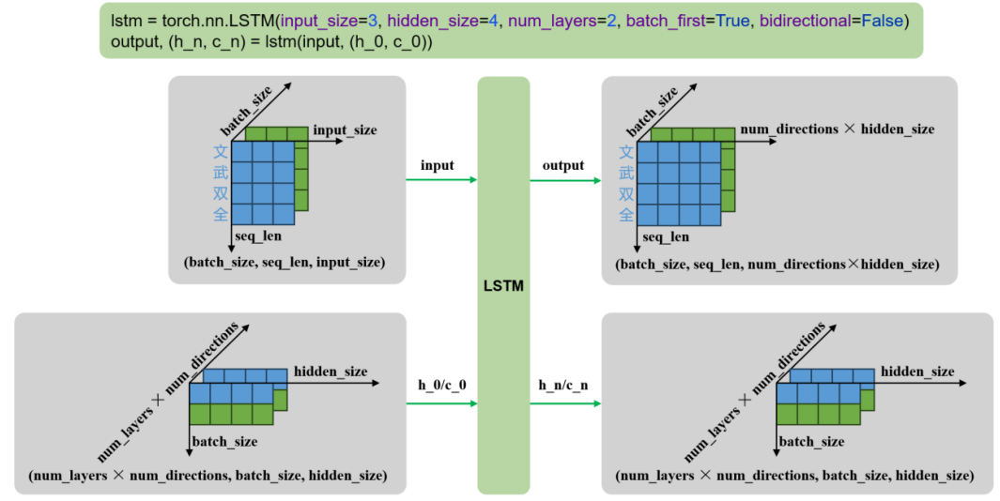

- 单层双向

  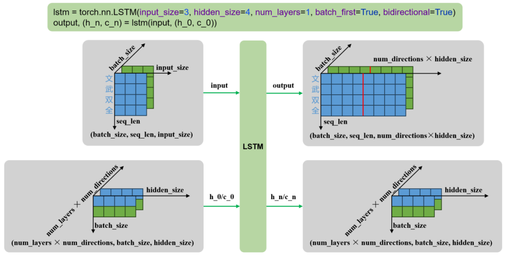

- 多层双向

  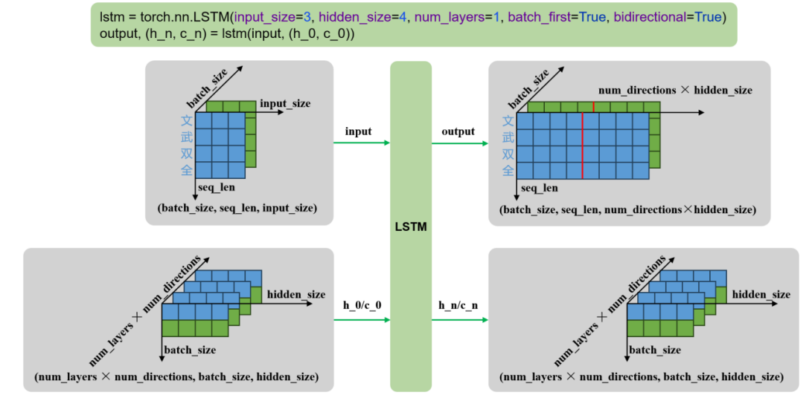

#### 3.2.7 案例实操（AI智评V1.0）

##### 3.2.7.1 需求说明

本案例的目标是基于 LSTM 构建一个文本情感分类模型，对评论内容进行二分类判断（正面或负面）。

##### 3.2.7.2 需求分析

1. 数据集处理

   本案例的目标对用户评论文本进行性感分类，因此需使用带有情感标签（正面/负面）的评论数据集。

   数据集来源为[ChineseNLPCorpus](#情感观点评论-倾向性分析)，格式CSV，具体结构如下：

   | cat  | label | review                                           |
   | ---- | ----- | ------------------------------------------------ |
   | 书籍 | 1     | 感谢于歌先生为大家带来这么精彩的一本好书！       |
   | 书籍 | 0     | 这本书纸质不怎样，内容也不怎样。                 |
   | 水果 | 1     | 苹果酸甜可口，大小适中，好吃。                   |
   | 水果 | 0     | 不是很大，比较甜，不会回购，感觉加运费后不划算。 |

2. 模型结构设计

   模型整体由以下三个主要部分组成：

   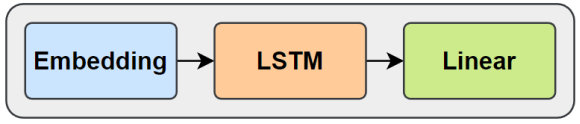

   - 嵌入层（Embedding）

     将输入的词或字索引映射为稠密向量表示，便于后续神经网络处理。

   - 长短期记忆网络（LSTM）

     用于建模输入序列的上下文信息，输出最后一个时间步的隐藏状态作为上下文表示。

   - 输出层（Linear）

     将 LSTM 的隐藏状态输出映射为一个标量，表示该评论为正面情感的倾向得分（经sigmod函数后，大于0.5判定为正面情感，小于等于0.5判定为负面情感）。

3. 训练方案

   - 损失函数：

     使用 BCEWithLogitsLoss，结合了sigmoid激活和二分类交叉熵计算，数值稳定且适合二分类任务。

   - 优化器：

     使用Adam优化器进行参数更新，提升训练效率。

4. 评估方案

   模型训练完毕后，使用测试集统计正确率。

##### 3.2.7.3 需求实现

- 项目结构

  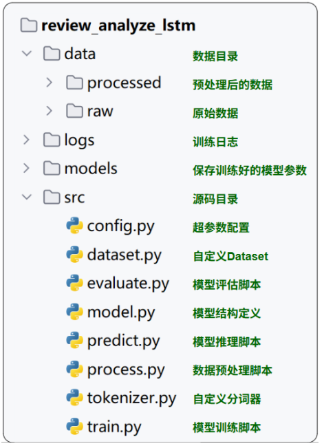

- 数据预处理

- 


