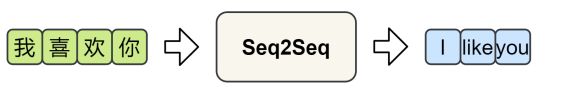
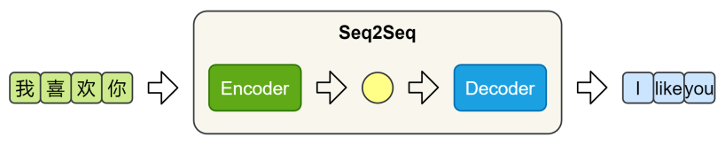
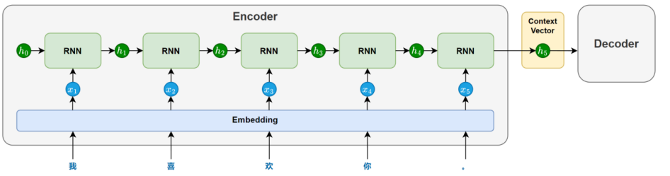
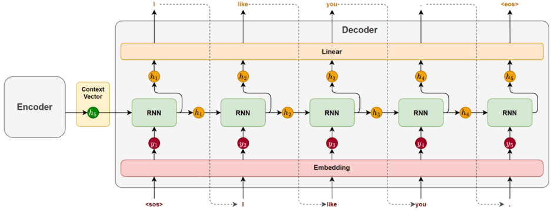
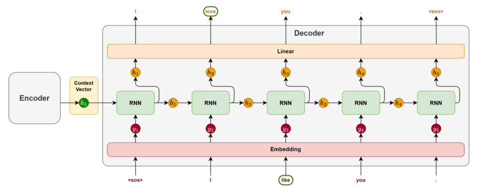
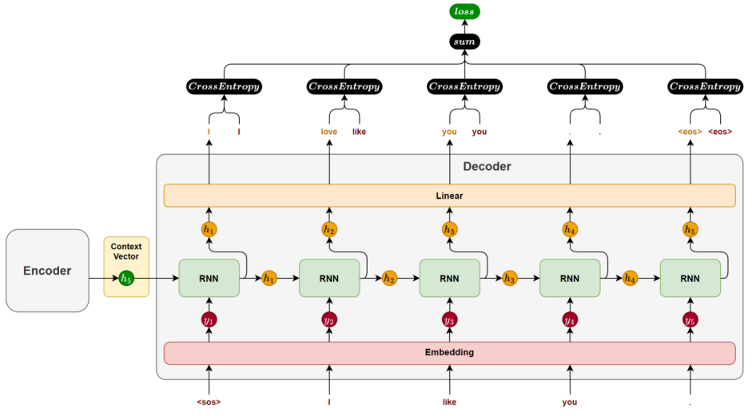
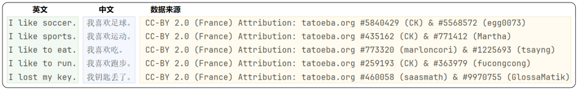
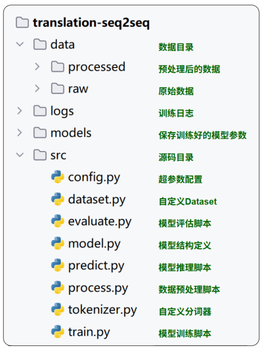

## 第04章_Seq2Seq模型

------

### 4.1 概述

传统的自然语言处理任务（如文本分类、序列标注）以**静态输出**为主，其目标是预测固定类别或标签。然而，现实中的许多应用需要模型**动态生成新的序列**，例如：

- **机器翻译**：输入中文句子，输出对应的英文翻译。
- **文本摘要**：输入长篇文章，生成简短的摘要。
- **问答系统**：输入用户问题，生成自然语言回答。
- **对话系统**：输入对话历史，生成连贯的下一条回复。

这些任务具有两个关键共同点：

- 输入和输出均为序列（如词、字符或子词序列）。
- 输入与输出序列长度动态可变（例如翻译任务中，中英文句子长度可能不同）。

为了解决这类问题，研究者提出了 **Seq2Seq（Sequence to Sequence，序列到序列）模型**。



### 4.2 模型结构详解

Seq2Seq 模型由一个编码器（Encoder）和一个解码器（Decoder）构成。编码器负责提取输入序列的语义信息，并将其压缩为一个固定长度的上下文向量（Context Vector）；解码器则基于该向量，逐步生成目标序列。



#### 4.2.1 编码器

编码器主要由一个循环神经网络（RNN/LSTM/GRU）构成，其任务是将输入序列的语义信息提取并压缩为一个上下文向量。

在模型处理输入序列时，循环神经网络会依次接收每个 token 的输入，并在每个时间步更新隐藏状态。每个隐藏状态都携带了截止到当前位置为止的信息。随着序列推进，信息不断累积，最终会在最后一个时间步形成一个包含整句信息的隐藏状态。

这个最后的隐藏状态就会作为上下文向量（context vector），传递给解码器，用于指导后续的序列生成。



为增强编码器的理解能力，循环网络也可以采用双向结构（结合前文与后文信息）或多层结构（提取更深的语义特征）。

#### 4.2.2 解码器

解码器主要也由一个循环神经网络（RNN / LSTM / GRU）构成，其任务是基于编码器传递的上下文向量，逐步生成目标序列。



在生成开始时，循环神经网络以上下文向量作为初始隐藏状态，并接收一个特殊的起始标记 `<sos>`（start of sentence）作为第一个时间步的输入，用于预测第一个 token。

随后，在每一个时间步，模型都会根据前一时刻的隐藏状态和上一步生成的 token，预测当前的输出。这种"将前一步的输出作为下一步输入"的方式被称为自回归生成（Autoregressive Generation），它确保了生成结果的连贯性。

生成过程会持续进行，直到模型生成了一个特殊的结束标记 `<eos>`（end of sentence），表示句子生成完成。

**说明：起始标记和结束标记会在训练数据中显式添加，模型会在训练中学会何时开始、如何续写，以及何时结束，从而掌握完整的生成流程。**

### 4.3 模型训练和推理机制

#### 4.3.1 模型训练

Seq2Seq 模型的训练目标，是在给定输入序列的条件下，逐步生成完整且准确的目标序列。下面以一个中–英机器翻译样本为例，说明训练过程的各个环节。

假设某个训练样本为：

中文输入：“我喜欢你。”

英文输出：“I like you.”

1. 数据准备

   为了让模型明确目标序列的起点和终点，通常在目标句前添加 <sos>（start of sequence），句末添加 <eos>（end of sequence）：

   “I like you.” → “<sos> I like you. <eos>”

   这两个特殊标记帮助模型学会从哪里开始生成，以及何时停止生成。

2. 前向传播

   模型由编码器和解码器两部分组成：

   - 编码器

     编码器接收源语言序列"我喜欢你。"，通过嵌入层和循环神经网络（RNN / LSTM / GRU）的逐步处理，将整句编码为上下文向量。

   - 解码器

     解码器使用该上下文向量初始化其隐藏状态，然后逐步生成目标序列。

     **需要特别注意的是，训练阶段与推理阶段的解码策略是不同的：**

     **推理阶段**，解码器采用自回归生成方式：每一步的输入是模型自己上一步的预测结果。

     **训练阶段**，通常使用一种称为 Teacher Forcing 的策略，即：解码器每一步的输入不是模型上一步的预测结果，而是目标序列中真实的前一个 token。

     如下图所示：

     

     这种做法带来了两个明显好处：

     - 训练更快，误差不会累积；
   - 梯度传播更稳定，有利于优化收敛；
   
3. 计算损失

   解码器每一步输出一个token的概率分布，我们通过交叉熵损失函数衡量模型对真实词的预测质量。训练过程中，每一个时间步都会产生一个损失值。该样本的总损失，就是所有时间步的损失值逐步累加的结果。

   

4. 反向传播

   在 PyTorch 中，调用 `loss.backward()` 即可自动完成梯度的反向传播。系统会沿时间维度展开计算图，自动完成所有参数的梯度计算，无需手动推导，实现简洁高效。

#### 4.3.2 模型推理

模型推理是Seq2Seq模型在实际任务中生成目标序列的过程，通常包括以下几个环节：

1. 编码器处理

   推理阶段的编码器处理流程与训练时完全一致。

   输入序列会经过分词、嵌入和循环神经网络的逐步处理，最终生成一个表示整句语义的上下文向量，该向量将作为解码器的初始隐藏状态，为生成过程提供语义基础。

2. 解码器处理

   解码器是推理过程的核心，其生成方式采用自回归生成（Autoregressive Generation）：每一步的输出会作为下一步的输入，逐步构造完整句子。

   - 自回归生成流程

     第一步，解码器接收起始标记 <sos>，生成第一个词；

     第二步，将上一步生成的词作为当前输入，再预测第二个词；

     持续重复以上过程，直到模型生成 <eos>，或达到设定的最大生成步数。

   - 词选择策略

     每个时间步，解码器输出的是一个词概率分布。我们需要从中选择一个具体词作为本时间步的输出，选择方式即为生成策略。常见策略包括：

     - 贪心解码（Greedy Decoding）

       每一步都选择概率最高的词。

       优点：简单高效

       缺点：容易陷入局部最优，生成不够多样。

     - 束搜索（Beam Search）

       每一步保留多个候选词序列（如 beam size = 3），并在扩展后选择得分最高的完整句子。

       优点：全局考虑，生成质量高

       缺点：计算开销大

### 4.4 案例实操（中英翻译V1.0）

#### 4.4.1 需求说明

本案例的目标是实现一个简易的中→英翻译模型，输入为中文句子（如“我喜欢你。”），输出为英文翻译结果（如“I like you.”）。

#### 4.4.2 需求分析

1. 数据处理

   本案例使用的数据集来自[阿里云天池平台](https://tianchi.aliyun.com/dataset/174937)，共包含 29,155 对中英文平行语句。原始文件为 TSV 格式，每行包含一对中文句子和对应的英文翻译，结构如下图所示：

   

   在本案例中，仅使用前两列数据：中文句子作为模型输入（源语言），英文句子作为模型输出（目标语言）。

   需要注意的是，输入和输出序列需要单独分词和构建词表，其中中文按照字粒度分词，英文使用[NLTK](https://www.nltk.org/howto/tokenize.html)分词工具。

2. 模型设计

   模型采用经典的 Seq2Seq 架构，由编码器（Encoder）与解码器（Decoder）两部分构成，具体结构如下：

   - 编码器

     编码器由两层组成：

     嵌入层（Embedding Layer）：将中文 token 序列映射为稠密向量。

     循环神经网络层（GRU）：为更好的提取输入序列的语义信息，采用双向GRU，最终拼接前向与后向的隐藏状态，作为上下文向量传递给解码器。

   - 解码器

     解码器由三层组成：

     嵌入层（Embedding Layer）：将目标序列中的token 转换为稠密向量。

     循环神经网络层（GRU）：结合前一步的词向量和隐藏状态，生成当前的隐藏状态。

     全连接层（Linear Layer）：将当前隐藏状态映射为词表大小的概率分布，用于预测下一个词。

3. 训练方案

   训练策略：采用 Teacher Forcing，即每一步使用目标序列中真实的前一个词作为解码器输入。

   损失函数：使用 CrossEntropyLoss。

   优化器：使用 Adam 优化器进行参数更新。

4. 推理方案

   推理阶段采用自回归生成策略（Autoregressive Generation）。

   词选择策略使用贪心解码（Greedy Decoding）。

5. 评估方案

   在机器翻译任务中，`BLEU（Bilingual Evaluation Understudy）`是一种常用的自动评估指标，用于衡量模型生成的翻译与人工参考译文之间的相似程度。其核心思想是：

   - n-gram 匹配：统计预测译文中有多少 n-gram（词或短语）同时出现在参考译文中，用于衡量翻译内容的准确性。

   - 精确率计算：将匹配到的 n-gram 数量除以预测译文中 n-gram 的总数，反映生成译文中"正确部分"的比例。

   此外，BLEU 还引入长度惩罚机制，防止模型通过生成过短句子获得不合理的高分。

   最终得到的 BLEU 分数越高，说明生成译文与参考译文越接近。

   本案例中，使用 Python 的 NLTK 库 中的 [bleu_score](#nltk.translate.bleu_score.corpus_bleu) 模块，对模型在测试集上的翻译结果进行评估，主要参考BLEU-4 的得分情况，作为翻译质量的衡量依据。

#### 4.4.3 需求实现

1. 项目结构

   

2. 完整代码

   - 数据预处理

     ```python
     import pandas as pd
     from sklearn.model_selection import train_test_split
     from tokenizer import EnglishTokenizer, ChineseTokenizer
     
     import config
     
     
     def process():
         print('开始处理数据')
         # 读取数据
         df = pd.read_csv(config.RAW_DATA_DIR / 'cmn.txt', sep='\t', header=None, usecols=[0, 1], encoding='utf-8',
                          names=["en", "zh"])
     
         # 过滤数据
         df = df.dropna()
         df = df[df['en'].str.strip().ne('') & df['zh'].str.strip().ne('')]
         # print(df.head())
     
         # 划分数据集
         train_df, test_df = train_test_split(df, test_size=0.2)
     
         # 构建词表
         ChineseTokenizer.build_vocab(train_df['zh'].tolist(), config.PROCESSED_DIR / 'zh_vocab.txt')
         EnglishTokenizer.build_vocab(train_df['en'].tolist(), config.PROCESSED_DIR / 'en_vocab.txt')
     
         # 构建tokenizer对象
         zh_tokenizer = ChineseTokenizer.from_vocab(config.PROCESSED_DIR / 'zh_vocab.txt')
         en_tokenizer = EnglishTokenizer.from_vocab(config.PROCESSED_DIR / 'en_vocab.txt')
     
         # 计算序列长度（95%分位数）
         # zh_len = train_df['zh'].apply(lambda x: len(zh_tokenizer.tokenize(x))).max()
         # en_len = train_df['en'].apply(lambda x: len(en_tokenizer.tokenize(x))).max()
         # print(zh_len,en_len)
     
         # 构建训练集
         train_df['zh'] = train_df['zh'].apply(lambda x: zh_tokenizer.encode(x, config.SEQ_LEN, add_sos_eos=False))
         train_df['en'] = train_df['en'].apply(lambda x: en_tokenizer.encode(x, config.SEQ_LEN, add_sos_eos=True))
         # 保存训练集
         train_df.to_json(config.PROCESSED_DIR / 'indexed_train.jsonl', orient='records', lines=True)
         # 构建测试集
         test_df['zh'] = test_df['zh'].apply(lambda x: zh_tokenizer.encode(x, config.SEQ_LEN, add_sos_eos=False))
         test_df['en'] = test_df['en'].apply(lambda x: en_tokenizer.encode(x, config.SEQ_LEN, add_sos_eos=True))
         # 保存测试集
         test_df.to_json(config.PROCESSED_DIR / 'indexed_test.jsonl', orient='records', lines=True)
     
         print('数据处理完成')
     
     
     if __name__ == '__main__':
         process()
     
     ```
   
   - 自定义分词器
   
     ```python
     from abc import abstractmethod
     
     import nltk
     from nltk import word_tokenize, TreebankWordDetokenizer
     from tqdm import tqdm
     
     
     class BaseTokenizer:
         unk_token = '<unk>'
         pad_token = '<pad>'
         sos_token = '<sos>'
         eos_token = '<eos>'
     
         def __init__(self, vocab_list):
             self.vocab_list = vocab_list
             self.vocab_size = len(vocab_list)
     
             self.word2index = {word: index for index, word in enumerate(vocab_list)}
             self.index2word = {index: word for index, word in enumerate(vocab_list)}
     
             self.unk_token_id = self.word2index.get(self.unk_token)
             self.pad_token_id = self.word2index.get(self.pad_token)
             self.sos_token_id = self.word2index.get(self.sos_token)
             self.eos_token_id = self.word2index.get(self.eos_token)
     
         @staticmethod
         @abstractmethod
         def tokenize(text):
             """
             分词抽象方法
             :param text: 文本
             :return:
             """
             pass
     
         @abstractmethod
         def decode(self, word_ids):
             """
             解码抽象方法
             :param word_ids: 索引
             :return: 字符串
             """
             pass
     
     
         def encode(self, text, seq_len, add_sos_eos=False):
             word_list = self.tokenize(text)
     
             if add_sos_eos:
                 if len(word_list) == seq_len - 2:
                     word_list = [self.sos_token] + word_list + [self.eos_token]
                 elif len(word_list) < seq_len - 2:
                     word_list = [self.sos_token] + word_list + [self.sos_token] + [self.pad_token] * (seq_len - len(word_list) - 2)
                 else:
                     word_list = [self.sos_token] + word_list[:seq_len - 2] + [self.eos_token]
             else:
                 # 补齐或截断到指定的seq_len
                 if len(word_list) > seq_len:
                     word_list = word_list[0:seq_len]
                 elif len(word_list) < seq_len:
                     word_list = word_list + [self.pad_token] * (seq_len - len(word_list))
     
             return [self.word2index.get(word, self.unk_token_id) for word in word_list]
     
         @classmethod
         def from_vocab(cls, vocab_file):
             # 1. 加载词表文件
             with open(vocab_file, 'r', encoding='utf-8') as f:
                 vocab_list = [line[:-1] for line in f.readlines()]
     
             # 2. 创建tokenizer对象
             return cls(vocab_list)
     
         @classmethod
         def build_vocab(cls, sentences, vocab_file):
             # 构建词表（用训练集）
             vocab_set = set()
             for sentence in tqdm(sentences, desc='构建词表'):
                 for word in cls.tokenize(sentence):
                     if word.strip() != '':  # 去除不可见的token
                         vocab_set.add(word)
             vocab_list = [cls.pad_token, cls.unk_token, cls.sos_token, cls.eos_token] + list(vocab_set)
             print(f'词表大小：{len(vocab_list)}')
     
             # 保存词表
             with open(vocab_file, 'w', encoding='utf-8') as f:
                 for word in vocab_list:
                     f.write(word + '\n')
             print('词表保存完成')
     
     
     class ChineseTokenizer(BaseTokenizer):
         @staticmethod
         def tokenize(text):
             return list(text)
     
         def decode(self, word_ids):
             word_list = [self.index2word[word_id] for word_id in word_ids]
             return ''.join(word_list)
     
     
     class EnglishTokenizer(BaseTokenizer):
         @staticmethod
         def tokenize(text):
             return word_tokenize(text)
     
         def decode(self, word_ids):
             word_list = [self.index2word[word_id] for word_id in word_ids]
             return  TreebankWordDetokenizer().detokenize(word_list)
     
     
     if __name__ == '__main__':
         print(ChineseTokenizer.tokenize("我喜欢乘坐地铁。"))
         print(EnglishTokenizer.tokenize("I'm happy."))
         print(EnglishTokenizer.tokenize('I am interested in Japanese history.'))
     ```
   
   - 自定义数据集
   
     ```python
     import pandas as pd
     import torch
     from torch.utils.data import Dataset, DataLoader
     import config
     
     
     # 1. 定义Dataset
     class TranslationDataset(Dataset):
         def __init__(self, data_path):
             self.data = pd.read_json(data_path, orient='records', lines=True).to_dict(orient='records')
     
         def __len__(self):
             return len(self.data)
     
         def __getitem__(self, index):
             input_tensor = torch.tensor(self.data[index]['zh'], dtype=torch.long)
             target_tensor = torch.tensor(self.data[index]['en'], dtype=torch.long)
             return input_tensor, target_tensor
     
     
     # 2. 获取DataLoader得方法
     def get_dataloader(train=True):
         data_path = config.PROCESSED_DIR / 'indexed_train.jsonl' if train else config.PROCESSED_DIR / 'indexed_test.jsonl'
         dataset = TranslationDataset(data_path)
         return DataLoader(dataset, batch_size=config.BATCH_SIZE, shuffle=True)
     
     
     if __name__ == '__main__':
         train_dataloader = get_dataloader(train=True)
         print(f'train batch个数：{len(train_dataloader)}')
         test_dataloader = get_dataloader(train=False)
         print(f'test batch个数：{len(test_dataloader)}')
     
         for inputs, targets in train_dataloader:
             print(f'inputs.shape:{inputs.shape}')  # [batch_size, seq_len]
             print(f'targets.shape:{targets.shape}')  # [batch_size,seq_len]
             break
     
     ```
   
   - 模型定义
   
     ```python
     from tensorboard import summary
     from torch import nn
     import torch
     import config
     
     
     # 编码器
     class TranslationEncoder(nn.Module):
         def __init__(self, vocab_size, padding_index):
             super().__init__()
             self.embedding = nn.Embedding(num_embeddings=vocab_size,
                                           embedding_dim=config.EMBEDDING_DIM,
                                           padding_idx=padding_index)
             self.gru = nn.GRU(input_size=config.EMBEDDING_DIM,
                               hidden_size=config.ENCODER_HIDDEN_SIZE,
                               batch_first=True,
                               num_layers=config.ENCODER_LAYERS,
                               bidirectional=True)
     
         def forward(self, x):
             # x.shape: [batch_size,seq_len]
             embed = self.embedding(x)
             # embed.shape: [batch_size,seq_len,embedding_dim]
             output, hidden = self.gru(embed)
             # hidden.shape: [num_layer * direction,batch_size,hidden_size]
             last_hidden_forward = hidden[-2]
             last_hidden_backward = hidden[-1]
             context_vector = torch.cat([last_hidden_forward, last_hidden_backward], dim=1)
             # context_vector.shape: [batch_size,hidden_size * 2]
             return context_vector
     
     
     class TranslationDecoder(nn.Module):
         def __init__(self, vocab_size, padding_index):
             super().__init__()
             self.embedding = nn.Embedding(
                 num_embeddings=vocab_size,
                 embedding_dim=config.EMBEDDING_DIM,
                 padding_idx=padding_index
             )
             self.gru = nn.GRU(
                 input_size=config.EMBEDDING_DIM,
                 hidden_size=config.DECODER_HIDDEN_SIZE,
                 batch_first=True
             )
             self.linear = nn.Linear(
                 in_features=config.DECODER_HIDDEN_SIZE,
                 out_features=vocab_size
             )
     
         def forward(self, tgt, hidden):
             embedded = self.embedding(tgt)  # (batch_size, 1, embedding_dim)
             output, hidden = self.gru(embedded, hidden)  # output: (batch_size, 1, hidden_dim)
             output = self.linear(output)  # (batch_size, 1, vocab_size)
             return output, hidden
     
     ```
   
   - 模型训练
   
     ```python
     import time
     from itertools import chain
     import torch
     from torch.utils.tensorboard import SummaryWriter
     from tqdm import tqdm
     
     from tokenizer import ChineseTokenizer, EnglishTokenizer
     import config
     from model import TranslationDecoder, TranslationEncoder
     from dataset import get_dataloader
     
     
     def train_one_epoch(dataloader, encoder, decoder, optimizer, loss_function, device):
         encoder.train()
         decoder.train()
         epoch_total_loss = 0
         for inputs, targets in tqdm(dataloader, desc='训练'):
             inputs = inputs.to(device)
             # inputs.shape：[batch_size,seq_len]
             targets = targets.to(device)
             # targets.shape: [batch_size,seq_len]
     
             optimizer.zero_grad()
     
             # 编码
             context_vector = encoder(inputs)
             # context_vector.shape: [batch_size,encoder_hidden_size]
     
             # 解码
             decoder_input = targets[:, 0:1]
             # decoder_input.shape: [batch_size,1]
             decoder_hidden = context_vector.unsqueeze(0)
             # decoder_hidden.shape: [1,batch_size,decoder_hidden_size]
     
             decoder_outputs = []
             # 1,seq_len次循环
             for t in range(1, targets.shape[1]):
                 decoder_output, decoder_hidden = decoder(decoder_input, decoder_hidden)
                 # decoder_output.shape: [batch_size, 1, vocab_size]
                 decoder_outputs.append(decoder_output)
                 decoder_input = targets[:,t:t+1]
             # 预测结果
             decoder_outputs = torch.cat(decoder_outputs, dim=1)
             # decoder_outputs.shape: [batch_size, seq_len-1, vocab_size]
             decoder_outputs = decoder_outputs.reshape(-1, decoder_outputs.shape[-1])
             # decoder_outputs.shape: [batch_size * (seq_len-1), vocab_size]
     
             # 期望值
             decoder_targets = targets[:, 1:]
             # decoder_targets.shape: [batch_size, seq_len-1]
             decoder_targets = decoder_targets.reshape(-1)
             # decoder_targets.shape: [batch_size * (seq_len-1)]
     
             # 计算损失
             loss = loss_function(decoder_outputs, decoder_targets)
     
             loss.backward()
             optimizer.step()
             epoch_total_loss += loss.item()
         return epoch_total_loss / len(dataloader)
     
     
     def train():
         device = torch.device('cuda' if torch.cuda.is_available() else 'cpu')
     
         # tokenizer
         zh_tokenizer = ChineseTokenizer.from_vocab(config.PROCESSED_DIR / 'zh_vocab.txt')
         en_tokenizer = EnglishTokenizer.from_vocab(config.PROCESSED_DIR / 'en_vocab.txt')
     
         # 模型
         encoder = TranslationEncoder(zh_tokenizer.vocab_size, zh_tokenizer.pad_token_id).to(device)
         decoder = TranslationDecoder(en_tokenizer.vocab_size, en_tokenizer.pad_token_id).to(device)
     
         # 加载数据
         dataloader = get_dataloader()
     
         # 损失函数
         loss_function = torch.nn.CrossEntropyLoss(ignore_index=en_tokenizer.pad_token_id)
     
         # 优化器
         optimizer = torch.optim.Adam(params=chain(encoder.parameters(), decoder.parameters()), lr=config.LEARNING_RATE)
     
         # tensorboard
         writer = SummaryWriter(config.LOGS_DIR / time.strftime('%Y-%m-%d_%H-%M-%S'))
     
         best_loss = float('inf')
         for epoch in range(1, 1 + config.EPOCHS):
             print(f'======= Epoch {epoch} =======')
             avg_loss = train_one_epoch(dataloader, encoder, decoder, optimizer, loss_function, device)
             print(f'Loss: {avg_loss:.4f}')
             writer.add_scalar('Loss', avg_loss, epoch)
             if avg_loss < best_loss:
                 best_loss = avg_loss
                 torch.save(encoder.state_dict(), config.MODELS_DIR / 'encoder.pt')
                 torch.save(decoder.state_dict(), config.MODELS_DIR / 'decoder.pt')
                 print('模型保存成功')
     
     
     if __name__ == '__main__':
         train()
     
     ```
   
   - 预测模型
   
     ```python
     
     ```
   
   - 评估模型
   
     ```python
     
     ```
   
   - 配置文件
   
     ```python
     from pathlib import Path
     
     ROOT_DIR = Path(__file__).parent.parent
     
     RAW_DATA_DIR = ROOT_DIR / 'data' / 'raw'
     PROCESSED_DIR = ROOT_DIR / 'data' / 'processed'
     LOGS_DIR = ROOT_DIR / 'logs'
     MODELS_DIR = ROOT_DIR / 'models'
     
     SEQ_LEN = 32
     BATCH_SIZE = 128
     EMBEDDING_DIM = 128
     ENCODER_HIDDEN_SIZE = 256
     DECODER_HIDDEN_SIZE = ENCODER_HIDDEN_SIZE * 2
     ENCODER_LAYERS = 1
     LEARNING_RATE = 1e-3
     EPOCHS = 30
     
     ```

### 4.5 存在问题

在上述 Seq2Seq 架构中，编码器会将整个源句压缩为一个固定长度的上下文向量，并将其作为解码器生成目标序列的唯一参考。这种“压缩再解压”的方式虽然结构简洁，但在实际任务中暴露出两个核心问题：

1. 在上述 Seq2Seq 架构中，编码器会将整个源句压缩为一个固定长度的上下文向量，并将其作为解码器生成目标序列的唯一参考。这种“压缩再解压”的方式虽然结构简洁，但在实际任务中暴露出两个核心问题：

   对于编码器而言，用一个定长向量去表达任意复杂的句子，是一项非常困难的任务。尤其在面对长句时，信息很容易在压缩过程中丢失，导致语义表达不完整。

   这种“信息瓶颈”限制了模型在处理长文本或复杂语义结构时的表现。

2. 缺乏动态感知，解码难以精准生成

   解码器始终只能基于同一个上下文向量进行生成。

   但在实际生成过程中，不同位置的目标词，往往依赖源句中不同的关键信息：

   生成主语时，可能更依赖源句的开头；

   生成谓语或宾语时，可能需要参考句中或句末内容。

   然而在固定表示下，解码器无法“有选择地关注”输入序列的不同部分，只能一视同仁地处理所有信息，从而降低了生成的准确性与灵活性。