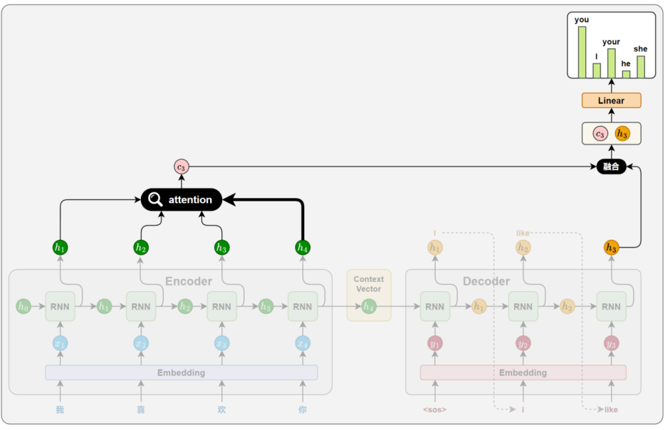
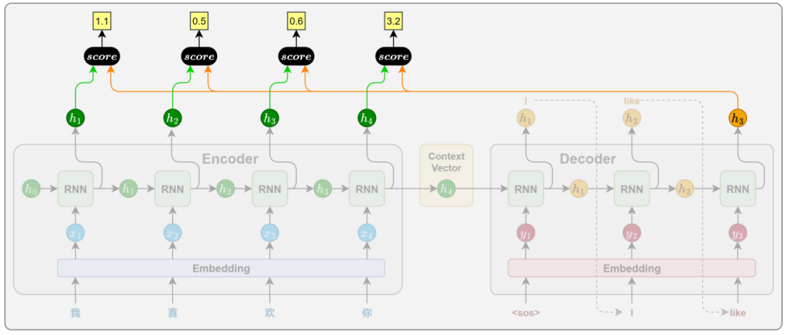
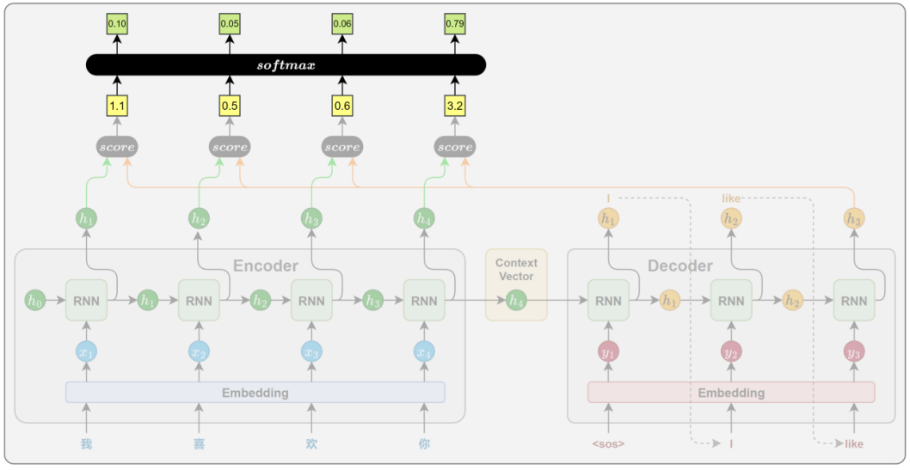
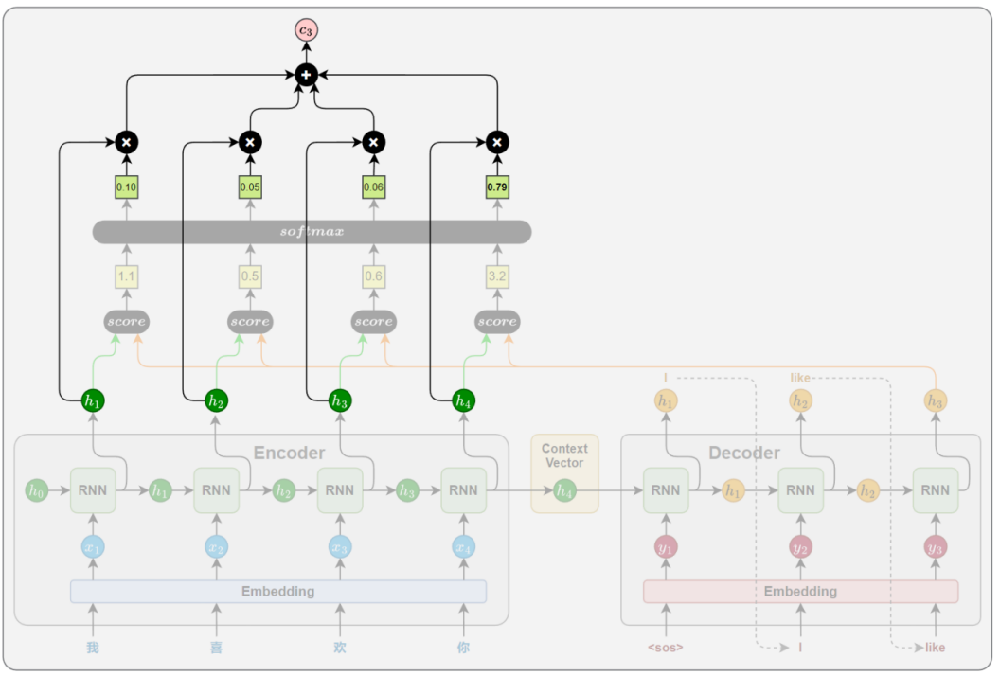
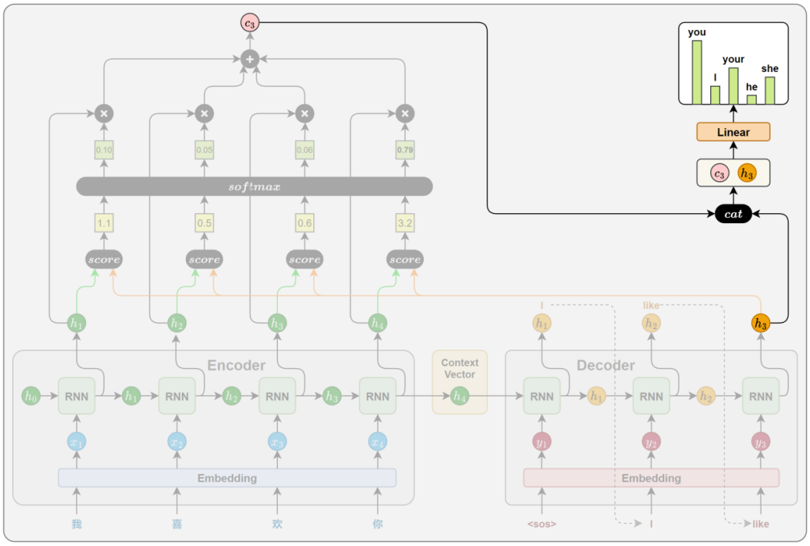
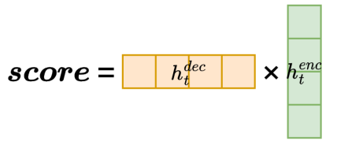
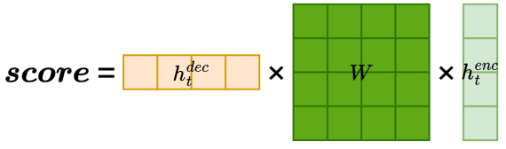
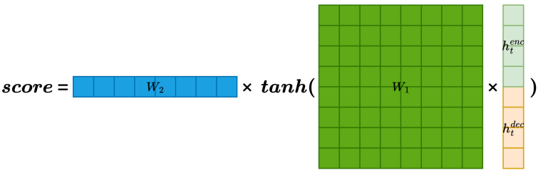
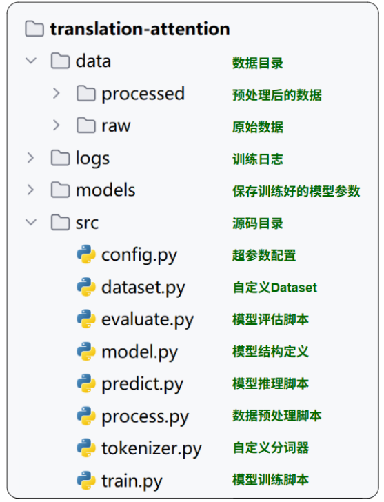

## 第05章_Attention机制

------

### 5.1 概述

传统的 Seq2Seq 模型中，编码器在处理源句时，无论其长度如何，最终都只能将整句信息压缩为一个固定长度的上下文向量，用作解码器的唯一参考。这种设计存在两个显著问题：

- 信息压缩困难：固定向量难以完整表达长句或复杂语义，容易丢失关键信息；
- 缺乏动态感知：解码器在每一步生成中都只能依赖同一个上下文向量，难以根据不同位置的生成需要灵活提取信息；

为了解决上述问题，研究者引入了 Attention 机制。其核心思想是：

解码器在生成目标序列的每一步时，不再依赖于一个静态的上下文向量，而是根据当前的解码状态，动态地从编码器各时间步的隐藏状态中选取最相关的信息，以辅助当前步的生成。

这种机制赋予模型“对齐”能力，使其能够自动判断源句中哪些位置对当前的目标词更为重要，从而有效缓解信息瓶颈问题，提升生成质量与表达能力。

### 5.2 工作原理

注意力机制的核心思想，是解码器在生成目标序列的每一步时，动态地从编码器的各个时间步的隐藏状态中提取当前所需的信息，而不再只依赖一个固定的上下文向量。



这一机制通常通过以下 4 个关键步骤实现：

#### 5.2.1 相关性计算

在目标序列生成的每一步，解码器都会计算当前时间步的隐藏状态与编码器各个时间步输出之间的相关性。这些相关性衡量了源句中每个位置对当前生成内容的重要程度，从而决定模型应将多少注意力分配给不同的源位置。

相关性的计算依赖于特定的函数，通常被称为注意力评分函数（attention scoring function）。常见的评分函数实现方式将在下一节中详细介绍。



#### 5.2.2 注意力权重计算

得到所有源位置的注意力评分后，使用 Softmax 函数将其归一化为概率分布，作为注意力权重。得分越高的位置，其对应的权重越大，代表模型在当前生成中更关注该位置的信息。



#### 5.2.3 上下文向量计算

将所有编码器输出按照注意力权重进行加权求和，得到一个上下文向量。这个向量就表示当前时间步，模型从源句中提取出的关键信息。



#### 5.2.4 解码信息融合

在得到上下文向量后，解码器将其与当前时间步的隐藏状态进行拼接，以融合两者信息，最终通过线性变换和 Softmax，生成当前时间步目标词的概率分布。



### 5.3 注意力评分函数

#### 5.3.1 概述

注意力评分函数有多种实现方式。本节将介绍三种常见的计算方法：点积评分（Dot）、通用点积评分（General）和拼接评分（Concat）。它们虽然在结构上各有差异，但本质上都是用于衡量解码器当前隐藏状态与编码器各时间步隐藏状态之间的相关性，并据此分配注意力权重。

#### 5.3.2 点积评分（Dot）

点积评分是注意力机制中最简单、最直接的一种相关性评分方法。它通过计算解码器当前时间步的隐藏状态与编码器每个时间步的隐藏状态的点积，来衡量二者之间的相关性：



其含义可以理解为：如果两个向量方向越一致（即越接近），它们的点积就越大，表示相关性越强，模型应当给予更多注意力。

#### 5.3.3 通用点积评分（General）

通用点积评分在点积的基础上引入了一个可学习的权重矩阵W,用于先对编码器隐藏状态进行线性变换，再与解码器隐藏状态进行点积：



该方法的设计动机主要是为了解决编码器和解码器隐藏状态维度不一致的问题。通过引入权重矩阵W，不仅实现了维度对齐，也增强了模型对编码器输出的适应能力，从而提升了注意力机制的表达能力。

#### 5.3.4 拼接评分（Concat）

拼接评分是一种表达能力更强的相关性评分方法。它的核心思想是：将解码器当前隐藏状态与编码器每个时间步的隐藏状态拼接为一个长向量，经过线性变换和非线性激活，最后用一个向量进行投影，得到最终打分值：



相比前两种方法，Concat 评分方式在建模能力上更强。它不仅考虑了两个状态的数值关系，还引入非线性变换，能够捕捉更复杂的交互模式，更适合处理对齐关系复杂的任务场景。

### 5.4 案例实操（中英翻译V2.0）

#### 5.4.1 需求说明

本案例要求在已有的 Seq2Seq 模型基础上，引入注意力机制，以提升模型在处理长句或复杂句时的表达能力和生成质量。

#### 5.4.2 需求实现

本案例要求在已有的 Seq2Seq 模型基础上，引入注意力机制，以提升模型在处理长句或复杂句时的表达能力和生成质量。

- 编码器

  编码器无需任何改变；

- 解码器

  解码器在每个时间步，都需要将当前隐藏状态与编码器输出序列共同用于计算注意力权重（使用点积评分函数）；之后根据权重对编码器各位置进行加权求和，得到上下文向量；最后再将上下文向量与当前解码状态拼接，作为输出的最终依据。

#### 5.4.3 需求实现

1. 项目结构

   

2. 完整代码

   - 数据预处理

     ```python
     
     ```

   - 自定义分词器

     ```python
     
     ```

   - 自定义数据集

     ```python
     
     ```

   - 模型定义

     ```python
     
     ```

   - 模型训练

     ```python
     
     ```

   - 预测模型

     ```python
     
     ```

   - 评估模型

     ```python
     
     ```

   - 配置文件

     ```python
     
     ```

### 5.5 存在问题

尽管注意力机制极大地增强了 Seq2Seq 模型的建模能力，但由于其核心依然依赖于 RNN 结构，仍面临两个根本性问题：

- 计算过程无法并行

  RNN 的时间步之间存在强依赖，必须顺序执行，限制了训练效率和硬件资源的利用率。

- 长期依赖问题仍未根除

  模型需要跨多个时间步传递信息，对于超长序列，训练过程中容易出现梯度消失，难以有效建模长距离依赖关系。