## 第06章_Transformer模型

------

### 6.1 概述

此前的Seq2Seq模型通过注意力机制取得了一定提升，但由于整体结构仍依赖 RNN，依然存在计算效率低、难以建模长距离依赖等结构性限制。

为了解决这些问题，Google在2017 年发表一篇论文《[Attention Is All You Need](https://arxiv.org/pdf/1706.03762)》，提出了一种全新的模型架构——Transformer。该模型完全摒弃了 RNN 结构，转而使用注意力机制直接建模序列中各位置之间的关系。通过这种方式，Transformer不仅显著提升了训练效率，也增强了模型对长距离依赖的建模能力。


Transformer 的提出对自然语言处理产生了深远影响。在机器翻译任务中，它首次超越了 RNN 模型的表现，并成为后续各类预训练语言模型的基础框架，如 BERT、GPT 等。这些模型推动 NLP 进入了“预训练 + 微调”的新时代，极大地提升了模型在多种任务上的通用性与性能。如今，Transformer 架构不仅广泛应用于 NLP，还扩展至语音识别、图像处理、代码生成等多个领域，成为现代深度学习中最具代表性的通用模型之一。

### 6.2 模型结构详解

#### 6.2.1 核心思想

在 Seq2Seq 模型中，注意力机制的引入显著增强了模型的表达能力。它允许解码器在生成每一个目标词时，根据当前解码状态动态选择源序列中最相关的位置，并据此融合信息。这一机制有效缓解了将整句信息压缩为固定向量所带来的信息瓶颈，显著提升了翻译等任务中的建模效果。

进一步分析可以发现，注意力机制不仅是信息提取的工具，其本质是在每一个目标位置上，显式建模该位置与源序列中各位置之间的依赖关系。

与此同时，循环神经网络（RNN）作为 Seq2Seq 模型的核心结构，其作用也在于建模序列中的依赖关系。通过隐藏状态的递归传递，RNN 使当前位置的表示能够整合前文信息，从而隐式捕捉上下文依赖。从功能角度看，RNN 与注意力机制完成的是同一类任务：建立序列中不同位置之间的依赖联系。

既然注意力机制也具备建模依赖关系的能力，那么理论上，它就可以在功能上替代 RNN。

此外，相比 RNN，注意力机制在结构上具备明显优势：无需顺序计算，便于并行处理；任意位置间可直接建立联系，更适合捕捉长距离依赖。因此，它不仅具备替代的可能，也在效率与效果上表现更优。

既然如此，是否可以将 Seq2Seq 中的 RNN 结构全部替换为注意力机制？

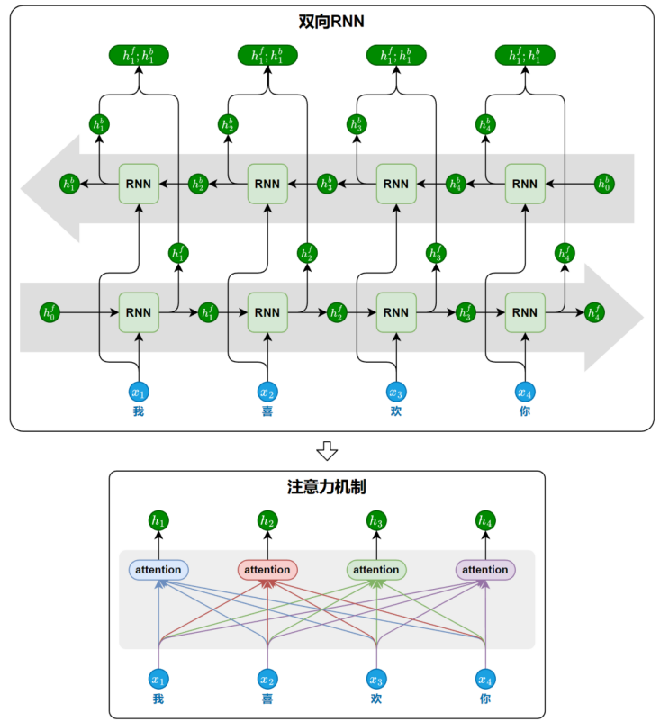

Transformer 模型正是在这一思路下诞生的。它摒弃了传统的递归结构，仅依靠注意力机制完成输入序列和输出序列中所有位置之间的依赖建模任务。这一结构上的彻底变革，也正是论文标题 Attention is All You Need 所体现的核心理念。

#### 6.2.2 整体结构

Transformer 的整体结构延续了 Seq2Seq 模型中 “编码器-解码器” 的设计理念，其中，编码器（Encoder）负责对输入序列进行理解和表示，而解码器（Decoder）则根据编码器的输出逐步生成目标序列。

与基于 RNN 的 Seq2Seq 模型一样，Transformer 的解码器采用自回归方式生成目标序列。不同之处在于，每一步的输入是此前已生成的全部词，模型会输出一个与输入长度相同的序列，但我们只取最后一个位置的结果作为当前预测。这个过程不断重复，直到生成结束标记 <eos>。

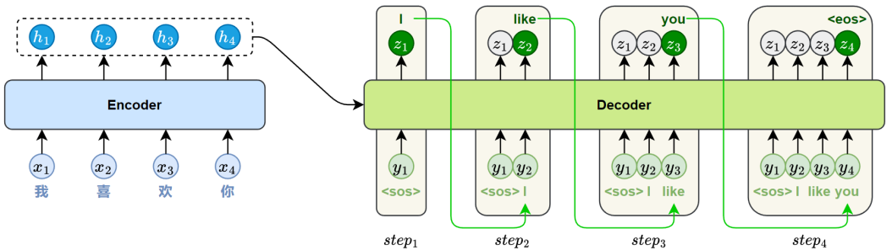

此外，Transformer 的编码器和解码器模块分别由多个结构相同的层堆叠而成。通过层层堆叠，模型能够逐步提取更深层次的语义特征，从而增强对复杂语言现象的建模能力。标准的 Transformer 模型通常包含 6个编码器层和 6 个解码器层。

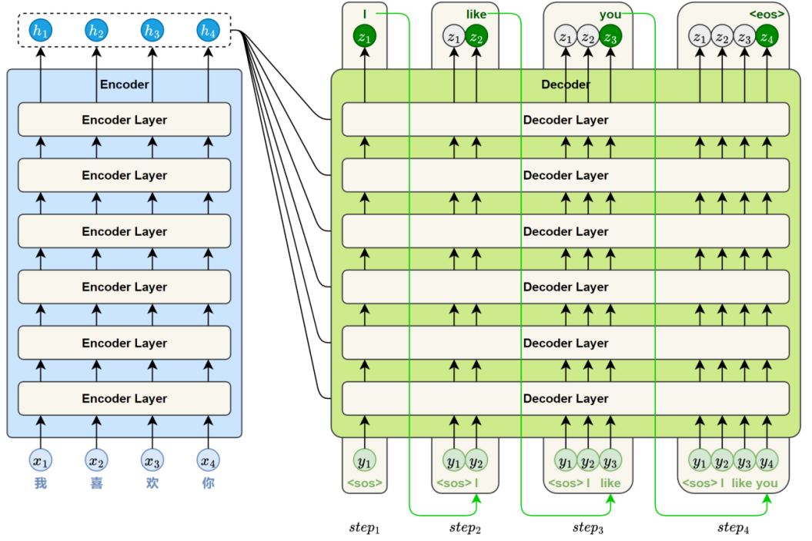

#### 6.2.3 编码器

##### 6.2.3.1 概述

Transformer 的编码器用于**理解输入序列的语义信息，并生成每个token的上下文表示**，为解码器生成目标序列提供基础。

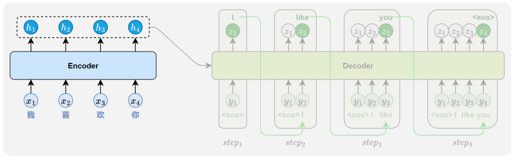

编码器由多个结构相同的编码器层（Encoder Layer）堆叠而成。

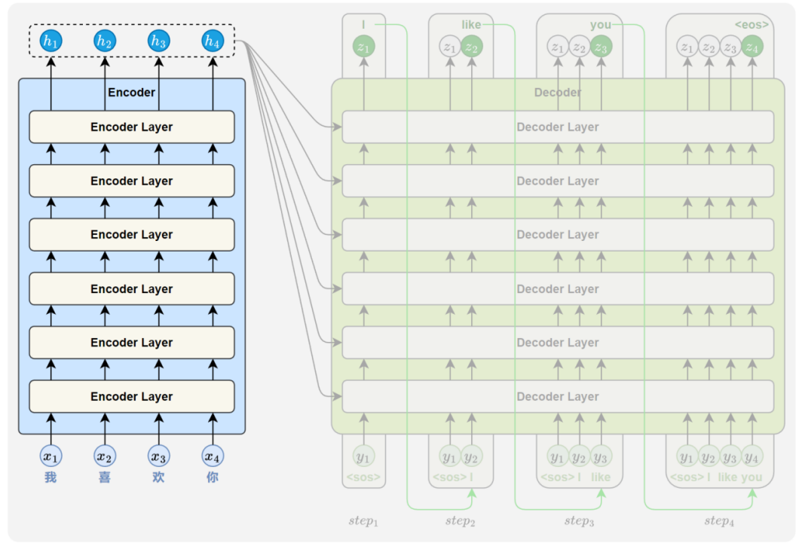

每个 Encoder Layer的主要任务都是对其输入序列进行上下文建模，使每个位置的表示都能融合来自整个序列的全局信息。每个 Encoder Layer都包含两个子层（sublayer），分别是自注意力子层（Self-Attention Sublayer）和前馈神经网络子层（Feed-Forward Sublayer）。

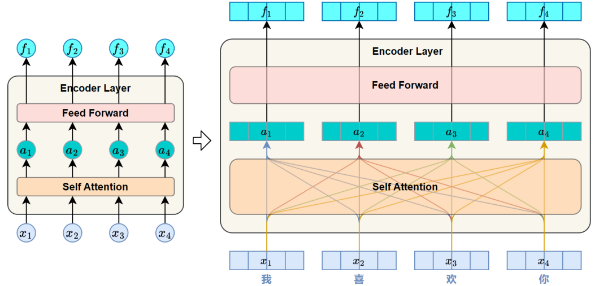

各层作用如下：

- Self-Attention

  用于捕捉序列中各位置之间的依赖关系。

- Feed-Forward

  用于对每个位置的表示进行非线性变换，从而提升模型的表达能力。

##### 6.2.3.2 自注意力层

自注意力机制（Self-Attention）是 Transformer 编码器的核心结构之一，它的作用是在序列内部建立各位置之间的依赖关系，使模型能够为每个位置生成融合全局信息的表示。

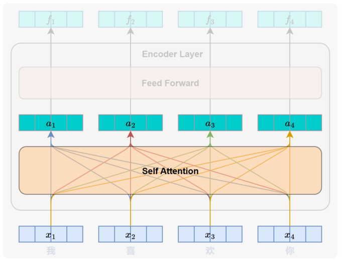

之所以被称为“自”注意力，是因为模型在计算每个位置的表示时，所参考的信息全部来自同一个输入序列本身，而不是来自另一个序列。

###### **自注意力计算过程**

1. 生成 Query、Key、Value 向量

   自注意力机制的第一步，是将输入序列中的每个位置表示映射为三个不同的向量，分别是 查询（Query）、键（Key） 和 值（Value）。

   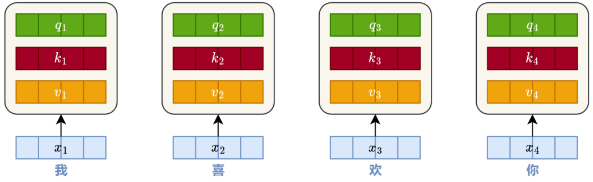

   Query：表示当前词的用于发起注意力匹配的向量；

   Key：表示序列中每个位置的内容标识，用于与 Query 进行匹配；

   Value：表示该位置携带的信息，用于加权汇总得到新的表示。

   >自注意力的核心思想是：每个位置用自身的 Query 向量，与整个序列中所有位置的 Key 向量进行相关性计算，从而得到注意力权重，并据此对对应的 Value 向量加权汇总，形成新的表示。

   三个向量的计算公式如下：

   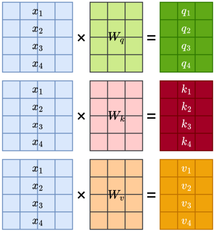

   其中 $W_q, W_k, W_v$ 均为可学习的参数矩阵。

2. 计算位置间相关性

   完成 Query、Key、Value 向量的生成后，模型会使用每个位置的 Query 向量与所有位置的 Key 向量进行相关性评分。

   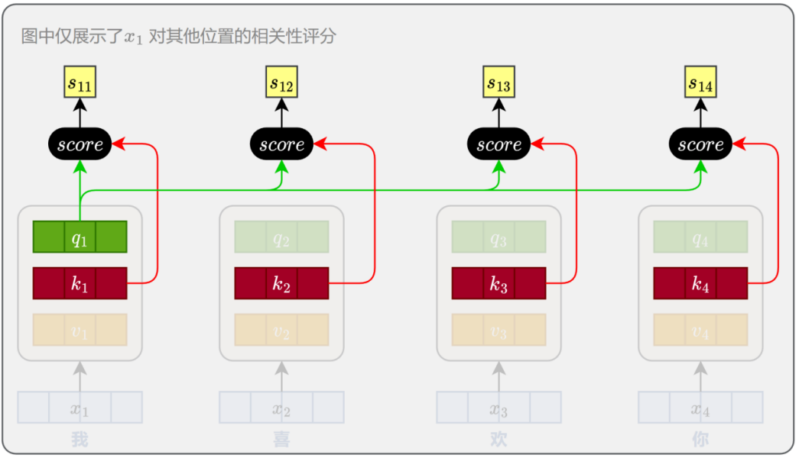

   评分函数采用向量点积形式。由于在高维空间中，点积的数值可能过大，会影响 softmax 的稳定性，因此在实际计算中对结果进行了缩放。最终的评分函数为：
   $$
   score(i, j) = \frac{q_i \cdot k_j}{\sqrt{d_k}}
   $$
   其中 $d_k$ 是 key 向量的维度，用于缩放点积的幅度。这个分数越大，表示第 $i$ 个位置越应该关注第 $j$ 个位置的信息。

   对于整个序列，可以通过矩阵运算一次性计算所有位置之间的评分，计算公式如下图所示：

   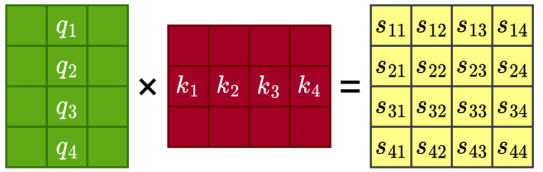

3. 计算注意力权重

   在得到每个位置与所有位置之间的相关性评分后，模型会使用 softmax 函数进行归一化，确保每个位置对所有位置的关注程度之和为 1，从而形成一个有效的加权分布。

   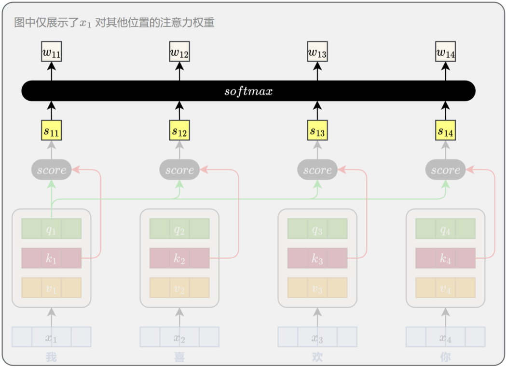

   对于整个序列，模型要做的是对之前得到的注意力评分矩阵的**每一行**进行`softmax`归一化。

   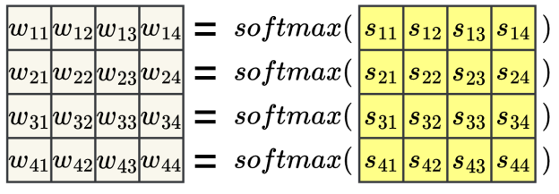

4. 加权汇总生成输出

   最后，模型会根据注意力权重对所有位置的 Value 向量进行加权求和，得到每个位置融合全局信息后的新表示。

   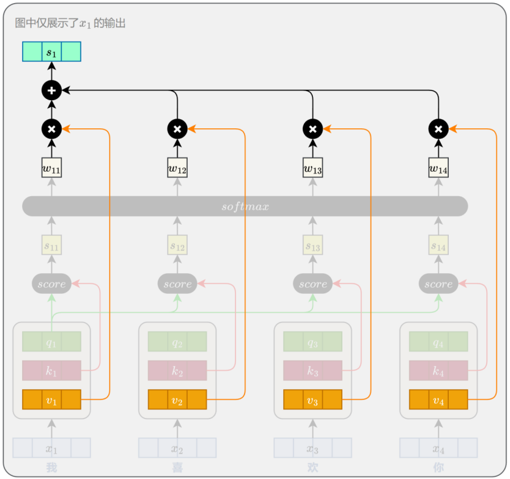

5. 对于整个序列，同样可以通过矩阵运算一次性计算所有位置的输出，如下图所示

   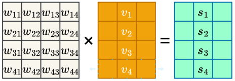

   综上所述，可得整个自注意力机制的完整的计算公式如下：

   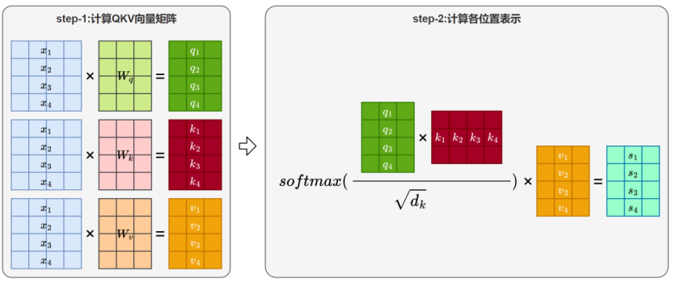

   对应[原始论文](https://arxiv.org/pdf/1706.03762)中的：
   $$
   Attention(Q, K, V) = softmax\left(\frac{QK^T}{\sqrt{d_k}}\right)V
   $$

###### 多头自注意力计算过程

自注意力机制通过 Query、Key 和 Value 向量计算每个位置与其他位置之间的依赖关系，使模型能够有效捕捉序列中的全局信息。

然而，自然语言本身具有高度的语义复杂性，一个句子往往同时包含多种类型的语义关系。例如，句子“那只动物没有过马路，因为它太累了”中就涉及多个层面的语言关系：

- "它"指代"那只动物"，属于跨句的代词关系；
- "因为"连接前后两个分句，体现语义上的因果逻辑；
- "过马路"构成动词短语，属于固定的动宾结构。

要准确理解这类句子，模型需要同时识别并建模多种层次和类型的依赖关系。但这些信息很难通过单一视角或一套注意力机制完整捕捉。

为此，Transformer 引入了 **多头注意力机制（Multi-Head Attention）**。其核心思想是通过多组独立的 Query、Key、Value 投影，让不同注意力头分别专注于不同的语义关系，最后将各头的输出拼接融合。

多头注意力的计算过程如下：

- 分别计算各头注意力

  每个 Self-Attention Head 独立计算一套注意力输出。

  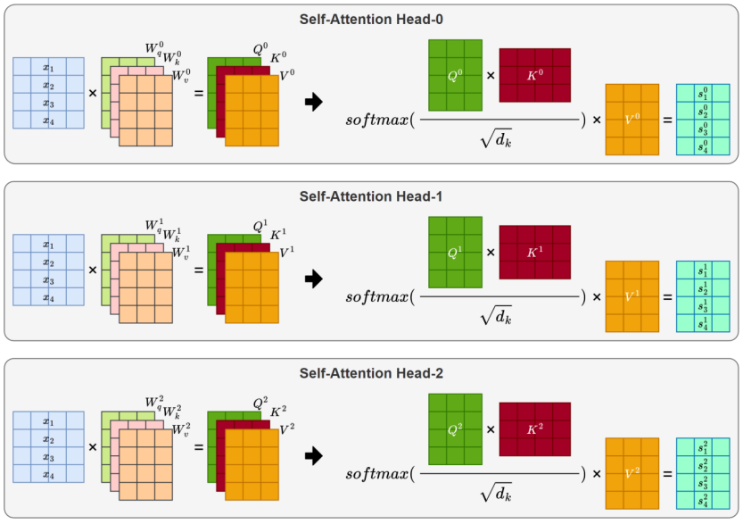

- 合并多头注意力

  多个输出矩阵按维度拼接，再乘以 $W_O$，得到最终多头注意力的输出。

  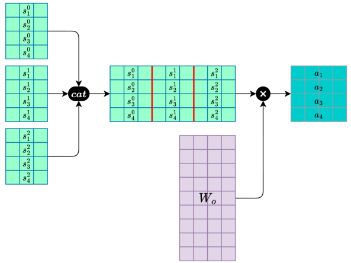

##### 6.3.3.3 前馈神经网络层

前馈神经网络（Feed-Forward Network，简称 FFN）是 Transformer 编码器中每个子层的重要组成部分，紧接在多头注意力子层之后。它通过对每个位置的表示进行**逐位置**、**非线性**的特征变换，进一步提升模型对复杂语义的建模能力。

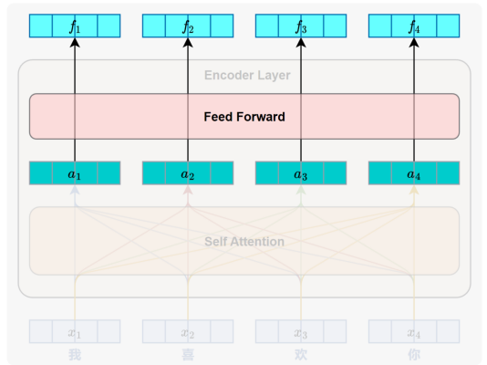

一个标准的 FFN 子层包含两个线性变换和一个非线性激活函数，中间通常使用 ReLU激活。其计算公式如下：
$$
FFN(x) = Linear_2(ReLU(Linear_1(x))) = W_2 \cdot ReLU(W_1x + b_1) + b_2
$$
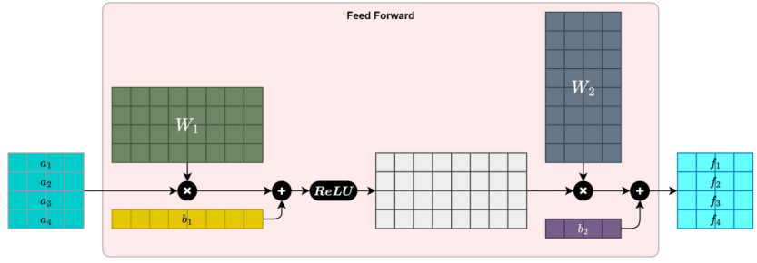

##### 6.2.3.4 残差连接与层归一化

在 Transformer 的每个编码器层中，每个子层，包括自注意力子层和前馈神经网络子层，其输出都要经过残差连接（Residual Connection）和层归一化（Layer Normalization）处理。这两者是深层神经网络中常用的结构，用于缓解模型训练中的梯度消失、收敛困难等问题，对于Transformer能够堆叠多层至关重要。

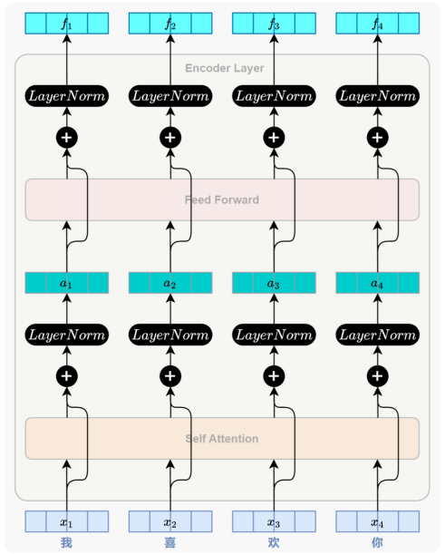

1. 残差连接

   残差连接（Residual Connection，也称“跳跃连接”或“捷径连接”）最初在计算机视觉领域被提出，用于缓解深层神经网络中的梯度消失问题。其核心思想是：

   将子层的输入直接与其输出相加，形成一条跨越子层的“捷径”，其数学形式为：
   $$
   y = x + SubLayer(x)
   $$
   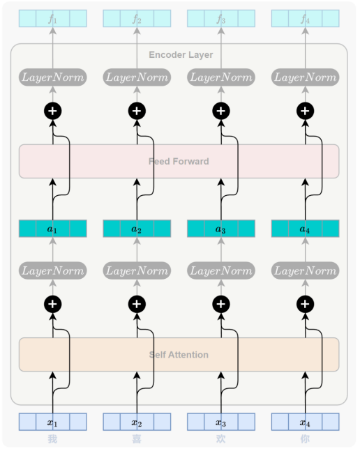

2. 层归一化

   每个子层在残差连接之后都会进行**层归一化（Layer Normalization，简称 LayerNorm）**。它的主要作用是规范输入序列中每个token的特征分布（某个token的表示可能在不同维度上有较大数值差异），提升模型训练的稳定性。

   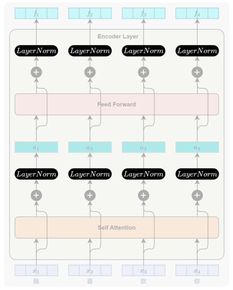

   该操作会将每个token的向量调整为均值为 0、方差为 1 的规范分布，具体效果如下图所示：

   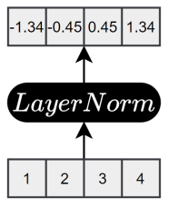

   具体的计算公式如下：

   1. 均值计算：

      计算该向量在所有特征维度上的平均值
      $$
      \mu = \frac{1}{d} \sum_{i=1}^{d} x^i
      $$
      其中 $d$ 为特征维度（向量长度）。

   2. 标准差计算

      计算向量各维度的标准差
      $$
      \sigma = \sqrt{\frac{1}{d} \sum_{i=1}^d (x^i - \mu)^2}
      $$

   3. 标准化变换

      将每个特征值转换为均值为 0、方差为 1 的标准正态分布；
      $$
      \tilde{x}^i = \frac{x^i - \mu}{\sigma + \epsilon}
      $$
      $\epsilon$ 为一个小的常数，防止出现除以 0 的情况。

   4. 缩放和平移

      让模型可以学习在归一化后的基础上进行适当的调整，保证归一化不会限制模型的表示能力。
      $$
      LayerNorm(x^i) = \gamma^i \cdot \tilde{x}^i + \beta^i
      $$
      $\gamma^i$ 和 $\beta^i$ 为可学习参数。

##### 6.2.3.5 位置编码

Transformer 模型完全摒弃了 RNN 结构，意味着它不再按顺序处理序列，而是可以并行处理所有位置的信息。尽管这带来了显著的计算效率提升，却也引发了一个问题：Transformer 无法像 RNN 那样天然地捕捉词语之间的顺序关系。换句话说，在没有额外机制的情况下，Transformer 无法区分“猫吃鱼”和“鱼吃猫”这类语序不同但词汇相同的句子。

为了解决这一问题，Transformer 引入了一个关键机制——位置编码（Positional Encoding）。该机制为每个词引入一个表示其位置信息的向量，并将其与对应的词向量相加，作为模型输入的一部分。这样一来，模型在处理每个词时，既能获取词义信息，也能感知其在句子中的位置，从而具备对基本语序的理解能力。

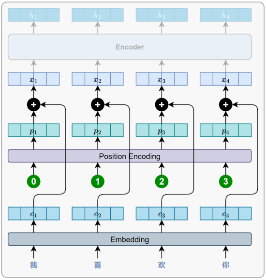

位置编码最直接的方式是使用**绝对位置编号**来表示每个词的位置，例如第一个词用 0，第二个词用 1，依此类推：

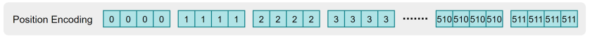

这样做虽然简单，但有一个明显的问题，越靠后的 token 位置编码就越大，若直接与词向量相加，会造成**数值倾斜**，让模型更关注位置，而忽视词义。

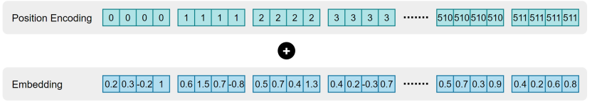

为缓解这一问题，可以考虑将位置编号归一化为 $[0, 1]$ 区间，例如用 $\frac{pos_T}{T}$ 表示位置，其中 $T$ 是句子长度。

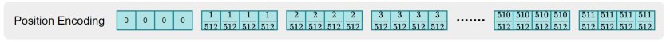

这种方式虽然使数值范围更平稳，但也引入了一个严重的问题：

**相同位置的词在不同长度句子中的位置编码不再一致.**

例如，位置 5 在长度为 10 的句子中被编码为 $\frac{5}{10}$，在长度为 1000 的句子中则为 $\frac{5}{1000}$。

这种依赖输入长度的表示方式会导致模型难以形成稳定的位置感知能力。理想的做法是：每个位置都拥有一个唯一且一致的编码，与句子长度无关。

为了解决上述问题，Transformer 使用了一种基于正弦（sin）和余弦（cos）函数的位置编码方式，具体定义如下：

$$
PE_{(pos,2i)} = \sin\left(\frac{pos}{10000^{2i/d_{model}}}\right)
$$

$$
PE_{(pos,2i+1)} = \cos\left(\frac{pos}{10000^{2i/d_{model}}}\right)
$$

其中：

- $pos$ 是当前词在序列中的位置；
- $i$ 用于表示位置编码向量的维度索引，$2i$ 表示偶数维，$2i+1$ 表示奇数维；
- $d_{model}$ 是词向量的维度大小。

序列中的每个位置 $pos$ 对应一个长度为 $d_{model}$ 的位置编码向量。该向量的**偶数维度**通过正弦函数生成，**奇数维度**通过余弦函数生成，如下图所示。

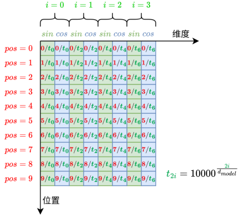

为帮助更直观地理解正余弦位置编码的构造和变化规律，可以使用以下可视化工具进行交互体验：

<iframe 
  src="https://beanmeat.github.io/ChaseTian/Position-Encoding.html" 
  width="100%" 
  height="600" 
  style="border: none;"
>
</iframe>

Transformer提出的这种编码方式不依赖任何可学习参数，数值稳定，并具备以下优势：

- 所有值都在[−1,1]范围内，数值稳定
- 编码方式固定、可预计算，无需训练
- 相同位置的编码在不同句子中保持一致
- 编码之间具有数学规律，便于模型在注意力机制中感知词语之间的相对位置关系

##### 6.2.3.6 小结

Transformer 编码器通过多个结构一致的编码器层堆叠构成，每一层由两个核心子层组成：

1. 自注意力子层（Self-Attention）：

   通过 Query、Key、Value 向量机制计算全序列中各位置之间的相关性，提取全局上下文信息，使每个词的表示能够融合整个序列的信息。

2. 前馈神经网络子层（Feed-Forward Network）：

   对每个位置独立进行非线性特征变换，增强模型的表示能力。

   另外，在这两个子层之后，Transformer 引入了两个关键结构：

   - 残差连接（Residual Connection）：缓解深层网络中的梯度消失问题
   - 层归一化（Layer Normalization）：规范向量分布，提升训练稳定性

最后，为弥补模型并行结构下缺乏顺序感的缺陷，Transformer 使用基于正余弦函数的位置编码来提供序列中每个词的位置信息。

编码器的完整结构如下图所示：

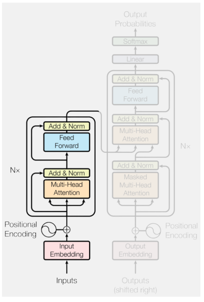

#### 6.2.4 解码器

##### 6.2.4.1 概述

Transformer 解码器的主要功能是：根据编码器的输出，逐步生成目标序列中的每一个词。其生成方式采用自回归机制（autoregressive）：每一步的输入由此前已生成的所有词组成，模型将输出一个与当前输入长度相同的序列表示。我们只取最后一个位置的输出，作为当前步的预测结果。这一过程会不断重复，直到生成特殊的结束标记 <eos>，表示序列生成完成。

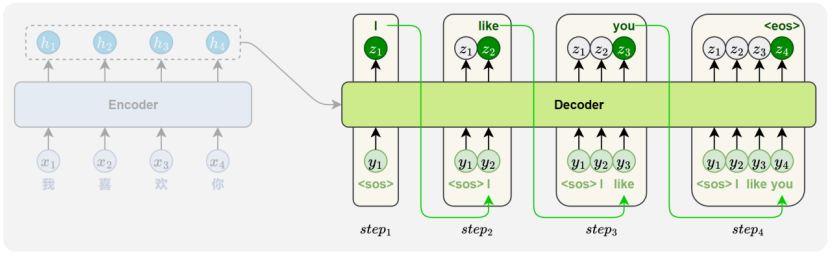

编码器也由多个结构相同的解码器层堆叠组成。

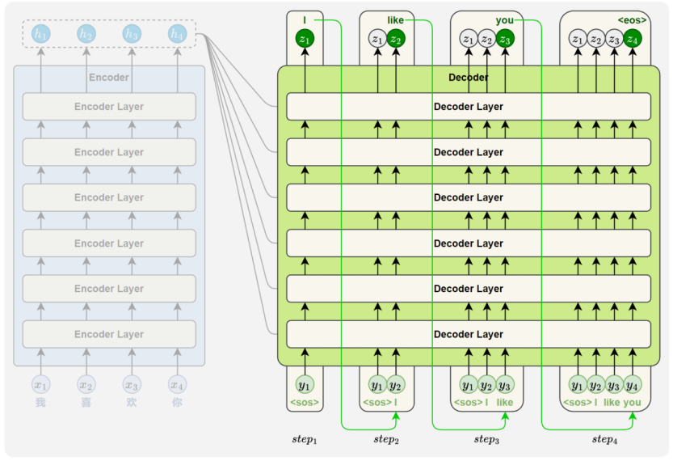

每个Decoder Layer都包含三个子层，分别是Masked自注意力子层、编码器-解码器注意力子层（Encoder-Decoder Attention）和前馈神经网络子层（Feed-Forward Network）。

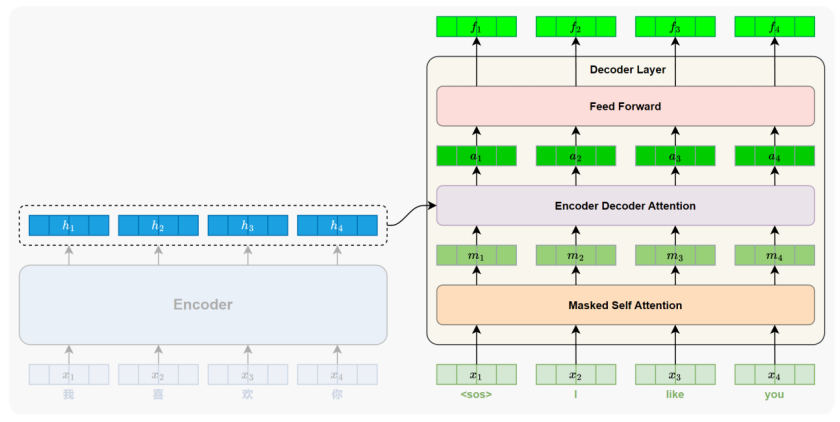

各层作用如下：

- Masked自注意力子层（Masked Self Attention）

  用于建模当前位置与前文词之间的依赖关系。为了在训练时模拟逐词生成的过程，引入遮盖机制（Mask），限制每个位置只能关注它前面的词。

- 码器-解码器注意力子层（Encoder-Decoder Attention）

  用于建模当前解码位置与源序列各位置之间的依赖关系。通过注意力机制，模型能够根据当前状态从编码器的输出中提取相关上下文信息（相当于 Seq2Seq 模型中的 Attention 机制）。

- 前馈神经网络子层（Feed-Forward Network）

  与编码器中结构完全一致，对每个位置的表示进行非线性变换，增强模型的表达能力。

   

  每个子层后也都配有**残差连接**与**层归一化（Layer Normalization）**，结构设计与编码器保持一致，确保训练的稳定性和效率。

  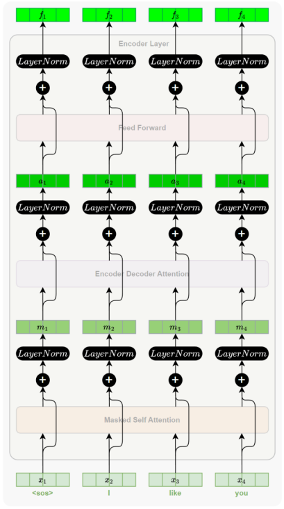

  此外，解码器在输入端同样需要加入 **位置编码（Positional Encoding）**，用于提供序列中的位置信息，其计算方式与编码器中相同。

  在输出端，解码器的隐藏向量会送入一个 **线性变换层（Linear）**，映射为词表大小的向量，并通过 **Softmax** 生成一个概率分布，用于预测当前应输出的词。

##### 6.2.4.2 Masked 自注意力子层

该子层的主要作用是：建模目标序列中当前位置与前文之间的依赖关系，为当前词的生成提供上下文语义支持。

由于Transformer不具备像RNN那样的隐藏状态传递机制，无法在序列生成过程中保留上下文信息，因此在生成每一个词时，必须将此前已生成的所有词作为输入，通过自注意力机制重新建模上下文关系，以预测下一个词。

此外，从结构上看，Transformer编解码器都具有一个典型特性：**输入多少个词，就输出多少个表示**。需要注意的是，在推理阶段，我们只使用解码器**最后一个位置的输出**作为当前步的预测结果，如下图所示：

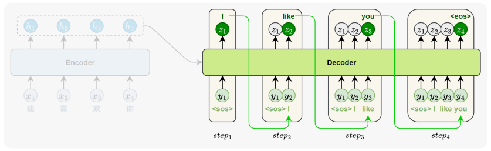

如果训练阶段也完全按照推理流程进行，就必须将每个目标序列拆分成多个训练样本，每个样本输入一段前文，只预测一个词。如下图所示：

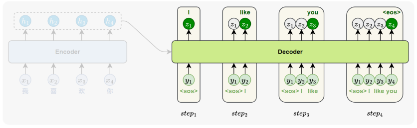

这种方式虽然逻辑合理，但训练效率极低，完全无法利用 Transformer 并行计算的优势。

为提升效率，Transformer 采用了并行训练策略：一次性输入完整目标序列，同时预测每个位置的词。如下图所示：

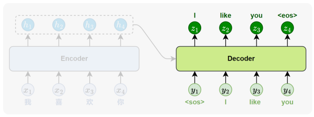

但如果不加限制，这种方式会让模型在预测每个位置时“看到”后面的词，即提前访问未来信息，破坏生成任务的因果结构，如下图所示：

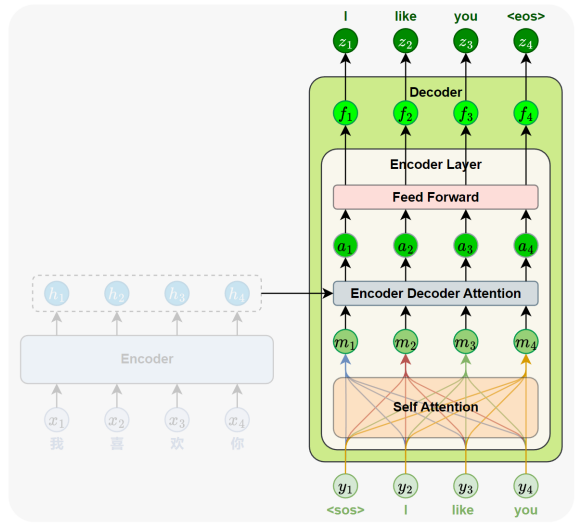

为解决这个问题，解码器在自注意力机制中引入了**遮盖机制（Mask）**。该机制会在计算注意力时，**阻止模型访问当前位置之后的词**，只允许它依赖自身及前文的信息。这样，即使在并行训练时，模型也只能像逐词生成一样"看见"它应该看到的内容，从而保持训练与推理阶段的一致性。如下图所示：

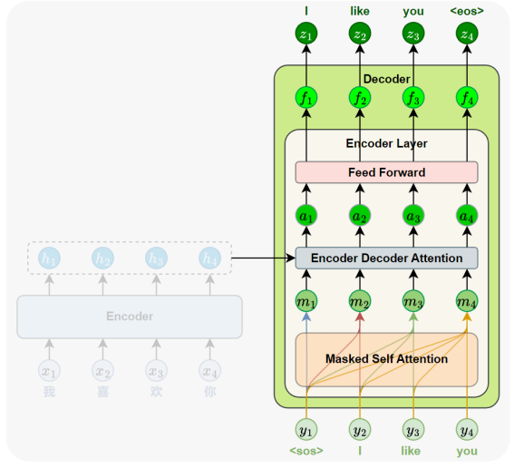

Mask 机制的实现非常简单：只需将注意力得分矩阵中当前位置对其后续位置的评分设置为 $-\infty$，如下图所示：

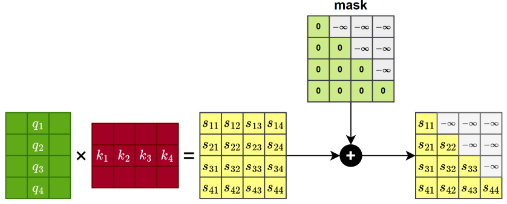

这样，在经过 `softmax` 运算后，这些位置的权重会趋近于 0。最终在加权求和时，来自未来位置的信息几乎不会参与计算，从而实现了"**当前词只能看到它前面的词**"的约束。如下图所示：

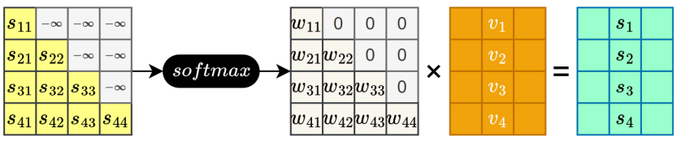

##### 6.2.4.3 编码器-解码器注意力子层

该子层的主要作用是：**建模当前解码位置与源语言序列中各位置之间的依赖关系**，帮助模型在生成目标词时有效地参考输入内容，相当于 Seq2Seq 模型中的注意力机制。

编码器-解码器注意力的核心机制与前面讲过的自注意力机制完全一致，区别仅在于：

- **Query** 来自解码器当前的输入表示，即当前生成状态；
- **Key** 和 **Value** 来自编码器的输出表示，即整个源序列的上下文。

也就是说，当前生成位置使用自己的 **Query**，去"询问"编码器输出中的哪些位置最相关。注意力机制会根据 **Query** 与所有 **Key** 的相似度，为每个源位置分配一个权重，然后用这些权重对 **Value** 进行加权求和，得到当前生成词所需的上下文信息。

##### 6.2.4.4 小结

Transformer 解码器通过自回归方式，逐步生成目标序列中的每一个词。其内部由多个结构相同的解码器层堆叠构成，每一层包含三个核心子层：

- **Masked 自注意力子层**：
  负责建模目标序列内部的上下文关系。通过引入遮盖机制（Mask），限制训练时每个位置只能关注它前面的词，从而在结构上模拟逐词生成，防止信息泄露。

- **编码器-解码器注意力子层**：
  负责建模目标序列与源序列之间的依赖关系。该机制允许解码器根据当前生成状态动态聚焦源语言中的关键信息，实现跨序列的信息对齐。

- **前馈神经网络子层**：
  对每个位置的表示进行独立的非线性变换，增强模型的表达能力，与编码器中的结构一致。

为了确保训练稳定，每个子层之后都配有 **残差连接与层归一化（LayerNorm）**，与编码器的设计保持一致，便于模型堆叠和优化。

此外，解码器同样采用了 **位置编码** 来注入顺序信息；输出端则通过 **线性变换和 Softmax** 层将隐藏表示映射为词表概率分布，从而逐步生成目标序列。

在输出阶段，解码器最后会通过一个 **线性层 + Softmax** 将隐藏表示映射为词表上的概率分布，逐步生成完整的目标句子。

整体来看，Transformer 解码器通过合理设计的多层结构与注意力机制，既保持了训练效率，又满足了生成任务的因果约束，是现代自然语言生成模型的核心组件之一。

解码器完整结构如下图所示：

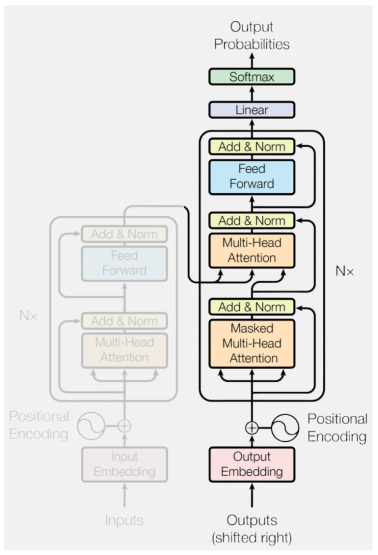

### 6.3 模型训练与推理机制

Transformer 的训练与推理都基于自回归生成机制（Autoregressive Generation）：模型逐步生成目标序列中的每一个词。然而，在实现方式上，训练与推理存在明显区别。

#### 6.3.1 模型训练

训练时，Transformer 将目标序列整体输入解码器，并在每个位置同时进行预测。为防止模型“看到”后面的词，破坏因果顺序，解码器在自注意力机子层中引入了 遮盖机制（Mask），限制每个位置只能关注它前面的词。

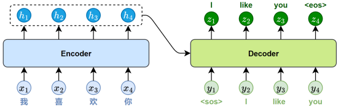

这种机制让模型在结构上模拟逐词生成，但在实现上能充分利用并行计算，大幅提升训练效率。

#### 6.3.2 模型推理

推理时，每一步都要重新输入整个已生成序列，模型需要基于全量前文重新计算注意力分布，决定下一个词的输出。整个过程必须顺序执行，无法并行。

推理阶段，模型每一步都要重新输入当前已生成的全部词，通过自注意力机制建模上下文关系，预测下一个词。

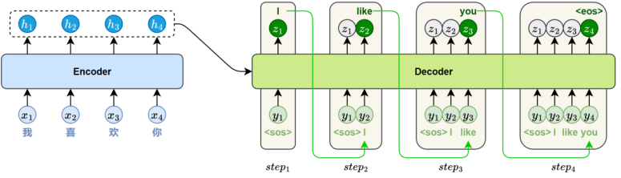

模型会基于完整前文重新计算注意力分布，生成当前步的输出。由于每一步的输入依赖前一步结果，整个过程必须**顺序执行，无法并行**。

每步输出的是一个词的概率分布，最终生成结果也可使用不同的解码策略（如贪心搜索、束搜索等）。

### 6.4 API使用

#### 6.4.1 概述

PyTorch 提供了对 [Transformer ](#transformer-layers)的官方实现，该模块封装了完整的编码器-解码器结构，可直接应用于机器翻译、文本生成等典型的序列建模任务。

#### 6.4.2 核心类

PyTorch 中的 Transformer 模块由以下几个核心类构成：

1. nn.Transformer

   封装了完整的 Transformer架构，由编码器和解码器组成。作为顶层接口，适用于需要同时使用编码器和解码器的任务，如机器翻译。支持用户通过参数自定义层数、注意力头数、隐藏维度等模型结构。

2. nn.TransformerEncoder

   实现了Transformer编码器结构，由多个编码器层的堆叠而成，用于将输入序列编码为上下文相关的表示。

3. nn.TransformerDecoder

   实现了Transformer解码器结构，由多个解码器层堆叠而成，用于基于编码结果逐步生成目标序列。

4. nn.TransformerEncoderLayer 

   实现了单个编码器层结构，包含一个多头自注意力子层和一个前馈神经网络子层，两者均带有残差连接和 LayerNorm。

5. nn.TransformerDecoderLayer

   实现了单个解码器层结构，包含自注意力、编码器-解码器注意力、前馈子层，同样配有残差连接和 LayerNorm。

#### 6.4.3 Transformer构造参数

```python
torch.nn.Transformer(
    d_model=512,
    nhead=8,
    num_encoder_layers=6,
    num_decoder_layers=6,
    dim_feedforward=2048,
    dropout=0.1,
    activation='relu',
    custom_encoder=None,
    custom_decoder=None,
    layer_norm_eps=1e-05,
    batch_first=False,
    norm_first=False,
    bias=True,
    device=None,
    dtype=None
)
```

1. 基础核心参数

   | 参数名             | 默认值 | 说明                                                         |
   | ------------------ | ------ | ------------------------------------------------------------ |
   | d_model            | 512    | 编码器和解码器输入的特征维度，即每个 token 的表示向量长度。  |
   | nhead              | 8      | 多头注意力中的头数，要求 d_model 能被整除。                  |
   | num_encoder_layers | 6      | 编码器中堆叠的层数，决定模型深度。                           |
   | num_decoder_layers | 6      | 解码器中堆叠的层数，结构与编码器相似。                       |
   | dim_feedforward    | 2048   | 前馈神经网络中的隐藏层维度，默认是 d_model 的 4 倍。         |
   | dropout            | 0.1    | Dropout 概率，用于缓解过拟合，作用于注意力层和前馈层。       |
   | batch_first        | False  | 若设为 True，输入和输出张量的维度格式为 (batch_size, seq_len, d_model)；否则为 (seq_len, batch_size, d_model)。推荐设为 True。 |
   | device             | None   | 模型参数所使用的设备，如 'cuda' 或 'cpu'。                   |
   | dtype              | None   | 模型参数的数据类型，如 torch.float32 或 torch.float16。      |

2. 高级参数

   | 参数名         | 默认值 | 说明                                                         |
   | -------------- | ------ | ------------------------------------------------------------ |
   | activation     | 'relu' | 编码器/解码器中间层的激活函数，支持字符串（'relu' 或 'gelu'）或自定义函数。 |
   | custom_encoder | None   | 自定义编码器模块。                                           |
   | custom_decoder | None   | 自定义解码器模块。                                           |
   | layer_norm_eps | 1e-5   | LayerNorm 层中的 epsilon 值，用于防止除零。                  |
   | norm_first     | False  | 若为 True，编码器和解码器层将在注意力或前馈操作之前执行 LayerNorm。 |
   | bias           | True   | 若为 False，则所有 Linear 和 LayerNorm 层不使用偏置项。      |

示例代码如下：

```python
from torch import nn

# 初始化 Transformer
transformer = nn.Transformer(
    d_model=512,
    nhead=8,
    num_encoder_layers=6,
    num_decoder_layers=6,
    batch_first=True
)
```

#### 6.4.4 Transformer.forward

nn.Transformer 封装了完整的前向传播逻辑，其 forward() 方法定义了编码器à解码器的执行流程。该函数接收源语言序列（src_sequence，编码器输入）和目标语言序列（tgt_sequence，解码器输入）作为输入，以解码器预测结果作为输出。如下图所示：

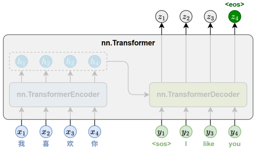

示例代码如下：

```python
output = transformer(
    src=src_emb,
    tgt=tgt_emb,
    src_key_padding_mask=src_pad_mask,
    tgt_key_padding_mask=tgt_pad_mask,
    tgt_mask=tgt_mask,
    memory_key_padding_mask=src_pad_mask
)
```

假设当前的源序列和目标序列为：

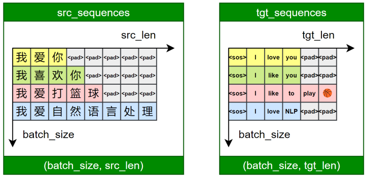

则具体的输入和输出内容如下表所示

- 输入

  |                         |                                                              |                                                              |
  | ----------------------- | ------------------------------------------------------------ | ------------------------------------------------------------ |
  | src                     | 源序列的嵌入表示，通常由词向量与位置编码相加得到，作为编码器的输入。其形状为 (batch_size, src_len, d_model) | 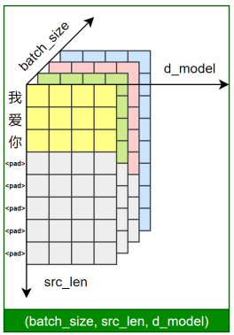 |
  | tgt                     | 目标序列的嵌入表示，通常由词向量与位置编码相加得到，作为解码器的输入。其形状为 (batch_size, tgt_len, d_model)。 | 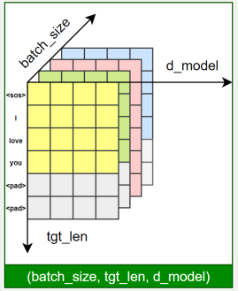 |
  | src_key_padding_mask    | 用于编码器中的自注意力机制，用以屏蔽源序列中填充（<pad>）的位置，防止模型在计算注意力时关注无意义的内容。其张量形状为 (batch_size, src_len)，其中值为 True 的位置表示应被忽略（即不参与注意力计算）。 | 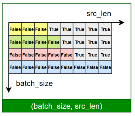 |
  | tgt_key_padding_mask    | 用于解码器中的自注意力机制，用以屏蔽源序列中填充（<pad>）的位置，防止模型在计算注意力时关注无意义的内容。其张量形状为 (batch_size, tgt_len)，其中值为 True 的位置表示应被忽略（即不参与注意力计算）。 | 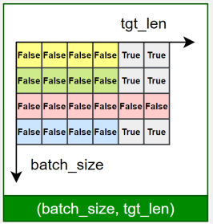 |
  | tgt_mask                | 用于解码器的自注意力机制，常用于训练阶段的自回归任务，防止模型关注当前位置之后的 token，避免信息泄露。是一个形状为 (tgt_len, tgt_len) 的上三角矩阵，类型为 float，遮挡位置为 -inf，其余为 0。也支持 bool 类型（True 表示遮挡），内部会自动转换为加性掩码。 | 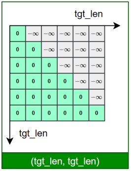 |
  | memory_key_padding_mask | 用于解码器的交叉注意力机制，屏蔽编码器输出中的 <pad> 位置，防止解码器关注源序列中的无效 token。形状为 (batch_size, src_len)，值为 True 的位置将被忽略。通常与 src_key_padding_mask 相同。 | 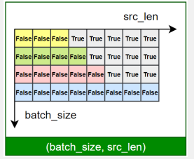 |

- 输出

  |       |                                                              |                                                              |
  | ----- | ------------------------------------------------------------ | ------------------------------------------------------------ |
  | ouput | 解码器输出的隐藏状态序列，形状为 (batch_size, tgt_len, d_model)。表示目标序列中每个位置的上下文表示，通常会送入线性层和 softmax，用于生成词表上的预测概率。 | 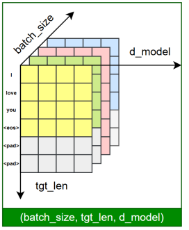 |

#### 6.4.5 Transformer.encoder

nn.Transformer 模块中包含一个编码器部分，可通过属性 transformer.encoder 访问，其本质是一个 nn.TransformerEncoder 实例。通过其 forward 方法，可以对源序列进行编码，提取上下文相关的语义表示。如下图所示：

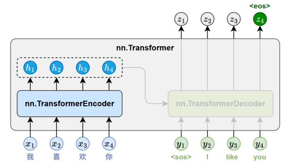

```python
from torch import nn

# 初始化 Transformer
transformer = nn.Transformer(
    d_model=512, nhead=8,
    num_encoder_layers=6, num_decoder_layers=6,
    batch_first=True
)

# 调用编码器
memory = transformer.encoder(
    src=src_emb,
    src_key_padding_mask=src_pad_mask
)
```

假如源序列为：

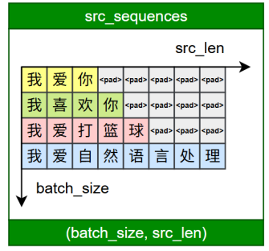

则具体的输入输出为：

- 输入

  |                      |                                                              |                                                              |
  | -------------------- | ------------------------------------------------------------ | ------------------------------------------------------------ |
  | src                  | 源序列的嵌入表示，通常由词向量与位置编码相加得到，作为编码器的输入。其形状为 (batch_size, src_len, d_model) | 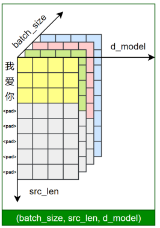 |
  | src_key_padding_mask | 用于编码器中的自注意力机制，用以屏蔽源序列中填充（<pad>）的位置，防止模型在计算注意力时关注无意义的内容。其张量形状为 (batch_size, src_len)，其中值为 True 的位置表示应被忽略（即不参与注意力计算）。 | 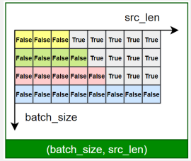 |

- 输出

  |        |                                                              |                                                              |
  | ------ | ------------------------------------------------------------ | ------------------------------------------------------------ |
  | memory | 编码器的输出表示，包含每个 token 的上下文语义信息，作为解码器的输入。其形状为 (batch_size, src_len, d_model)。 | 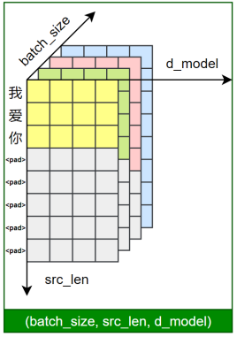 |

#### 6.4.6 Transformer.decoder

nn.Transformer 模块中包含一个解码器部分，可通过属性 transformer.decoder 访问，其本质是一个 nn.TransformerDecoder 实例。通过其 forward 方法，可以基于编码器的输出（memory）和目标序列的嵌入表示，逐步生成目标序列中的各个 token。如下图所示：

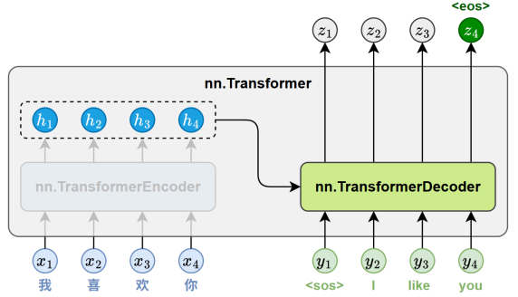

```python
from torch import nn

# 初始化 Transformer
transformer = nn.Transformer(
    d_model=512, nhead=8,
    num_encoder_layers=6, num_decoder_layers=6,
    batch_first=True
)

# 调用编码器
memory = transformer.encoder(
    src=src_emb,
    src_key_padding_mask=src_pad_mask
)

# 调用解码器（逐步生成）
output = transformer.decoder(
    tgt=tgt_emb,
    memory=memory,
    tgt_mask=tgt_mask,
    tgt_key_padding_mask=tgt_pad_mask,
    memory_key_padding_mask=src_pad_mask
)
```

若源序列和目标序列为：

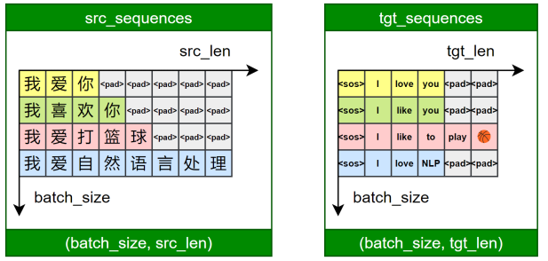

则具体输出输出为：

- 输入

  |                         |                                                              |                                                              |
  | ----------------------- | ------------------------------------------------------------ | ------------------------------------------------------------ |
  | tgt                     | 目标序列的嵌入表示，通常由词向量与位置编码相加得到，作为解码器的输入。其形状为 (batch_size, tgt_len, d_model)。 | 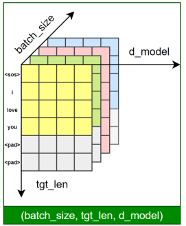 |
  | memory                  | 编码器的输出表示，包含源序列每个 token 的上下文语义信息，作为解码器的输入。其形状为 (batch_size, src_len, d_model)。 |  |
  | tgt_mask                | 用于解码器的自注意力机制，常用于训练阶段的自回归任务，防止模型关注当前位置之后的 token，避免信息泄露。是一个形状为 (tgt_len, tgt_len) 的上三角矩阵，类型为 float，遮挡位置为 -inf，其余为 0。也支持 bool 类型（True 表示遮挡），内部会自动转换为加性掩码。 | 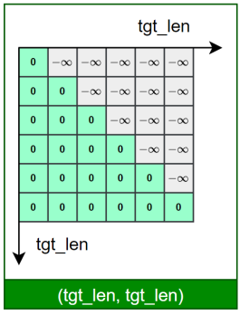 |
  | tgt_key_padding_mask    | 用于解码器中的自注意力机制，用以屏蔽源序列中填充（<pad>）的位置，防止模型在计算注意力时关注无意义的内容。其张量形状为 (batch_size, tgt_len)，其中值为 True 的位置表示应被忽略（即不参与注意力计算）。 | 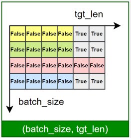 |
  | memory_key_padding_mask | 用于解码器的交叉注意力机制，屏蔽编码器输出中的 <pad> 位置，防止解码器关注源序列中的无效 token。形状为 (batch_size, src_len)，值为 True 的位置将被忽略。通常与 src_key_padding_mask 相同。 | 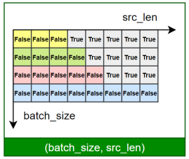 |

- 输出

  |        |                                                              |                                                              |
  | ------ | ------------------------------------------------------------ | ------------------------------------------------------------ |
  | output | 解码器输出的隐藏状态序列，形状为 (batch_size, tgt_len, d_model)。表示目标序列中每个位置的上下文表示，通常会送入线性层和 softmax，用于生成词表上的预测概率。 | 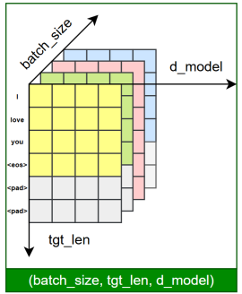 |

### 6.5 案例实操（中英翻译V3.0）

#### 6.5.1 需求说明

本案例要求使用Transformer模型实现上述中英翻译任务。

#### 6.5.2 需求分析

PyTorch 已提供了 nn.Transformer 模块，包含完整的编码器-解码器结构，因此我们可以直接使用其核心组件来搭建模型。

然而，PyTorch 并未内置位置编码（Positional Encoding）模块，而 Transformer 又不具备处理位置信息的能力，因此我们需要手动实现位置编码，并与嵌入层输出相加，作为 Transformer 的输入。

除此之外，还需要完成以下模块：

- 源语言和目标语言的词嵌入层（nn.Embedding）
- 输出层（nn.Linear）用于将模型输出映射为目标词表大小

#### 6.5.3 需求实现

1. 项目结构

   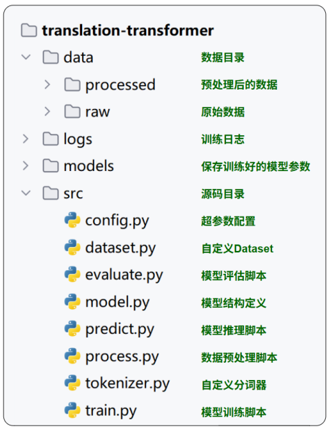

2. 完整代码

   - 数据预处理

     ```python
     
     ```

   - 自定义分词器

     ```python
     
     ```

   - 自定义数据集

     ```python
     
     ```

   - 模型定义

     ```python
     
     ```

   - 模型训练

     ```python
     
     ```

   - 预测模型

     ```python
     
     ```

   - 评估模型

     ```python
     
     ```

   - 配置文件

     ```python
     
     ```