## 第07章_预训练模型

------

### 7.1 概述

早期的自然语言处理方法通常针对每个具体任务单独训练模型，并依赖大量人工标注数据。这种方式在一定条件下能取得不错效果，但在实际应用中也暴露出明显局限：

- 语言知识难以复用：每个模型从头开始学习，无法共享已有的语言能力，训练成本高、效率低。

- 高度依赖标注数据：获取高质量标注样本代价昂贵，特别是在医疗、法律等专业领域，数据稀缺问题尤为突出。

为解决这些问题，研究者近年来提出了"预训练 + 微调"的新思路：

- 预训练阶段

  在海量未标注文本上训练通用语言模型，使其初步掌握词汇、句法和上下文依赖等语言规律。

- 微调阶段

  将预训练模型迁移至具体任务，仅用少量标注数据进行进一步训练，以快速适配下游需求。

  这种方法极大提升了模型的通用性与开发效率，成为当前 NLP 的主流技术路线。

### 7.2 微调阶段

#### 7.2.1 概述

GPT（Generative Pre-trained Transformer）是首个系统性提出“预训练 + 微调”范式的语言模型，由 OpenAI 于 2018 年 6 月发布，论文题为[《Improving Language Understanding by Generative Pre-Training》](https://cdn.openai.com/research-covers/language-unsupervised/language_understanding_paper.pdf)。

GPT 的核心设计理念体现在两个方面：

- 预训练方式

  以“在给定前文条件下预测下一个词”为目标，对大规模非标注语料执行语言建模，令模型逐步掌握词汇分布、语法结构及长程依赖。

- 微调方式

  下游任务无需额外结构设计，只需通过输入格式化（prompt engineering），将分类、推理、问答等任务转化为“预测下一个词”的同质问题。模型本体保持不变，仅用少量标注样本完成适配，大幅提升迁移效率与灵活性。

#### 7.2.2 模型结构

GPT 的预训练目标是语言建模，即在给定上下文的前提下，预测下一个最有可能出现的词语。这是自然语言生成任务的基本形式。

早期模型多采用循环神经网络（RNN）来完成这一任务，但由于难以并行计算、训练效率低，以及在建模长距离依赖方面存在局限，难以满足大规模语言建模的需求。

Transformer 的出现为这一问题提供了新的解决方案。其原始结构包括编码器（Encoder）和解码器（Decoder），设计用于序列到序列任务：编码器用于理解输入序列，解码器则在此基础上生成目标序列。

然而，语言建模只涉及单个序列的自回归建模，即在给定前文的基础上预测下一个词，因此无需编码器。因此，GPT选择仅保留 Transformer 的解码器部分，并对其进行了简化和调整，使其更适合自回归语言建模任务。

具体结构如下图所示：

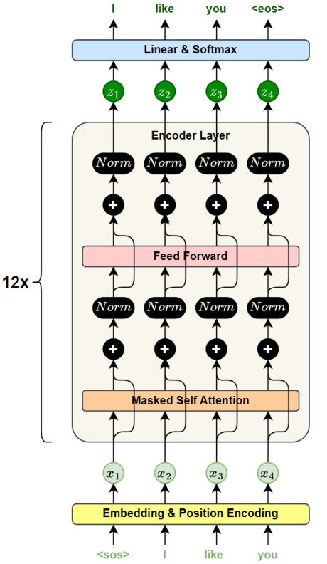

相较于标准的 Transformer 解码器，GPT 对结构进行了精简调整：移除了编码器-解码器注意力子层（因为模型中并不存在编码器），仅保留自注意力与前馈网络两类子层。此外，GPT-1 中共堆叠了 12 层解码器层，每层结构完全一致，参数独立。

#### 7.2.3 预训练方式

GPT 的预训练目标是语言建模，即在给定前文的条件下预测下一个词。这一任务属于自监督学习，无需人工标注，训练目标可直接从原始文本中自动构建，因此能够轻松获取大量高质量的训练样本。

同时，得益于 Transformer 架构所具备的强大并行计算能力，GPT 可以高效处理长文本序列，大幅提升训练效率，使得在大规模语料上进行预训练成为可能。

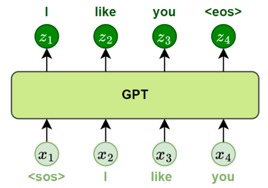

在实践中，GPT-1 使用了一个名为 BooksCorpus 的英文语料库，包含来自 7000 多本小说的完整书籍文本，总规模约 8 亿词。该语料语言自然、上下文完整，非常适合训练具备长距离依赖建模能力的语言模型。

通过对大规模文本的语言建模，GPT 学习到丰富的通用语言知识，如词语搭配、句法结构、语义理解和上下文连贯性等。这些能力可在微调阶段迁移至分类、问答、翻译等下游任务，显著提升模型的泛化效果和实际应用能力。

#### 7.2.4 微调方式

在预训练完成后，GPT 只需进行少量微调即可适配各种下游任务，如文本分类、文本蕴含（推理）、相似度判断和问答系统等。

为更好地完成这些任务，GPT在微调阶段会在模型顶部**添加一个线性输出层**，用于将模型输出映射为具体的标签或答案。同时，还需**设计特定的输入格式**，将不同任务的输入转化为连续文本序列，使其可以直接送入 GPT 模型中进行处理。

下图展示了 GPT 在不同任务中的输入格式转换方式：

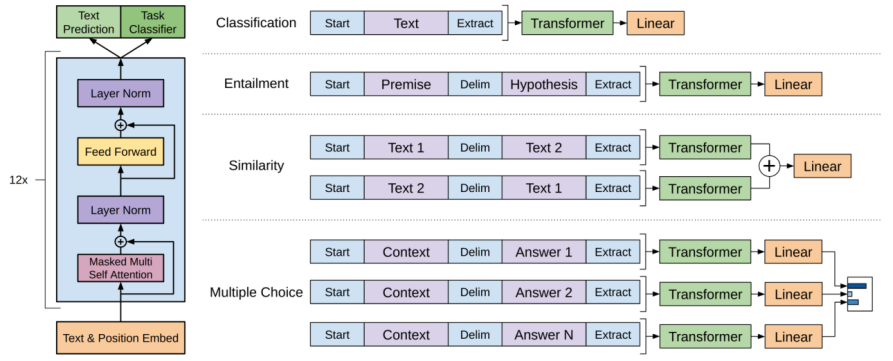

以图中的**文本分类任务**为例，假设我们有一个带标注的微调数据集如下：

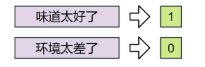

首先，将每条评论转为 token 序列，并添加特殊标记 `[Start]` 与 `[Extract]`，形成模型标准输入格式：

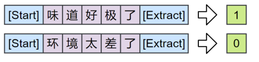

然后，将转换后的序列送入 GPT 模型。模型逐层处理后，输出每个位置的预测。我们只提取序列中最后一个位置 `[Extract]` 对应的输出，再通过新添加的线性输出层完成分类预测，最终输出标签"0"或"1"。如下图所示：

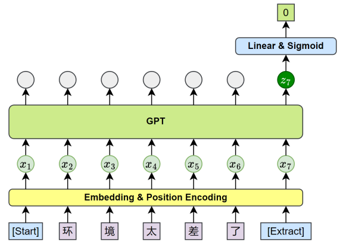

整个过程保持了预训练模型结构不变，仅在顶层增加极少量参数，通过统一的输入转换方式，即可实现从语言建模向多种下游任务的高效迁移。

### 7.3 BERT

#### 7.3.1 概述

BERT（Bidirectional Encoder Representations from Transformers）是由 Google 于 2018 年提出的一种语言预训练模型，其论文为《BERT: Pre-training of Deep Bidirectional Transformers for Language Understanding》。

与 GPT 所采用的自回归建模方式（即从左向右预测下一个词）不同，BERT 的核心创新在于使用 Transformer 编码器（Encoder）结构，对每个词同时融合左右两个方向的上下文信息，从而获得更完整的语义表示。

为训练这种双向结构，BERT 引入了两个预训练目标：

- **掩码语言模型（Masked Language Modeling, MLM）**：随机遮盖输入中的部分词，训练模型根据上下文预测被遮盖的词；

- **下一句预测（Next Sentence Prediction, NSP）**：判断两个句子是否在原文中相邻，以学习句间的语义与逻辑关系。

BERT 的设计更偏向于自然语言理解类任务，如文本分类、序列标注、句子匹配和阅读理解等。模型发布后，在多个语言理解基准测试中取得了前所未有的领先成绩，推动 NLP 研究全面转向"预训练 + 微调"的通用建模范式。

#### 7.3.2 模型结构

BERT 基于标准的 Transformer 编码器构建，提供两种模型规模，分别是 BERT-base 和 BERT-large。

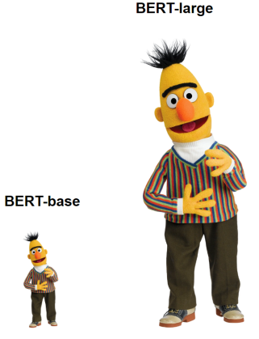

| 模型版本   | 层数 (Layers) | 模型维度 (d_model) | 注意力头数 (Heads) | 参数量 |
| ---------- | ------------- | ------------------ | ------------------ | ------ |
| BERT-base  | 12            | 768                | 12                 | 1.1 亿 |
| BERT-large | 24            | 1024               | 16                 | 3.4 亿 |

#### 7.3.3 预训练方式

BERT 的预训练阶段包含两个核心任务：掩码语言模型（Masked Language Modeling, MLM）和下一句预测（Next Sentence Prediction, NSP），分别用于学习词级语义和句间逻辑关系。

- 掩码语言模型（MLM）

  为实现双向语言建模，BERT 不采用传统的从左到右或从右到左预测方式，而是引入了掩码语言模型。在训练中，BERT 会随机遮盖输入序列中约 15% 的 token，并训练模型根据上下文预测被遮盖的词。

  遮盖策略如下：

  - 80% 的被遮盖 token 替换为 `[MASK]`；
  - 10% 替换为随机词；
  - 10% 保持原词不变。

  这种机制让模型在预训练时既能看到左侧上下文，也能看到右侧上下文，真正实现深度双向建模。

  

- 下一句预测（NSP）

  为了提升模型理解句间关系的能力，BERT 引入了"下一句预测"任务。训练时模型接收两个句子，判断第二句是否是第一句的真实后续句，其中：

  50% 的训练样本是上下文中真实相邻的句子（正例）；

  50% 是从语料中随机采样的非相邻句子（反例）。

  **正例：**
  - A：我今天很忙。
  - B：所以没去上班。

  **反例：**
  - A：我今天很忙。
  - B：天气很好。

  在预训练时，BERT 同时优化 MLM 和 NSP 两个目标。为同时支持这两项任务，BERT 设计了统一的输入表示方式。输入可以是单句，也可以是句子对，整体格式如下：

  首先，BERT 引入了两个特殊符号：

  - **[SEP]**：用于标记句子结束，或分隔两个句子。例如在 NSP 任务中，句子 A 和句子 B 的末尾都会插入一个 `[SEP]`。

  - **[CLS]**：始终添加在输入序列的最前面，用于表示整个输入的语义。例如在 NSP 任务中，模型使用该位置的输出向量进行正负判断。

  如下图所示：

  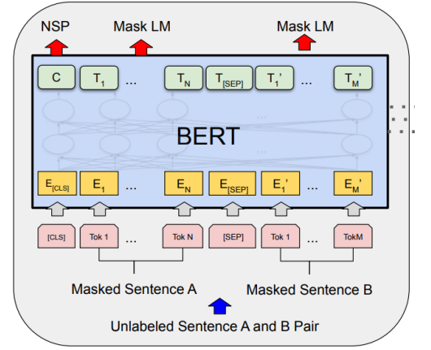

除此之外，每个 token 的表示由以下三类嵌入向量相加组成：

- **Token Embedding**：词本身的语义表示；

- **Segment Embedding**：用于区分句子 A 和句子 B，分别用一个可学习的向量表示；

- **Position Embedding**：表示 token 在序列中的位置，用于注入顺序信息。

如下图所示：

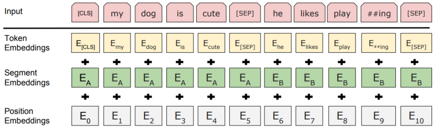

#### 7.3.4 微调方式

在预训练完成后，BERT 可通过少量微调适配多种下游任务，如文本分类、句子匹配、问答系统、序列标注等。微调时，模型主体结构保持不变，仅在顶部添加一个任务特定的输出层，并使用下游任务数据对整个模型进行训练。

BERT 的输入格式在微调阶段基本保持与预训练一致，仍以 token 序列为输入，使用 `[CLS]` 和 `[SEP]` 等特殊符号。不同任务的差异主要体现在输出层设计，以及从模型输出中提取哪些表示进行预测。

下面分别介绍 BERT 在四类典型任务中的微调方式：

1. 句子对分类任务

   **输入格式**：`[CLS] 句子 1 [SEP] 句子 2 [SEP]`

   **输出方式**：使用 `[CLS]` 的输出向量接入线性层进行分类，用于判断两个句子之间是否存在重复、蕴含、矛盾等关系。

   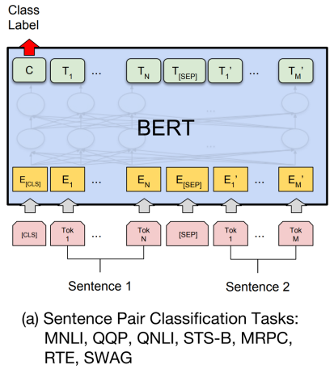

   注：

   - **MNLI**：Multi-Genre Natural Language Inference，多类别句子蕴含判断
   - **QQP**：Quora Question Pairs，问句语义重复判断
   - **QNLI**：Question Natural Language Inference，判断句子是否为问题的答案
   - **STX-B**：Semantic Textual Similarity Benchmark，语义相似度回归
   - **MRPC**：Microsoft Research Paraphrase Corpus，句子复述判断
   - **RTE**：Recognizing Textual Entailment，二分类蕴含判断
   - **SWAG**：Situations With Adversarial Generations，多项选择填句任务

2. 单句分类任务

   **输入格式**：`[CLS] 句子 [SEP]`

   **输出方式**：同样使用 `[CLS]` 的输出向量，经过线性层用于情感极性判断、语法可接受性判断等。

   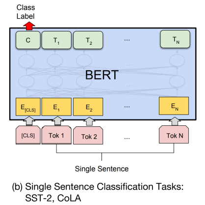

   注：

   - **SST-2**：Stanford Sentiment Treebank (binary)，情感极性判断（二分类）
   - **CoLA**：Corpus of Linguistic Acceptability，语法可接受性判断（二分类）

3. 问答任务

   **输入格式**：`[CLS] 问题 [SEP] 段落 [SEP]`

   **输出方式**：模型不会使用 `[CLS]` 向量，而是对每个 token 分别预测其作为答案起始位置和结束位置的概率。最终根据得分确定答案在段落中的位置范围，从中直接抽取连续的答案文本。

   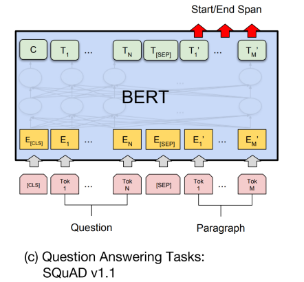

   注：

   - **SQuAD v1.1**：Stanford Question Answering Dataset，抽取式问答（起止定位）

4. 序列标注任务

   **输入格式**：`[CLS] 句子 [SEP]`

   **输出方式**：对每个 token 的输出向量单独进行分类，例如判断是否为人名（B-PER）、地名（B-LOC）等。

   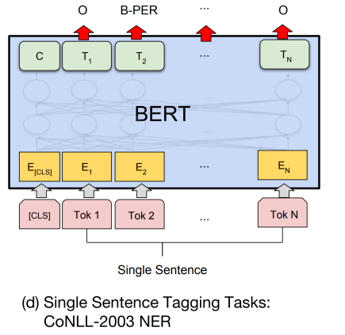

   注：

   - **NER**：Named Entity Recognition，命名实体识别

### 7.4 案例实操（AI智评V3.0）

#### 7.4.1 案例实操（AI智评V3.0）

本案例任务是基于预训练 BERT 模型实现评论的情感分析任务。

#### 7.4.2 需求分析

本案例将使用 [Hugging Face](https://huggingface.co/) 提供的 [transformers](https://huggingface.co/docs/transformers/index)库，结合 PyTorch 完成训练与推理。此外，考虑到 BERT 参数量大，我们使用 [bert-base-chinese](https://huggingface.co/google-bert/bert-base-chinese) 作为基础模型，并在其上进行微调。

注：Hugging Face平台的用法可参考附录。

#### 7.4.3 需求实现

1. 项目结构

   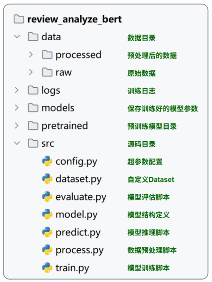

2. 完整代码

   - 数据预处理

     ```python
     
     ```

   - 自定义分词器

     ```python
     
     ```

   - 自定义数据集

     ```python
     
     ```

   - 模型定义

     ```python
     
     ```

   - 模型训练

     ```python
     
     ```

   - 预测模型

     ```python
     
     ```

   - 评估模型

     ```python
     
     ```

   - 配置文件

     ```python
     ```

     

