# 大模型技术之微调理论

## 1. 硬件基础

### 1.1 GPU与显卡

#### 1.1.1 GPU

1. 定义

  GPU通常指GPU芯片，是真正完成图形渲染或各种计算任务的组件。**最初特指用于图形渲染的处理器**，随着AI的蓬勃发展，研究人员或开发者利用GPU的并行能力加速模型训练和推理，GPU厂商也积极变革，开发了专为高性能计算（High Performance Computing，HPC）场景而生的数据中心GPU或专用于AI计算的NPU。**现在的GPU泛指所有可用于并行计算的处理器**，包括GPU、TPU和NPU。由于TPU定位是为谷歌自家的AI训练加速为目的，这里只讨论GPU和NPU。

  TPU特指谷歌自研的AI芯片，针对自家的深度学习框架`TensorFlow`而设计，不出售，生态封闭。

  NPU泛指各类厂商（华为、苹果、高通、寒武纪）专为AI加速设计的芯片，需要专用的软件栈和编译器（如华为昇腾的CANN），生态相对较新，不成熟。广义上，TPU也属于NPU的一种。

2. 子类

  随着AI的蓬勃发展，GPU衍生出了不同的子类，目前根据用途可以分为两类

  1. **PC GPU**

     用于个人电脑的GPU，面向终端消费者，性能一般，显存较小。市场主要被国外厂商占据，国外的英伟达（NVIDIA）、AMD、Intel占据了几乎所有的市场份额。

  2. **数据中心 GPU**

     顾名思义，是用于搭建数据中心的GPU，面向大企业，性能强大、显存大，但相应地价格自然更贵。脱胎于图形渲染，目标是兼顾高性能、通用性和编程灵活性，能处理图形渲染、科学计算、AI计算等多种并行任务。用于搭建超级计算机或者大型的AI集群。

     目前在数据中心GPU市场，英伟达几乎是唯一的选择，其它厂商基本没有份额。

     英伟达是数据中心GPU的龙头老大，CUDA是生态标杆，有海量的库支持（cuDNN、cuBLAS等）和优化工具。发展时间较长，生态非常成熟。

3. CPU和GPU对比

  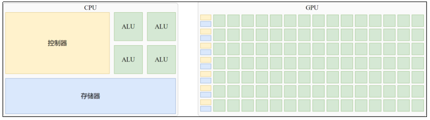

  一个CPU内核可能包含若干ALU，这些ALU擅长处理复杂任务，就像一个学富五车的博士生。博士生的培养成本是很高的，同样地，CPU ALU的构造也比较复杂，因此**单个CPU内核只能包含少量ALU**。

  一个GPU也可以包含多个运算单元，不同的是，它们能力单一，通常只能支持简单的运算，比CPU的ALU能力弱得多。就像一个小学生，**只能做加减乘除这样简单的操作**。虽然小学生不能像博士那样完成复杂的工作，但培养成本低，人多力量大。同样地，GPU运算单元的数量要远多于CPU的ALU。核心特点是**高并行计算能力**，尤其在数据并行任务中表现远超传统CPU。

  对于需要并行计算的场景，如10000次独立的加法操作，交给10000个小学生最多一分钟就可以完成任务，而交给10个博士生，也很难在一小时内完成这样的任务。

  因此，GPU擅长执行大量相互独立的并行运算，而CPU擅长少量的复杂任务；

#### 1.1.2 显卡

1. 什么是显卡

   单独的GPU芯片是无法工作的，必须通过PCB（印刷电路板，电脑的主板也是一种PCB）板集成供电、散热等辅助模块。GPU芯片和PCB以及所有辅助模块构成的整体就是显卡，所以严格来说，GPU和显卡并不等同。

   通常GPU芯片不会单独出售给消费者，个人或下游企业（买来用而非二次出售）买到的都是可以直接使用的显卡，因此**很多时候我们并不会特意区分GPU和显卡**。

2. 公版显卡和非公版显卡

   GPU芯片制造商**不会向终端消费者**直接出售GPU芯片，而是封装为显卡。这类显卡以稳定性优先，其散热较为基础，**被称为公版显卡**。公版显卡也是非公版设计的设计规范。RTX消费系列公版显卡通常只有单风扇。

   显卡厂商（七彩虹、华硕、技嘉）从GPU厂商处**购买GPU芯片，参考公版显卡的设计规范**重新设计PCB、供电模块、散热系统（可能采用三风扇或水冷）及外观结构，形成差异化产品，**即非公版显卡**。如华硕ROG系列显卡强化供电和散热，预设高频，性能强于公版。

3. 显卡分类

   根据用途的不同，显卡大致可以分为四类：

   1. 游戏显卡（消费级显卡）

      面向主流游戏玩家，注重图形渲染性能和实时体验。属于传统GPU，通常是**独立显卡**（discrete GPU，独立于主板存在，通过PCIE插槽与PC主板相连，有独立的显存和散热系统，也成为AIB GPU，即Add-in-Board GPU，直译为“扩展板/附加卡”GPU，**通常性能强大**）

      但也有特例，**AMD的部分集成显卡**（Integrated Graphics（集显），集成在CPU内部，和CPU封装在一起，也叫核心显卡（核显））**也属于游戏显卡**。

      代表：NVIDIA GeForce RTX系列、AMD Radeon RX系列。国产的摩尔线程S80、S70。

   2. 专业工作站显卡

      针对3D建模、影视渲染、科学计算等专业领域，优化驱动和稳定性，也属于传统GPU。

      代表：NVIDIA Quadro（现为RTX A系列）、AMD Radeon Pro系列、国产的摩尔线程X300、S50；

   3. 计算加速卡（专用于AI训练）

      用于AI训练、高性能计算（HPC），侧重并行计算能力。包括英伟达的数据中心GPU和其他厂商的NPU（提到计算加速卡时，一般只考虑可用于搭建数据中心的NPU，不包括SoC内集成和用于边缘计算的NPU）。

      代表：NVIDIA H100、A100、AMD Instinct系列。国产的华为昇腾（Ascend）系列、摩尔线程S4000、S3000、S2000。

   4. 入门级（办公显卡）

      低功耗，适合日常办公、视频播放等轻度需求，属于传统GPU，大部分是集成显卡。主要用于轻薄本，目标是以较低的功耗提供基本的图形渲染功能，**平衡续航与性能**。

      代表：Intel集显、NVIDIA GeForce GT 1030和GeForce MX570（独显）、国产的摩尔线程S30和S10（独显）。

   >需要注意的是，大多数入门级显卡都是集成显卡，这部分大都是Intel和AMD的产品。此外，其它公司也有少量入门级独显。

   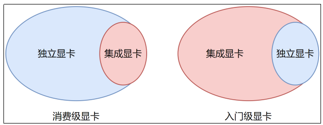

### 1.2 英伟达GPU与CUDA

英伟达公司（NVIDIA Corporation）是一家美国跨国科技企业，总部位于加利福尼亚州圣克拉拉（硅谷的主要部分位于圣克拉拉县），注册于特拉华州。该公司由黄仁勋（Jensen Huang，总裁兼CEO）、克里斯·马拉乔夫斯基（Chris Malachowsky）和柯蒂斯·普里姆（Curtis Priem）与1993年创立，主要涉及并提供**GPU、CUDA软件平台**、面向数据科学与高性能计算的**API**、以及用于移动计算和汽车市场的**SoC**。该公司同时是**AI硬件与软件**的主要供应商。目前在**桌面（PC）独显**市场、**数据中心GPU**市场一家独大。

英伟达推出了三个系列：

1. GeForce：消费级显卡
2. Quadro：专业图形渲染（3D建模）
3. Tesla：用于大规模并行计算的显卡，也就是计算卡，早期Tesla是一个架构名称，逐渐发展为一个产品系列，经典产品如Tesla V100。有趣的是，从Ampere架构以后，英伟达在介绍GPU时已经不再提及Tesla这一名词，或许官方已经不再用Tesla为计算卡命名。

#### 1.2.1 CUDA基本概念

英伟达的CUDA（Compute Unified Device Architecture，统一计算设备架构）是一个软硬件协同设计的并行计算平台和编程模型，是软硬件的紧密集合与统一。允许开发者利用GPU进行通用计算。

英伟达于2006年首次提出CUDA架构，并与次年6月23日发布CUDA编程手册1.0，其中给出了CUDA架构图，如下：

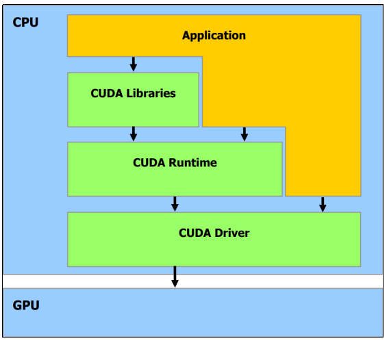

用户程序可以通过CUDA库、CUDA运行时调用CUDA驱动，后者与GPU硬件直接交互，从而实现用户程序对GPU的间接调用。

#### 1.2.2 CUDA线程模型

CUDA中线程分为三个层次：线程（Thread）、线程块（ThreadBlock）、线程网络（Grid）。

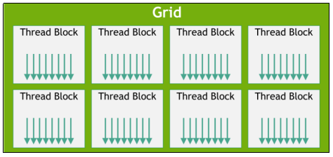

1. Thread

   CUDA编程模型中最基本的执行单元，由硬件支持、开销很小，每个线程执行相同的代码。

2. Thread Block

   若干线程的分组，一个线程块可以包含**最多1024个**线程。

   一个线程块**只能交给一个SM处理**，反过来一**个SM可以处理多个线程块**。

3. Grid

   若干线程块Block的网格。

#### 1.2.3 CUDA的执行

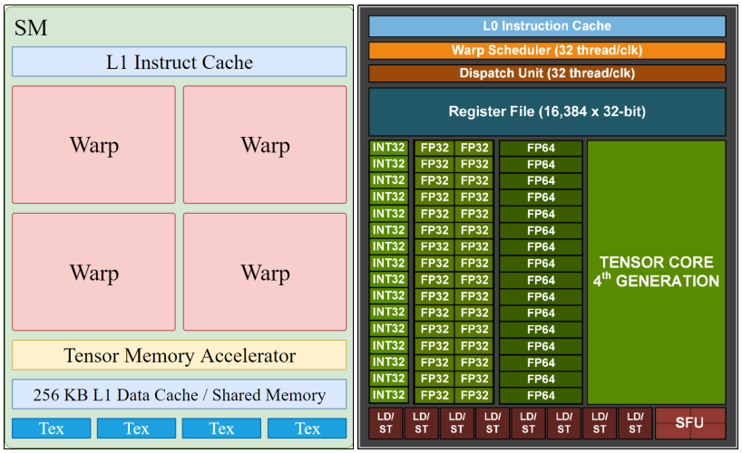

GPU上有很多计算核心也就是StreamingMultiprocessor(SM)，SM是一块硬件，包含了固定数量的运算单元，寄存器和缓存。

warp（线程束）是SM内最基本的调度与执行单位，由32个并行线程组成。

一个Block会被绑定到一个SM上，划分成warp进行调度执行。

比如一个Block内部有256个线程，划分成256/32=8个warp，这8个warp只会在同一个SM中执行（同时或先后）。而同一个SM可以执行的多个warp（取决于调度器）可能来自不同的Block，由相应的调度器来进行调度。

#### 1.2.4 CUDA的内存

为了在成本和数据读写效率之间权衡，科学家设计了存储器分层访问架构。

1. GPU显存体系分层架构

   以英伟达A100显卡的GPU芯片GA100为例说明：

   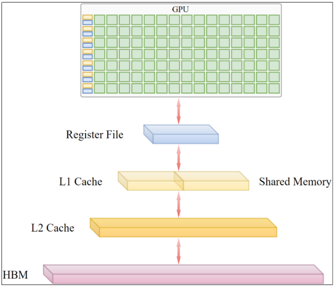

   - HBM

     显存（VRAM）的一种，显存在GPU数据访问分层访问架构中的地位类似于内存。

   - 缓存

     显存（VRAM）的一种，显存在GPU数据访问分层访问架构中的地位类似于内存。

   - Shared Memory

     共享内存（SMEM），物理上和L1 Cache共享一块硬件池，二者所占用的硬件资源可以动态调整。用于同一个线程块内共享数据。

   - Register File

     GPU的寄存器文件，类比CPU的寄存器，少量超高速存储单元，是GPU显存访问路径的最后一环。

2. CUDA中使用的内存

   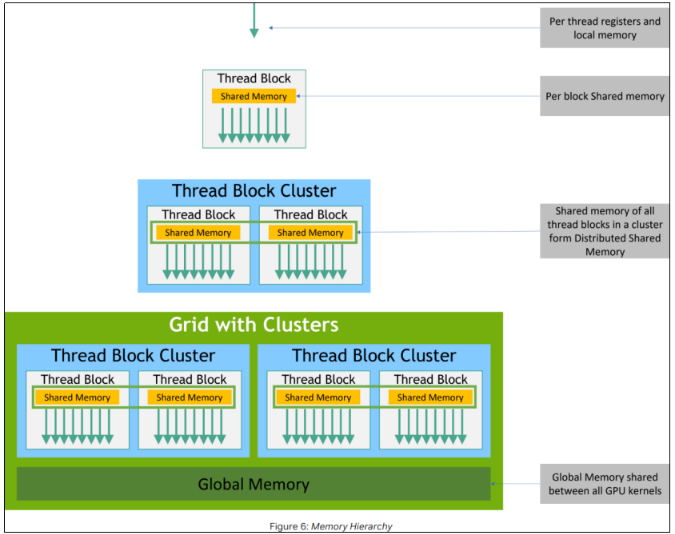

   每个线程拥有**自己的寄存器和本地内存**，分别对应SM硬件结构中的寄存器文件和线程数据在全局显存的专属区域。

   每个线程块拥有**自己的共享内存**，对应**SM内的共享内存（Shared Memory）区域**。

   Grid可以访问所有内核共享的**全局显存**。

#### 1.2.5 CPU&GPU训练时间对比

模型：BERT-base

训练数据集：180000

batch\_size:32

|  |  |
| --- | --- |
| CPU (Xeon(R) Gold 5118 2CPU24Core) | 40:30:00 |
| CPU (Xeon(R) Platinum 8255C 1CPU40Core) | 16:25:00 |
| GPU (P40) | 3:00:00 |
| GPU (V100) | 1:17:00 |

## 2. 微调技术

### 2.1 概述

#### 2.1.1 大模型环境

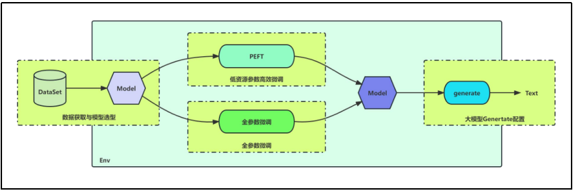

#### 2.1.2 大模型微调流程

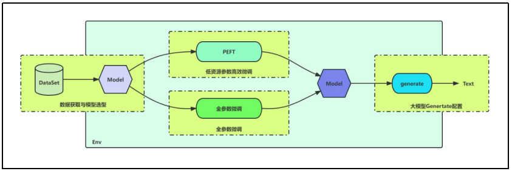

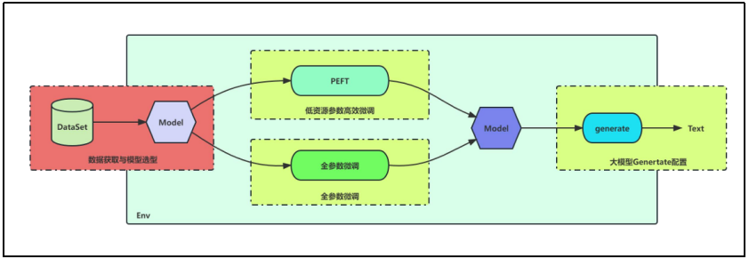

#### 2.1.3 大模型微调要素

* 模型从哪里来？
* 数据从哪里来？
* 如何明确训练某个模型的环境依赖？
* 如何估算大模型占用的显存？
* 如何确定我的训练需求需要怎样的硬件？

#### 2.1.4 模型来源

1. [Huggingface](https://huggingface.co/)

   Hugging Face是国际领先的AI开源社区平台，目标是成为**机器学习的GitHub**。它提供了一个中心化的平台，提供海量**预训练模型**（如BERT、GPT）、**数据集**、演示应用（Spaces）以及**协作工具**。它构建了一个极其庞大和活跃的开源社区。

   1. 核心产品与服务

      ① Transformers库：这是Hugging Face最核心和最知名的开源库。它提供了数千个预训练模型（BERT、GPT、T5、Stable Diffusion等）的统一接口，支持PyTorch、TensorFlow、JAX等主流框架，极大简化了模型的加载、训练和推理。

      ② Hugging Face Hub：一个巨大的模型、数据集和演示应用（Spaces）的在线仓库。

      * Models Hub：用户可以上传、下载、搜索、发现和共享各种机器学习模型（不仅仅是NLP，还包括CV、语音、多模态等）。
      * Datasets Hub：提供大量公开可用的数据集，方便用户下载和使用。
      * Spaces：允许用户轻松创建、托管和分享基于模型的交互式Web应用（如聊天机器人、图像生成器、文本摘要器等），支持Gradio、Streamlit、Docker等多种方式。

   2. Transformers库安装

      ```shell
      pip install transformers # 基础库
      ```

2. [ModelScope](https://modelscope.cn/models)

   ModelScope（魔搭）是由阿里巴巴推出的中国本土AI模型平台，目标是成为 “模型即服务”的中国本土化平台。旨在为中国开发者提供一个符合本地法规、拥有丰富中文模型、优化本地部署体验、并且集成了模型开发、训练、评估、部署全流程的一站式平台。

   1. 核心产品与服务

      ① ModelScope Hub：类似Hugging Face Hub，是中国本土的大型模型仓库。

      - 模型：重点收录了大量高质量的中文预训练模型（尤其是阿里巴巴达摩院自研的模型，如Qwen、Tongyi以及众多社区贡献的模型），也包含国际知名模型。强调模型的可复现性和质量。
      - 数据集：提供丰富的中文数据集资源。
      - Notebook：集成在线Notebook环境（如DSW - Data Science Workshop），方便用户开箱即用，快速体验模型。
      - 创空间：类似Hugging Face Spaces，用于创建和分享模型应用演示。

      ② ModelScope Library：提供Python SDK，方便用户加载、使用 Hub 上的模型和数据集，其API设计借鉴了Transformers并有所扩展，支持更丰富的模型类型（如多模态、科学计算模型）和任务。

      ③ 一站式开发平台

      - 模型训练与微调：提供云端和本地化的训练工具链支持。
      * 模型评估内置多种评估指标和Benchmark工具。
      * 模型部署：提供多种部署方案，特别优化了本地部署的体验（如通过msdeploy工具），满足国内企业对数据安全和私有化部署的需求。

   2. 特色功能

      - 中文优化：对中文模型、中文任务、中文数据集有深度支持和优化。
      * 模型即插件（MaaS）：倡导将模型作为即插即用的服务。
      * 法律合规：更注重符合中国的数据安全法律法规要求。
      * 产学研结合：与国内高校、研究机构和企业紧密合作。

   3. Modelscop安装

      ```shell
      pip install modelscope         # 核心库
      pip install "modelscope[nlp]" -f https://modelscope.oss-cn-beijing.aliyuncs.com/releases/repo.html  # NLP 扩展
      ```

### 2.2 数据来源

#### 2.2.1 开源高质量数据

1. Github

   BELLE：https://github.com/LianjiaTech/BELLE

   https://github.com/OpenLMLab/MOSS

   https://github.com/TigerResearch/TigerBot

   https://github.com/hiyouga/ChatGLM-Efficient-Tuning

   https://github.com/yanqiangmiffy/InstructGLM

2. huggingface

   <https://huggingface.co/datasets/BAAI/COIG-PC>

   <https://huggingface.co/datasets/YeungNLP/firefly-train-1.1M>

   <https://huggingface.co/datasets/YeungNLP/moss-003-sft-data>

   <https://huggingface.co/datasets/YeungNLP/ultrachat>

#### 2.2.2 基于 LLM 的数据收集

1. Prompt设计
   - Prompt 常规格式：定义角色 + 说明要求 + 罗列限制 + 指定输出格式
   - Prompt 迭代策略：有的任务使用简单直接的 Prompt 就可以达到很好的效果，有的任务需要设计针对性的 Prompt 并且多次迭代后才能达到预期效果，因此建议先尝试简单 Prompt 效果，再进入 Prompt 设计迭代
   - 借助大规模参数模型优化 Prompt：可以让GPT-4o、Qwen3-32B等强大的模型进行Prompt的优化或者提供适合任务的Prompt
   - 优秀示例：https://github.com/yzfly/wonderful-prompts

#### 2.2.3 数据质量对微调效果的影响

**数据质量**对大模型微调效果影响很大，因此，在组织数据阶段，尽可能对数据进行过滤和人工校验，保证各个来源的数据尽可能干净，因此，收集高质量问题，使用ChatGPT接口生成数据会是一个不错的选择。

**重复数据**对于大模型微调也有较大影响，数据集必须去重后再用于模型训练。

**大规模多任务数据集**主要用于基座模型构建阶段，基座模型训练完成后，使用**高质量垂域数据**再对垂域模型进行训练。

### 2.3 微调方法分类

根据反向传播过程中更新参数的不同，微调方法大致可以分为两类：全参数微调和参数高效微调。

#### 2.3.1 全参数微调

顾名思义，全参数微调过程中更新所有权重，实际上和训练阶段的前向和反向传播过程完全一致，区别只在于数据不同。

训练流程不变，全参数微调的流程就不变。

然而，如果不用任何优化手段（或者只用数据并行）直接训练，将所有模型权重全部放在一起，受限于单块显卡的显存规模，可以支持的模型规模实在有限，在模型规模日益增长的当下远远无法满足需求。因此，出现了一系列并行训练技术，目的都是通过**“分布式训练”**突破单卡性能上限（显存是瓶颈），使得可以训练的模型规模**理论上（实践中会受到通信开销、同步效率、成本等因素的限制）**可以随集群规模无限增长。

市面上所说的全参数微调技术主要就是指这类技术，此外，还包括**混合精度训练。需要注意的是，这两种技术不仅可以用于全参数微调，对参数高效微调也同样适用。**

#### 2.3.2 参数高效微调

顾名思义，这类微调方法通过某种算法提升了训练效率。

参数高效微调（Parameter Efficient Fine-Tuning，PEFT）是指在使用预训练模型进行下游任务适配时，**只更新或添加少量**模型参数，同时保持大部分预训练参数不变的微调方法。这类方法大幅减少模型微调所消耗的显存、算力资源，并大幅提升微调效率。

选择合适的PEFT算法，可以获得和全参数微调相近的效果（有时达到甚至超越），而资源消耗大幅降低。

全参数微调需要海量的资源，只有大中型企业才具备这样的条件。PEFT将微调所需的资源大幅降低，使得小企业和个人开发者也有机会尝试微调大模型。

### 2.4 混合精度训练

#### 2.4.1 传统大模型的数据类型

传统的大语言模型通常采用FP32作为权重的标准数据类型，以确保训练过程中的数值精度和稳定性，尤其是在处理细微的梯度更新和复杂优化算法时。然而，随着模型规模的日益增长，显存越来越成为训练的瓶颈。如果能将数据类型替换为FP16/BF16或位宽更小的数据类型，将能节约大量的资源。

FP32 是单精度浮点数，用8bit 表示指数，23bit 表示小数；

FP16 是半精度浮点数，用5bit 表示指数，10bit 表示小数；

BF16 是对FP32单精度浮点数截断数据，即用8bit 表示指数，7bit 表示小数。

二进制表示的浮点数由符号位（Sign）+指数位（Exponent）+尾数位（Mantissa/Fraction）

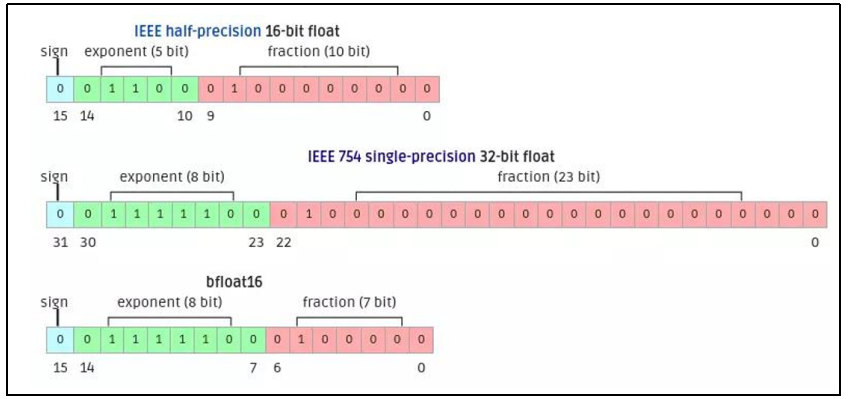

#### 2.4.2 半精度浮点数溢出和舍入误差

如果将权重的数据类型全部替换为FP16/BF16固然可以节约资源，但可能会导致训练过程中模型发散，最常见的原因是**溢出和舍入误差**。以FP16为例说明

1. 下溢出

   FP16（半精度浮点数）可以表示的范围（正数）为：

   FP32（单精度浮点数）可以表示的范围（正数）为：

   FP32替换为FP16会导致可以表示的数据范围急剧缩小，可能上溢出（Overflow）或下溢出（Underflow）。

   BF16的指数位与 FP32 相同（8位），数据范围和FP32接近，溢出几乎不会出现，但代价是精度的大幅降低，舍入误差更大。

2. 舍入误差

   假设权重为 $2^{-3}$，梯度为 $2^{-14}$，那么新的权重为 $2^{-3} - 2^{-14}$

   如果用 FP16 执行这样的计算就会出现舍入误差，分析如下。

   FP16 在区间 $[2^{-3}, 2^{-2})$ 内，最小间隔为 $2^{-13}$，所以 $2^{-3} - 2^{-14}$ 是无效操作，最终结果还是 $2^{-3}$。

   因此，从 FP32 替换为 FP16 时，可能因为精度不足导致舍入误差，使得权重无法更新。

   如果替换为 BF16（精度更低），舍入误差就更大了。

#### 2.4.3 混合精度训练

为了在节省资源的同时保证模型训练效果，百度研究院和英伟达联合提出了[混合精度训练](https://arxiv.org/pdf/1710.03740)策略。包含三种技术：① 保留FP32格式的权重主副本，② 通过损失缩放避免梯度值变为零，③ 将FP16算术累加至FP32格式。

1. 保留FP32权重主副本（解决舍入误差）

   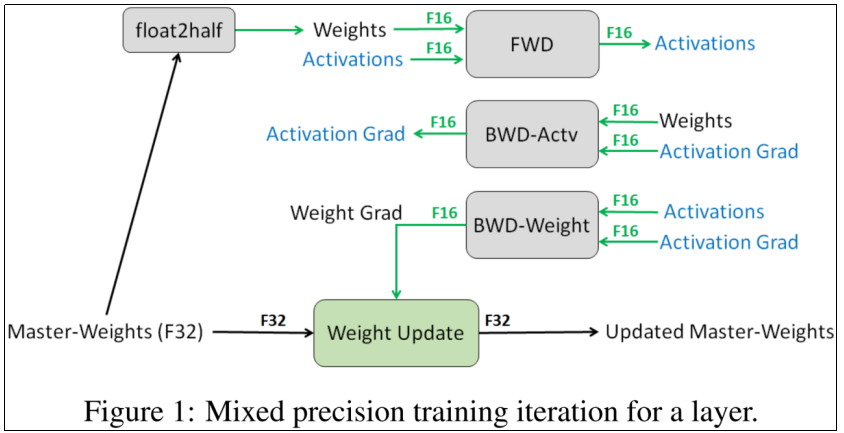

   1. FP32权重主副本

      上图中左下角的Master-Weights表示FP32类型的权重主副本。

   2. 前向传播

      通过float2half将FP32权重转换为FP16权重副本，和FP16类型的激活值（上图FWD左侧的Activations，激活值是指神经网络的隐藏层，当前层的输入，上一层的输出）一起经过前向传播得到FP16类型的激活值（上图中FWD右侧的Activations，当前层的输出，下一层的输入）。

   3. 反向传播激活值梯度计算

      对应上图中 **BWD-Actv** 的部分。通过回传的梯度（Activation Grad）和权重（矩阵求导规则，$W \cdot X = O$，$\frac{\partial O}{\partial X} = W^T$，$\frac{\partial O}{\partial W} = X^T$，所以求每一层对输入的梯度需要用到权重，对应上图中的 **Weights**）得到当前层激活值的梯度 **Activation Grad**。

      这一过程的所有数据类型均为 **FP16**。

   4. 反向传播权重梯度计算

      对应上图中BWD-Weight的部分。通过激活值梯度（Activation Grad）和激活值（Activations）计算每层的权重梯度（Weight Grad）。

      这一过程的所有数据类型为FP16。

   5. 用FP16类型的权重梯度更新FP32类型的权重主副本。

      类型转换，计算时权重梯度会转成FP32进行计算

      重复上述过程。

2. 损失缩放（解决下溢出）

   1. 提出背景

      下图是使用FP32类型权重进行的普通话语音识别训练中权重梯度指数的直方图：

      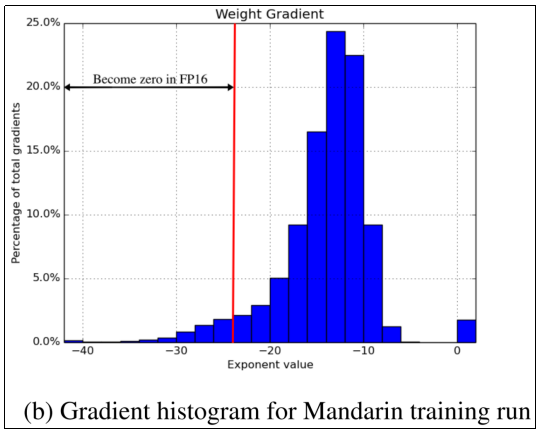

      FP16可表示的指数范围是，如果用FP16训练，则上图中红线左侧的部分归零，导致梯度消失，反向传播被阻断。此外，FP16可表示范围的大部分没有被利用。上图整体向右平移一定值即可确保大部分数据都落在FP16可表示范围内，从而获得与FP32精度接近的效果。指数的平移等价于损失或梯度乘以，这边是损失缩放的本质。

      作者给出了双向LSTM试验的训练结果，当采用混合精度方式，没有损失缩放时训练发散，对应下图中黄色的曲线。

      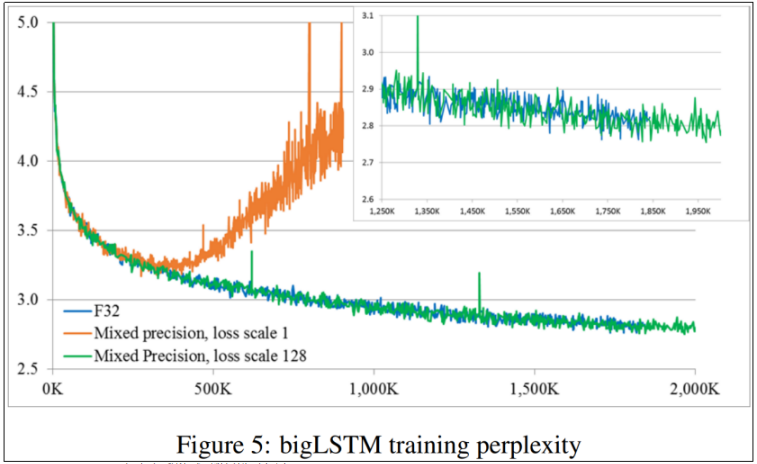

   2. 损失缩放方法

      ① 只需要在反向传播开始前对损失值进行缩放，通过链式法则所有梯度值都会按照相同比例缩放。

      ② 参数更新前进行反缩放（除以缩放系数），然后才能更新权重，确保与FP32保持相同的更新幅度。

      ③ 损失缩放的意义是避免了反向传播过程中因为精度不足而导致梯度归零，避免阻断梯度的反向传播。

   3. 损失系数的选择

      损失系数是反向传播开始前损失值的倍乘数值。

      作者提供了两种方法：

      ① 选用恒定比例因子，通过实验确定最佳值。作者使用8至32K不等的缩放因子训练了多种网络。

      ② 当梯度统计信息可用时，只要确保最大梯度和缩放因子的乘积不超过FP16可表示的最大值（65504）即可。

3. 将FP16算术累加至FP32格式

   矩阵乘法用FP16（计算效率高，显存占用低） 、转换到FP32累加（保障精度）。

### 2.5 模型规模及资源计算

#### 2.5.1 模型规模计算

1. 统计单位

   K：一千个，1K=1000

   M：一百万个，1M=1000K=1,000,000

   B：十亿个，1B=1000M=1,000,000K=1,000,000,000

   以DeepSeek-V3-1226为例，参数规模为671B，即6710亿个参数（也叫权重）。

2. 权重所占存储空间计算

   模型文件大小，就是加载模型需要的资源大小，和参数的数据类型密切相关。

   | 规模 | FP16 类型大小                      | FP32 类型大小                      |
   | ---- | ---------------------------------- | ---------------------------------- |
   | 6B   | 6,000,000,000 × 2Byte ≈ 11.18GB    | 6,000,000,000 × 4Byte ≈ 22.35GB    |
   | 7B   | 7,000,000,000 × 2Byte ≈ 13.04GB    | 7,000,000,000 × 4Byte ≈ 26.08GB    |
   | 13B  | 13,000,000,000 × 2Byte ≈ 24.21GB   | 13,000,000,000 × 4Byte ≈ 48.43GB   |
   | 175B | 175,000,000,000 × 2Byte ≈ 325.96GB | 175,000,000,000 × 4Byte ≈ 651.93GB |

#### 2.5.2 权重显存计算（混合精度训练）

1. 混合精度训练

   混合精度训练的简图如下所示：

   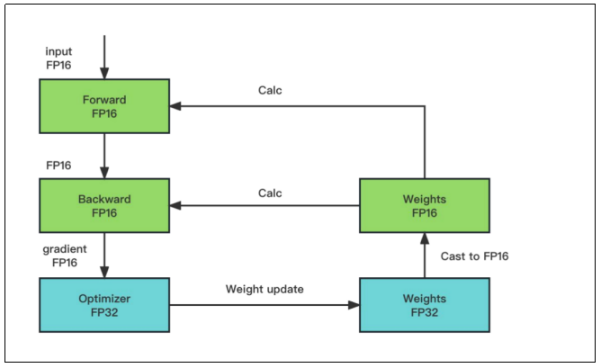

   不考虑隐藏层输出，假设权重参数量为 $\phi$

   占用资源的数据有四个部分：

   - FP32权重主副本

     这部分占用 $4\Phi$ 个字节。

   - FP16权重副本

     这部分占用 $2\Phi$ 个字节。

   - FP16梯度

     这部分占用 $2\Phi$ 个字节。

   - FP32优化器

     现代大模型通常用AdamW优化器，需要存储一阶矩和二阶矩。

     这部分占用 $4\Phi + 4\Phi = 8\Phi$ 个字节。

     综上，除隐藏层外占用的总显存为 $16\Phi$ 个字节。

2. 全部使用FP32

   此时占用资源的数据有个部分

   - FP32权重

     这部分占用 $4\Phi$ 个字节。

   - FP32梯度

     这部分占用 $4\Phi$ 个字节。

   - FP32优化器

     这部分占用 $8\Phi$ 个字节。

   综上，除隐藏层外占用的总显存为个字节。

3. 分析

   根据上述分析可以发现，无论采用混合精度训练还是全用FP32数据类型的权重进行训练，除隐藏层外占用的总显存均为 $16\Phi$ 个字节。

   那么，混合精度的意义是什么？主要体现在两方面

   - 加速训练

     如果训练受限于计算效率，FP16计算效率更高，加速训练。

     如果训练受限于带宽，FP16节省一半带宽，也会提升训练速度。

   - 节约显存

     现代LLM通常都会采用混合精度，除隐藏层的部分，混合精度训练没有节约显存。

     隐藏层的元素数量远大于权重数量，用FP32和FP16所占用的显存以及计算资源差别很大。混合精度训练的隐藏层全都是用FP16存储的，可以节约大量的显存。

#### 2.5.3 隐藏层显存计算

RMSNorm 的过程会缓存形状为 $batch\_size \times seq\_len \times 1$ 的均方根，和输入矩阵（形状为 $batch\_size \times seq\_len \times d_{model}$）相比，资源占用可以忽略，因此，在经过 RMSNorm 时不会给均方根矩阵。此外，忽略最终隐藏层之后的 softmax 计算。

以 Qwen3-0.6B 为例，其前向传播过程如下图所示。

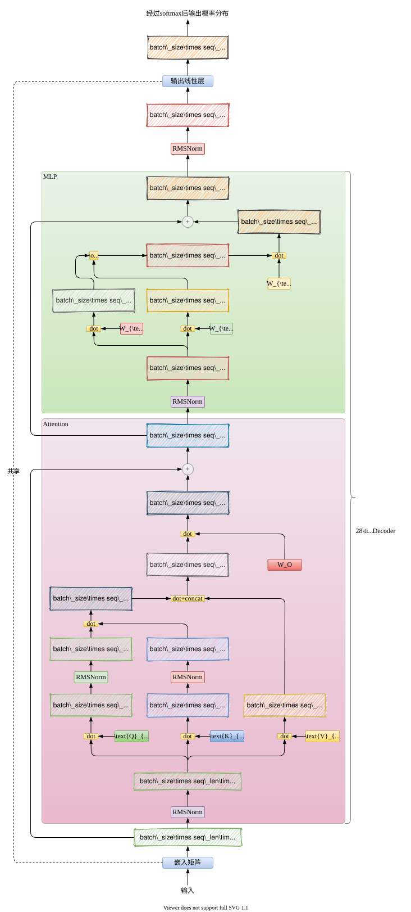

上图中毛玻璃效果的矩形都表示隐藏层（神经网络每一层的输入或输出）。统计上图中所有隐藏层矩阵的元素数量，如下：

1. 单层解码器汇总
   $$
   24 \times batch\_size \times seq\_len \times d_{model} + batch\_size \times seq\_len \times seq\_len
   $$

2. 汇总

   Qwen3-0.6B 的解码器共有 28 层，因此，计算过程中总的隐藏层元素数量为

   $$
   \begin{aligned}
   & 2 \times \text{batch\_size} \times \text{seq\_len} \times d_{\text{model}} + \text{batch\_size} \times \text{seq\_len} \times d_{vocab} + 28 \\
   & \times (24 \times \text{batch\_size} \times \text{seq\_len} \times d_{\text{model}} + \text{batch\_size} \times \text{seq\_len} \times \text{seq\_len})
   \end{aligned}
   $$
   Qwen3-0.6B 支持的上下文长度为 32K，而 $d_{model}$ 为 1024，显然，隐藏层元素数量远远大于权重数量，影响隐藏层显存占用的因素主要是 **batch_size** 和 **seq_len**。

#### 2.5.4 训练所需总显存

不考虑其他优化手段，训练所需总显存=16φ+激活值+显存碎片+预留

### 2.6 并行训练技术

#### 2.6.1 理论方法

1. 数据并行

   数据并行（Data Parallelism，DP）是最常见的并行形式，因其实现相对简单。在数据并行训练中，数据集被划分为多个分片，每个分片分配给一个设备（通常是GPU）。这相当于沿批次（Batch）维度对训练过程进行并行化。每个设备持有完整的模型副本，并在其分配的数据分片上独立进行训练。在反向传播之后，所有设备的模型梯度会被聚合（通常通过 AllReduce 操作），以确保不同设备上的模型参数保持同步。PyTorch DDP（Distributed Data Parallel）是其典型实现。

   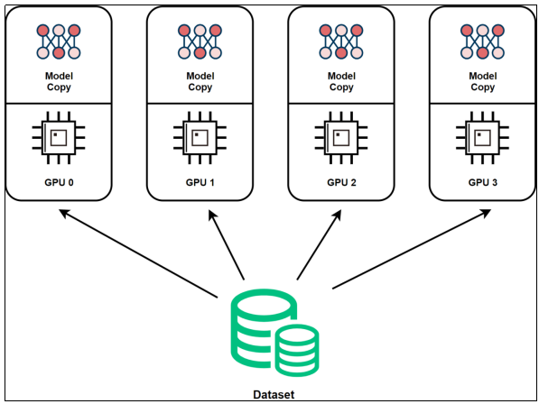

2. 模型并行

   数据并行的显著特点是每个 GPU 都存储整个模型的权重副本，这带来了存储冗余。另一种并行模式是模型并行（Model Parallelism, MP），它将模型本身分割并分布在多个设备上。

   模型并行通常分为两种类型：

   张量并行（Tensor Parallelism, TP）：在一个操作内部进行并行计算（例如矩阵乘法）。

   流水线并行（Pipeline Parallelism, PP）：在模型的不同层之间进行并行计算。

   因此，张量并行可视为层内并行，而流水线并行可视为层间并行。

   - 流水线并行

     流水线并行的核心思想是，模型按层分割成若干块（stages），每块都交给一个设备。

     在前向传播过程中，每个设备将中间的激活值（activations）传递给下一个阶段。

     在反向传播过程中，每个设备将输入张量的梯度传回给前一个流水线阶段的设备。

     这种方式允许多个设备同时进行计算，从而提升训练吞吐量。

     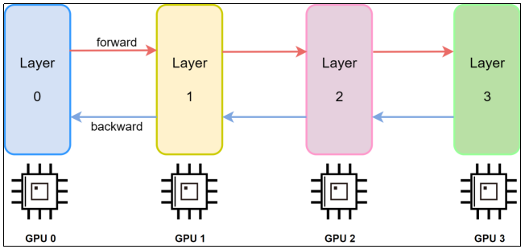

     流水线并行训练的一个明显缺点是训练设备容易出现空闲状态（因为后一个阶段需要等待前一个阶段执行完毕），导致计算资源的浪费，加速效率没有数据并行高。

     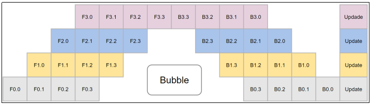

   - 张量并行

     张量并行（Tensor Parallelism）训练是将一个张量沿特定维度分成 $N$ 块，每个设备只持有整个张量的 $\frac{1}{N}$，同时不影响计算图的正确性。这需要额外的通信来确保结果的正确性。

     以矩阵乘法 $C = AB$ 为例。我们可以将 $B$ 沿着列分割为 $n$ 块：$[B_0, B_1, B_2, \dots, B_n]$，每个设备持有一块。然后 $A$ 与每个设备本地持有的 $B$ 块相乘，如设备 $(rank = 0)$ 计算 $AB_0$。

     此时，每个设备持有结果矩阵 $C$ 的一部分。为了得到完整且正确的结果 $C$，需要将分布在所有设备上的计算结果收集（AllGather）并沿分割维度（列）拼接起来。最终的结果矩阵为：$[AB_0, AB_1, AB_2, \dots, AB_n]$。

     通过这种方式，张量得以分布在不同设备上，同时维持了计算的正确性。

     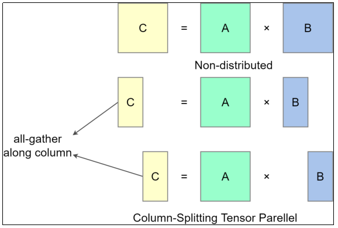

   - 多维混合并行

     多维混合并行是指将**数据并行、张量并行和流水线并行**等多种并行技术结合起来进行分布式训练。在训练超大规模模型（如预训练和全参数微调）时，通常需要采用这种混合并行策略。

     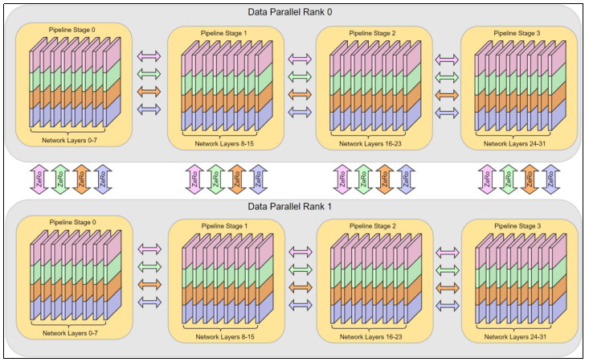

     通常，在进行超大规模模型的预训练和全参数微调时，都需要用到多维混合并行。

     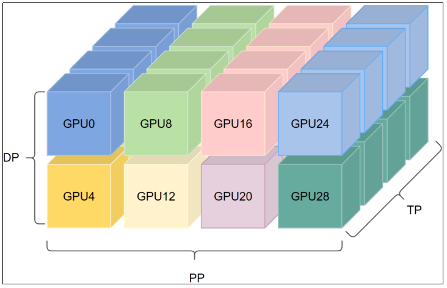

     为了优化通信效率（充分利用带宽），通常将通信密集度最高的张量并行限制在单个服务器（节点）内的多个 GPU 之间（因为节点内通信带宽高、延迟低）。而通信量相对较小的数据并行和流水线并行，则用于跨服务器（节点间）的并行化。

     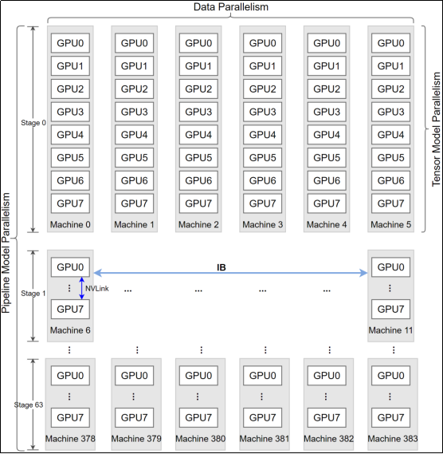

   - 异构系统并行

     上述方法通常需要大量GPU来训练大型模型。然而，常被忽视的一点是：相比GPU，CPU通常拥有大得多的内存（典型服务器上可达数百GB甚至TB级，而单张GPU卡通常只有48GB或80GB）。这促使研究者探索利用CPU内存甚至NVMe磁盘进行分布式训练。核心思路是在GPU不活跃处理某些张量时，将其卸载（offload）到CPU内存或NVMe磁盘存储。通过这种异构系统架构，有可能在单台机器上容纳并训练巨大的模型。

     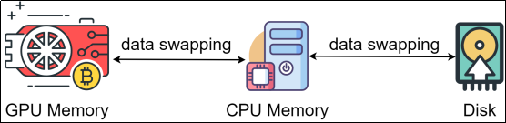

   - 自动并行

     实现前述的数据并行、张量并行、流水线并行等混合并行策略，需要将模型切分到多张加速卡上。如果完全依赖开发者手动实现，难度极高，需综合考虑性能、内存占用、通信开销和训练效果等因素。自动并行技术应运而生，其目标是将模型（按算子或按层）自动切分到不同的加速卡上，从而大幅降低开发者的使用门槛。

     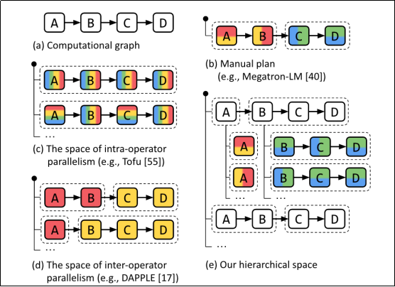

   - MOE并行/专家并行

     模型规模的扩展通常伴随训练成本的显著增加，计算资源限制成为大规模密集模型训练的瓶颈。为突破此瓶颈，研究者提出了基于稀疏 MoE (Mixture of Experts) 层的模型架构。其核心思想是将大模型拆分成多个较小的子模型（称为“专家”, experts），并在每轮迭代中，根据输入样本动态激活（activate）一部分专家进行计算，从而节省计算资源。模型通过可训练的“门控”（gate）机制决定样本应路由到哪些专家，该机制确保计算的稀疏性。

     采用MoE结构，可以在计算成本仅呈次线性增长的同时训练超大规模模型，为固定计算资源预算带来显著增益。MoE并行本质上也是一种模型并行策略。下图展示了一个包含六个专家的模型在两路专家并行下的训练：专家1-3放置在第一个计算单元上，专家4-6放置在第二个计算单元上。

     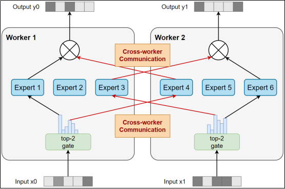

#### 2.6.2 框架实现

1. Deepspeed

   DeepSpeed是一个由微软开发的**开源深度学习优化库**，旨在**提高大规模模型训练的效率和可扩展性**。

   它通过**多种技术手段来加速训练**，包括模型并行化、梯度累积、动态精度缩放、本地模式混合精度等。

   DeepSpeed还提供了一些**辅助工具**，如分布式训练管理、内存优化和模型压缩等，以帮助开发者更好地管理和优化大规模深度学习训练任务。

   Deepspeed**基于pytorch构建**，只需要简单修改即可迁移。

   目前，DeepSpeed已经在许多大规模深度学习项目中得到了应用，包括语言模型、图像分类、目标检测等等。

   - Apis：提供易用的api接口，训练模型、推理模型只需要简单调用几个接口即可。其中最重要的是initialize接口，用来初始化引擎，参数中配置训练参数及优化技术等。配置参数一般保存在config.json文件中。
   - runtime：运行时组件，是deepspeed管理、执行和性能优化的核心组件。如部署训练任务到分布式设备、数据分区、模型分区、系统优化、微调、故障检测、checkpoints保存和加载等。该组件使用python语言实现。
   - ops：用c++和cuda实现底层内核，优化计算和通信，例如ultrafast transformer kernels, fuse LAN kernels, customary deals等。

2. ZeRO

   ZeRO：Zero Redundancy Optimizer，零冗余优化器。

   ZeRO 用于**优化内存，极大地提高训练速度，同时增加可有效训练的模型大小。**

   ZeRO **消除了数据和模型并行训练中的内存冗余，同时保留了低通信量和高计算粒度，使我们能够根据设备数量按比例缩放模型大小，并保持持续的高效率。**

   通过对内存需求和通信量的分析表明：使用现今的硬件，ZeRO 有潜力扩展到超过 1 万亿（1000B）参数。

   1. ZeRO-1

      只对优化器存储进行切分，也就是 $12\phi$ 的 fp32 数据，有多少 GPU 就切分多少份，即 $12\phi / \text{NumGPU}$。

   2. ZeRO-2

      除了对优化器存储进行切分，还对梯度存储数据进行切分，即 $2\phi / \text{NumGPU}$。

   3. ZeRO-3

      除了对优化器存储进行切分，还对梯度和参数 $W$ 存储数据进行切分，又多了一个 $2\phi / \text{NumGPU}$。

   ZeRO-1 和 ZeRO-2 没有带来额外通讯，而 ZeRO-3 是有额外的通讯的，增加了 ZeRO-3 之后，整个通讯量增加 1.5 倍，即增加 50%，只要通讯时间小于计算时间就能够接受。

   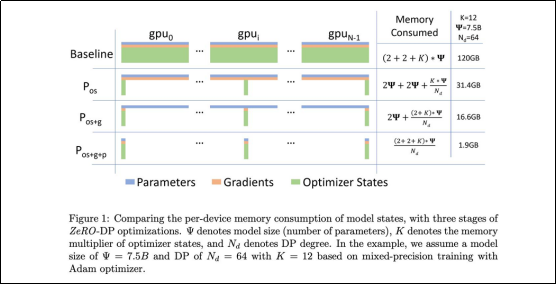

   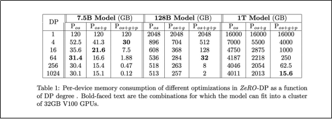

   从左到右，越来越慢：

   Stage 0 (DDP) > Stage 1 > Stage 2 > Stage 2 + offload > Stage 3 > Stage 3 + offloads

   从左到右，所需GPU显存越来越少：

   Stage 0 (DDP) < Stage 1 < Stage 2 < Stage 2 + offload < Stage 3 < Stage 3 + offloads

   在实际训练阶段，应采用从左到右的方式逐一尝试，找到在当前硬件配置下，能够运行的最优方案。

3. 训练配置

   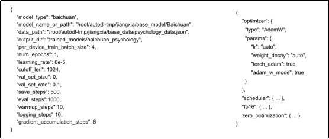

4. 大模型生成参数配置

   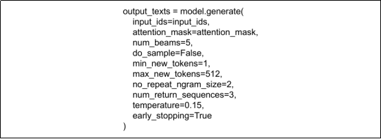

### 2.7 参数高效微调技术（PEFT）

#### 2.7.1 什么是PEFT

PEFT（Parameter Efficient Fine-Tuning，参数高效微调）是指一类用于微调大型预训练语言模型（Pretrained Language Models，PLMs）的技术，通常仅更新或引入少量参数（通常占总参数的1%-10%），同时保持预训练模型的主体参数冻结（不变）。目标是以远少于全参数微调的资源开销，获得接近、甚至等同或超过后者的性能。

#### 2.7.2 PEFT技术分类

PEFT大致分为五类

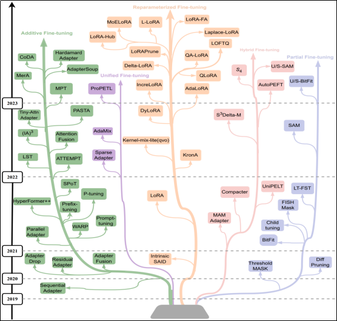

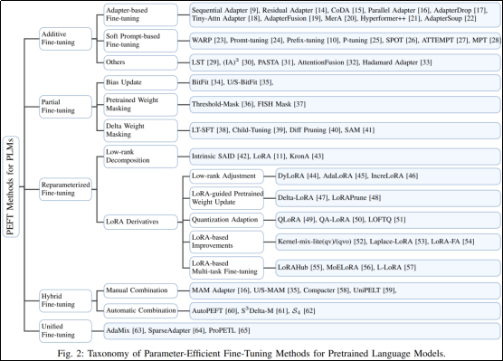

1. Additive Fine-Tuning

   附加式微调方法，引入额外的可训练参数（如适配器Adapter、连续的伪提示词向量），原先模型的所有参数全部冻结。

   附加式微调方法可以分为三类：

   - 基于适配器（Adapter-based）的微调
   - 基于软提示（Soft Prompt-based）的微调
   - 其他

2. Partial Fine-Tuning

   部分微调方法，筛选预训练模型参数中对下游任务至关重要的子集，冻结其余（认为不重要）的权重，从而减少微调的参数量。

   部分微调方法可以分为三类：

   - 偏置更新

   - 预训练掩码方法

     基于某种重要性评判标准（如梯度、权重幅值等），对预训练权重进行稀疏化筛选，生成二进制掩码，通过掩码动态冻结预训练模型中“不重要”的参数，仅微调被掩码选中的参数。

   - δ权重掩码（Delta Weight Masking）

     不直接修改预训练权重，而是学习一组增量权重（Delta Weight），通过掩码控制增量的稀疏性。

3. Reparameterized Fine-Tuning

   重参数化微调方法，通过数学变换或结构转换，将模型的参数表示转换为另一种功能等价但参数量大大减少的形式，冻结模型权重，仅微调参数量更少的等价形式，如LoRA（Low Rank，低秩矩阵分解）。

   分为两类：

   - LoRA分解
   - LoRA派生

4. Hybrid Fine-Tuning

   混合微调方法，结合多种微调策略（如部分微调+附加式微调），灵活平衡计算效率和模型性能。

   分为两类：

   - 人为组合
   - 自动组合

5. Unified Fine-Tuning

   统一微调提出了一个用于微调的整合框架，将多种微调方法整合为统一架构（同一套接口规范，如统一的预处理格式、导出格式和训练方法）。用户可以在不同的任务上通过统一的接口调用不同的微调方法。

   不同于混合微调，统一微调只采用**单一的微调方法**，而不是多种方法的混合。

#### 2.7.3 LoRA（Reparameterized）

1. 背景

   [Li等人（2018a）](https://arxiv.org/abs/1804.08838)和[Aghajanyan等人（2020）](https://arxiv.org/abs/2012.13255)的研究表明，经过训练（或微调）的过参数化（权重规模远大于训练数据规模）模型，其有效参数空间（即真正影响模型性能的关键变化）实际上位于一个低维子空间（低内在维度，即低秩）中。受此启发，LoRA的研究团队认为，可以用低秩矩阵来高效地近似或“等效代换”全参数微调过程中整个模型的参数变化。

2. 定义

   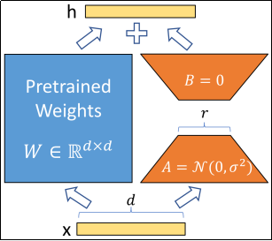

   LoRA（Low-Rank Adaptation）是一种高效参数微调技术，基于对微调过程中，权重变化矩阵 $\Delta W$ 低内在维度的洞察。通过对 $\Delta W$ 的低秩分解，在大幅减少训练参数、显著降低显存开销的同时，获得与全参数微调相当的性能。当预训练模型为 GPT-3 175B 时，LoRA 微调可以 0.01% 的参数量，1/3 的内存占用，获得了与全参数微调相当的性能。

3. 方法

   1. 用 $W_0$ 表示预训练模型中的权重矩阵，全参数微调后获得的权重矩阵 $W$ 可表示为

      $$
      W = W_0 + \Delta W
      $$
      LoRA 微调利用了 $\Delta W$ 的低秩特性，将其表示为两个低秩矩阵的乘积

      $$
      \Delta W = BA, \quad \Delta W \in \mathbb{R}^{d \times k}, \quad B \in \mathbb{R}^{d \times r}, \quad A \in \mathbb{R}^{r \times k}
      $$
      其中 $d$ 和 $k$ 分别为输出和输入特征维度。$r$ 是 LoRA 微调的秩，通常 $r \ll \min(d, k)$。

      $$
      W_0 + \Delta W = W_0 + BA
      $$

   2. 训练过程中只更新 $A$ 和 $B$，冻结其它权重。

   3. 需要更新的参数量只有 $d \times r + r \times k$，通常 $r \ll \min(d, k)$，对于 $d_{model} = 12,288$ 的 GPT-3 175B，$r$ 取极小值如 1 或 2 时，更新的参数量低至全量微调的万分之一。

   4. 原文只对注意力机制的四个权重矩阵 $W_q, W_k, W_v, W_o$ 进行低秩代换，即每个 Transformer 模块至多只包含四组作用于注意力机制的 $A$ 和 $B$。除了引入的 $A$ 和 $B$，其它权重都是冻结的。

      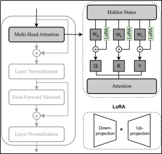

4. 数学表示

   1. 前向传播的输入为 $x$，激活值为 $h$，则

      $$
      h = W_0 x + \Delta W x = W_0 x + B A x
      $$
      对 $A$ 采用随机正态分布初始化，$A \sim N(0, \sigma^2)$，$B$ 初始化为零。

5. 代码实现与论文的差别

   代码实现引入了一个额外的参数 $s$，称为缩放系数，决定低秩矩阵对激活值的影响程度，修正后的表示为  
   $$
   W_0 + \Delta W = W_0 + s \cdot BA
   $$

   $$
   s = \alpha / r
   $$

   $\alpha$ 是用户可配置的超参数（通常记为 `lora_alpha`），用于控制低秩更新的强度。

6. 推理阶段的处理

   1. 合并 W 和 AB

      为了追求低延迟，训练结束后可以将 $W$ 和 $AB$ 合并为新的 $W$，这样推理时不会有任何额外延迟。

   2. 不合并

      也可以分别存储 $W$ 和 $AB$，只是在推理时需要分别计算结果求和。这样会引入少量延迟，但可以替换 $AB$，从而在不同任务间动态切换。

7. 优势与局限

   1. 优势

      ① 对于使用 Adam/AdamW 优化器的大型 Transformer 模型，由于无需为冻结参数存储优化器状态，当 $r \ll d_{model}$ 时显存使用量减少高达 2/3。在 GPT-3 175B 模型上，显存开销从1.2TB 缩减至 350GB。当 $r = 4$，且只对 Q 和 V 投影矩阵进行低秩分解并冻结其它权重时，模型检查点大小（反映更新的参数量）约为原先的万分之一（从 350GB 缩减至 35MB）。

      ② 部署时只需要存储一份预训练权重，可通过仅切换 LoRA 权重以极低成本实现任务切换，可以动态加载/卸载大量定制化模型。对 GPT-3 175B，对 100 个任务进行全参数微调后，部署需要 $350GB \times 100 = 35TB$ 显存，而进行 LoRA 微调则只需要 $350GB + 35MB \times 100 = 354GB$。

      ③ 无需为绝大多数参数计算梯度，因此与全参数微调相比训练更快，在 GPT-3 175B 上观察到 25% 的训练加速。

   2. 局限

      如果将 A、B 与权重矩阵 W 合并以消除额外推理延迟，则无法在单次前向传播中批量处理针对不同任务的输入（A 和 B 不同）。在延迟不敏感的场景，可以不合并权重，动态地为同一批次中的样本选择合适的 LoRA 模块。

8. 试验评估

   下表展示了不同的方法对 RoBERTa$_{\text{base}}$、RoBERTa$_{\text{large}}$ 和 DeBERTa$_{\text{XXL}}$ 模型进行微调后，在 GLUE 基准测试上的得分。所有测试得分都是越高越好。

   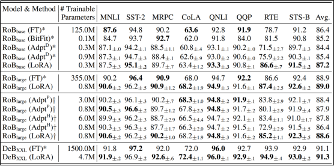

   1. FT 表示全参数微调。

   2. BitFit 表示偏置项微调。

   3. Adpt$^H$ 是原版的 Adapter 微调。

   4. Adpt$^P$ 也叫 Adpt$^L$，是原版 Adapter 的改进，只在 MLP 模块和层归一化之后添加 Adapter。

   5. Adpt$^D$ 是另一种名为 AdapterDrop 的高效微调技术。

9. 应将LoRA适配应用于哪些权重矩阵

   上文提到，研究团队只对自注意力模块应用 LoRA 适配，其中包含四个权重矩阵 
   $W_q, W_k, W_v, W_o$

   下表展示了当微调参数预算固定为 18M（参数的个数，如果以 FP16 存储则占用空间约为 35MB）时，在 GPT-3 175B 预训练模型上，对不同的注意力权重矩阵进行 LoRA 适配后，在 WikiSQL 和 MultiNLI 任务上测试的准确率。

   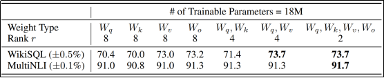

   1. 将所有参数预算都用于适配 $\Delta W_q$ 或 $\Delta W_k$ 会导致显著的性能损失。

   2. 同时对 $\Delta W_q$ 和 $\Delta W_v$ 进行适配在 WikiSQL 上可以获得最佳性能。

   3. 同时对所有矩阵进行适配可以在两个任务上都获得最佳性能。

   4. 这意味着，即便只用大小为 2 的秩，在所有矩阵上进行适配也可以从 $\Delta W$ 中获得足够多的信息。

   5. 当参数预算固定的情况下，用更小的秩适配更多的权重矩阵，比用更大的秩适配单个权重矩阵能获得更好的效果。

10. 最佳秩的确定

    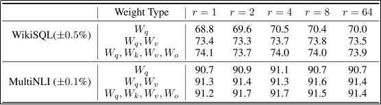

    同时适配 $W_q, W_v$ 时，只需要很小的秩（$r$）即可获得最佳性能，而仅适配 $W_q$ 则需要更大的秩。这证实了推论：$\Delta W$ 具有极小的“内在秩”。

11. 时间复杂度和空间复杂度的置换

    1. 空间复杂度

       LoRA 将 $\Delta Wx$ 替换为 $BAx$，参数量由 $d \times k$ 替换为 $d \times r + r \times k$，在 $r \ll \min(d, k)$ 时参数量显著减少。以 $r=2$ 为例，参数量变为 $2d+2k$，空间复杂度显著降低。

    2. 时间复杂度

       然而，假设 $x \in \mathbb{R}^{k \times n}$，其中 $n$ 为序列长度，则 $\Delta Wx$ 的时间复杂度为 $d \times k \times n$，而 $BAx$ 的时间复杂度为 $d \times r \times k + d \times k \times n = d \times k \times (r+n)$（顺序计算，不考虑矩阵乘法的结合律），时间复杂度增加 $d \times k \times r$。而因为 $r$ 是一个非常小的值，通常 $r \ll n$，因此额外的计算开销可以忽略不计。

    3. 总结

       LoRA 本质上是以时间换空间，以略大的算力开销为代价（可以忽略不计），显著降低了显存开销。目前大模型训练的瓶颈主要在于显存，因此，这样的置换是有意义的。此外，全参数微调会更新所有权重，而 LoRA 只会选择其中的一部分权重矩阵进行低秩代换，进一步降低了显存开销，同时也减少了额外的计算开销。是一种经济高效的微调方式。

#### 2.7.4 QLora

1. 定义

   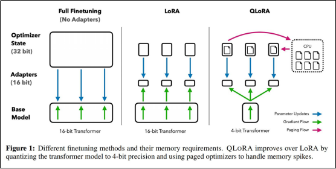

   通过4-bit量化的BaseModel在保持高性能的同时减少内存使用，使得模型微调的门槛大大降低。

   * 4bit NormalFloat(NF4)：提出了一种对于以零为中心的正态分布数据在信息论上最优的数据类型，该数据类型对正态分布数据产生比4bitint和4bitfloat更好的效果;
   * Double Quantization：对量化常数进行量化，减少存储空间;
   * 分页优化器：在GPU偶尔内存不足的情况下，自动在CPU和GPU之间进行页面到页面的传输，以避免GPU OOM。

   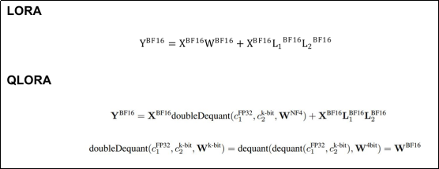

2. NF4

   如果是平均量化

   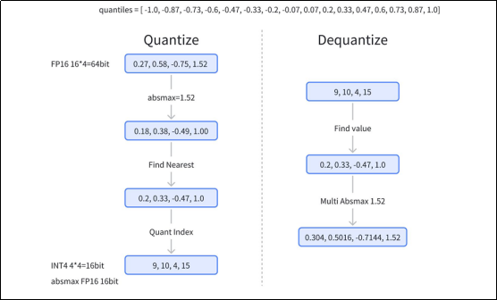

   SimpleQuant-Int4如下分布，Y轴表示权重落入特定量化区间的比例：

   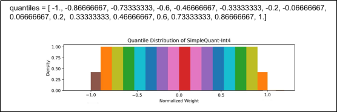

   NF4 是一种数据类型，它在量化过程中保留了零点，并使用所有 $2^k$ 位来表示 $k$ 位数据类型。这种数据类型通过估计两个范围的分位数 $q_i$ 来创建一个非对称的数据类型，这两个范围分别是负数部分 $[-1,0]$ 的 $2^{k-1}$ 和正数部分 $[0,1]$ 的 $2^{k-1} + 1$。然后，它统一了这两组分位数 $q_i$，并从两组中都出现的两个零中移除一个。

   这种结果数据类型在每个量化 bin 中都有相等的期望值数量，因此被称为 k-bit NormalFloat (NFk)，这种数据类型**对于以零为中心的正态分布数据在信息论上是最优的**。

   NF4 分位数计算公式：

   $$
   q_i = \frac{1}{2} \times \left( Q \times \left( \frac{i}{2^k + i} \right) + Q \times \left( \frac{i + 1}{2^k + i} \right) \right)
   $$
   标准正态分布量化函数把 $[-1,0]$ 分成 7 份，然后生成 $[-1,\dots,0]$ 共 8 个分位数，把 $[0,1]$ 分成 8 份，然后生成 $[0,\dots,1]$ 共 9 个分位数，两个合起来去掉一个 0 就生成全部的 16 个分位数了。

   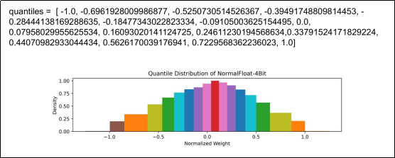

3. Double Quantization

   在量化的过程中，为了降低异常值的影响，我们采用分块的方式进行进行量化。

   具体来说就是每64个参数共享一个量化常数(Absmax，32bit)，这样的话相当于每一个参数的量化额外开销为32bit/64=0.5bit。

   这个总体来说也是比较大的一个开销，所以为了进一步优化这个量化开销，我们对其进行二次量化DoubleQuantization，对量化常数进行进一步的量化。我们采用256的块大小对量化常数进行FP8量化，这样的话，我们可以把每个参数的量化额外开销降低到：`8/64 + 32/(64 \* 256) = 0.127 bit`

4. 分页优化器

   在GPU偶尔内存不足的情况下，自动在CPU和GPU之间进行页面到页面的传输，以避免GPU OOM。

   这个特性就像CPU RAM和磁盘之间的常规内存分页一样工作。我们使用这个特性为优化器状态分配分页内存，当GPU内存不足时，这些优化器状态会自动被驱逐到CPU RAM，当在优化器更新步骤中需要内存时，它们会被分页回GPU内存。

#### 2.7.5 其他（了解）

##### 2.7.5.1 基准数据集

1. GLUE

   GLUE（General Language Understanding Evaluation）是一个用于评估自然语言处理模型通用语言理解能力的基准测试（Benchmark）集。它由纽约大学、华盛顿大学等机构的研究者于2018年提出，旨在推动NLP模型在多种语言任务上的全面评估。

   1. GLUE包含9种不同的自然语言理解任务，如下表所示

      | 任务类型       | 具体任务 | 描述                                          | 数据规模（训练集） |
      | -------------- | -------- | --------------------------------------------- | ------------------ |
      | 文本相似度     | QQP      | 判断两个问题是否语义等价                      | ~364K              |
      | 文本相似度     | MRPC     | 判断两个句子是否语义等价                      | ~3.7K              |
      | 文本蕴含       | MNLI     | 判断句子A与句子B的关系（蕴含/矛盾/中立）      | ~393K              |
      | 文本蕴含       | RTE      | 判断句子A是否蕴含句子B                        | ~2.5K              |
      | 情感分析       | SST-2    | 二分类情感判断（正面/负面）                   | ~67K               |
      | 句子可接受性   | CoLA     | 判断句子是否符合语法和语义（可接受性）        | ~8.5K              |
      | 问答对匹配     | QNLI     | 判断句子是否包含给定问题的答案                | ~108K              |
      | 释义相似度评分 | STS-B    | 对两个句子的语义相似度进行1-5评分（回归任务） | ~7K                |
      | 指代消解       | WNLI     | 判断句子在替换代词后是否蕴含原句              | ~634               |

   2. 统一评估标准

      ① 每个任务使用其特定的评估指标（如准确率、F1值、马修斯相关系数MCC、皮尔逊相关系数）。

      ② 所有任务的得分通过加权平均转化为一个统一的“GLUE分数”，便于横向比较模型性能。不同任务的权重根据其数据集大小等因素确定。

2. SuperGLUE

   SuperGLUE是GLUE的升级版基准测试集，由包括纽约大学、华盛顿大学、DeepMind、Facebook AI Research、谷歌等机构的研究者于2019年提出。它旨在包含更困难、更贴近人类水平理解能力的任务。

   1. SuperGLUE包含8个任务

      设计上比GLUE任务更具挑战性，需要更复杂的推理、知识运用或更精细的语言理解能力。特别强调需要多步推理和世界知识的任务。任务设计更注重避免浅层线索（shortcuts），迫使模型进行更深入的理解。

      | 任务类型             | 具体任务 | 描述                                                         | 数据规模（训练集） |
      | -------------------- | -------- | ------------------------------------------------------------ | ------------------ |
      | 布尔问答             | BoolQ    | 回答关于短文的是/否问题                                      | ~9.4K              |
      | 文本蕴含             | CB       | 判断给定前提是否蕴含/矛盾假设（含置信度）                    | ~250               |
      | 共指消解             | COPA     | 选择给定前提的合理原因或结果                                 | ~400               |
      | 多句推理             | MultiRC  | 回答关于短文的问题，每个问题对应多个正确/错误选项，需独立判断 | ~27K (questions)   |
      | 阅读理解（填空）     | ReCoRD   | 从候选列表中选出最适合填入文章空缺处的实体（需阅读理解与实体链接） | ~101K              |
      | 文本蕴含             | RTE      | 判断句子A是否蕴含句子B（源自GLUE，但数据源不同且更具挑战性） | ~2.5K              |
      | 句子选择（蕴含推理） | WiC      | 判断句子中某个多义词在两个不同语境下是否具有相同的含义       | ~6K                |
      | 指代消解与问答       | WSC      | 判断句子中的代词是否指代某个特定名词短语（需常识推理）       | ~554               |

   2. 统一且更严格的评估标准

      ① 每个任务使用其特定的、精心选择的评估指标（如准确率、F1值、EM）。

      ② 所有任务的得分通过加权平均转化为一个统一的“SuperGLUE分数”，便于横向比较模型性能。

      ③ 关键提升：引入了“人类表现基线”。SuperGLUE不仅报告模型分数，还报告了非专家人类（通过众包平台）在该基准上的表现，作为模型性能的终极参照点，明确标定了模型与人类理解能力的差距。这使得评估更具意义。

      ④ 权重计算方式经过优化，更均衡地反映不同任务的难度和重要性。

3. GLUE和SuperGLUE的对比

   1. 任务类型对比

      | 任务类型         | GLUE 覆盖    | SuperGLUE 覆盖 | 差异说明                                                     |
      | ---------------- | ------------ | -------------- | ------------------------------------------------------------ |
      | 文本相似度       | ✅(QQP, MRPC) | ❌              | SuperGLUE 移除基础相似度任务，聚焦更高阶理解                 |
      | 文本蕴含         | ✅(MNLI, RTE) | ✅(CB)          | SuperGLUE 的 CB 需判断“承诺性”蕴含（含置信度），推理更复杂   |
      | 情感分析         | ✅(SST-2)     | ❌              | 未保留基础分类任务                                           |
      | 句子可接受性     | ✅(CoLA)      | ❌              | 未保留语法合理性任务                                         |
      | 问答匹配         | ✅(QNLI)      | ✅(MultiRC)     | MultiRC 升级为多答案判断，需从长文中定位分散依据（更接近开放域问题） |
      | 释义评分（回归） | ✅(STS-B)     | ❌              | 移除连续评分任务                                             |
      | 布尔问答         | ❌            | ✅(BoolQ)       | SuperGLUE 新增需结合常识的问题                               |
      | 因果推理         | ❌            | ✅(COPA)        | SuperGLUE 新增因果归因任务（选择合理原因/结果）              |
      | 指代消解         | 🔺(WNLI)      | ✅(WSC)         | WNLI 名义上涉及指代消解，但因任务设计被转化为文本蕴含问题，且存在数据集缺陷，不能视为真正的指代消解任务。WSC 直接测试指代关系，且依赖常识推理，更贴合人类语言理解。 |
      | 词语消歧         | ❌            | ✅(WiC)         | SuperGLUE 新增词义消歧，测试多义词在不同语境中的含义一致性   |
      | 完形填空阅读     | ❌            | ✅(ReCoRD)      | SuperGLUE 新增链接实体知识的填空式阅读理解（非指代消解）     |

   2. 总结

      | 维度     | GLUE                    | SuperGLUE                       |
      | -------- | ----------------------- | ------------------------------- |
      | 核心目标 | 基础语言理解能力评估    | 人类级复杂推理能力评估          |
      | 任务选择 | 保留传统分类/相似度任务 | 移除基础任务，专注高阶推理      |
      | 数据特点 | 部分任务数据规模较大    | 包含极小样本任务（如CB仅250条） |
      | 评估参照 | 无明确人类基线          | 引入众包人类表现作为终极基线    |

##### 2.7.5.2 BitFit（Partial）

1. 定义

   BitFit是偏置项微调技术。其原理是冻结Transformer模型的大部分权重，只更新偏置项和任务特定的分类层。

2. 三大特征

   1. 匹配全参数微调模型的结果

      作者证明，通过仅微调偏置项，冻结其它参数，所实现的迁移学习性能可与全网络微调相媲美（有时甚至更优）。

      BERT$_{\text{BASE}}$、BERT$_{\text{LARGE}}$ 和 RoBERTa$_{\text{BASE}}$ 通过全参数微调和 BitFit 微调后，在不同任务上的得分如下所示：

      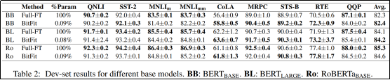

      此外，仅微调偏置参数的子集（即与注意力层和 MLP 层第二线性层相关的偏置项），仍能达到与全模型微调相当的准确率。

      BERT$_{\text{BASE}}$ 通过偏置项的子集微调后，在不同任务上的得分如下所示：

      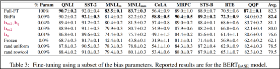

   2. 支持任务流式到达，无需同时访问所有数据集

   3. 仅需微调模型参数的一小部分

   在 BERT$_{\text{BASE}}$ 和 BERT$_{\text{LARGE}}$ 模型中，偏置项分别占模型全部参数量的 0.09% 和 0.08%。

##### 2.7.5.3 Prefix-Tuning（Additive）

研究人员发现，对于Transformer架构的预训练模型，在输入序列之前添加任务特定的自然语言Prompt（提示词）可以大幅提升任务表现。然而，自然语言提示词往往不能取得非常好的效果。

1. 定义

   受到提示词的启发，斯坦福大学的研究人员通过在**神经网络各层的激活值之前**添加连续的前缀向量，并冻结模型权重，在训练时，只更新这部分前缀，得到了接近全参数微调的效果，这就是前缀微调（Prefix-Tuning）。

   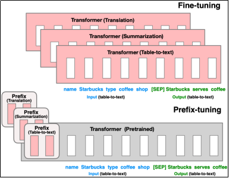

2. 方法

   我们以《表格到文本（Table To Text）》任务为例。假设输入输出如下（x为输入，y为输出），其中y已经包含了分隔符[SEP]。
   $$
   x = \text{Harry Potter, Education, Hogwarts}
   $$

   $$
   y = [\text{SEP}] \text{Harry Potter is graduated from Hogwarts.}
   $$

   

   1. 自回归语言模型

      自回归语言模型即生成式语言模型，如 GPT-2，这类模型的目标是预测下一个 token。

      对于这类模型，前缀微调的方法是将 $x$ 和 $y$ 拼接在一起，然后在序列之前添加连续可微的向量序列，如下：

      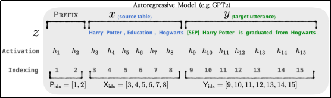

   2. 编码器-解码器架构

      对于这类模型，前缀微调的方法是在 $x$ 和 $y$ 之前分别添加一个前缀，然后各自输入给编码器和解码器。

      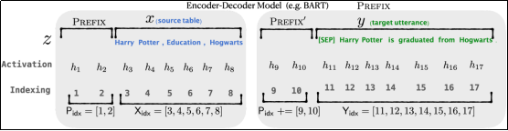

3. 数学表示

   作者给出了自回归模型的完整数学表示。

   1. $z$ 表示拼接后的完整序列，$z = [\text{PREFIX}; x; y]$

   2. $P_{idx}$ 表示前缀的索引序列

   3. $P_{idx}$ 表示索引序列的长度，即前缀序列的长度。

   4. $h_i$ 表示第 $i$ 个时间步的隐藏层输出，它是该时间步每一层输出的集合，$$h_i = [h_i^{(1)}; \dots; h_i^{(n)}], \quad h_i^{(j)} \text{ 表示时间步 } j \text{ 个 Transformer 层的激活值（输出）}。$$

   5. $P_\theta$ 表示形状为 $P_{idx} \times \dim(h_i)$ 的矩阵，是前缀向量的拼接。需要注意的是，这里的 $\dim(h_i)$ 是指 $\dim(h_i^{(j)})$，即 $d_{model}$。

   6. $h_i = \text{LM}_\phi(z_i, h_{<i})$ 表示自回归模型通过 $i$ 位置及之前的输入预测下一个 token。

   7. 最终，自回归模型前缀微调的数学表示（不包含嵌入层和用于计算）为
      $$h_i = 
      \begin{cases} 
      P_\theta[i; \cdot], & \text{if } i \in P_{idx}, \\ 
      \text{LM}_\phi(z_i, h_{<i}), & \text{otherwise}.
      \end{cases}$$

   8. 根据数学表示，我们可以得到一个重要的信息：**Prefix-Tuning 的前缀注入到每一个 Transformer 层，而不仅仅是嵌入层**。因为对于任意的 $h_i^{(j)}$，只要 $i \in P_{idx}$，它就是直接从前缀向量矩阵 $P_\theta$ 中获取的第 $i$ 个行向量，而不是通过 Transformer 层计算得到的激活值。**所有 Transformer 层的前缀部分都是由 $P_\theta$ 直接注入的**，如下图所示：

      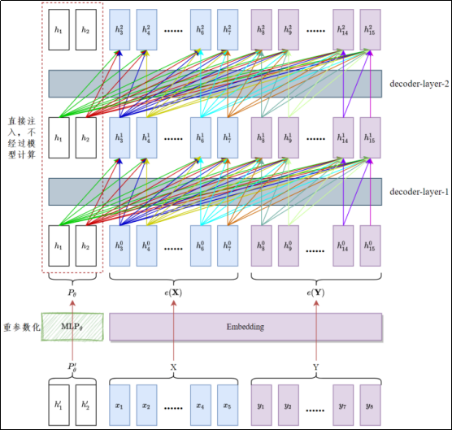

   9. 激活值 $h_i^{(j)}$ 是从 $j = 1$ 开始的，即从第一层 Transformer 层输出之后开始，但结合论文，第一层 Transformer 之前也应该注入前缀。

   10. 最后一层隐藏层输出经过最终线性层和 softmax 得到下一个 token 的概率分布，表示为 $p_\phi(z_{i+1} | h_{\leq i}) = \text{softmax}\left(W_\phi h_i^{(n)}\right)$

   11. 根据数学表示，我们认为前缀的**注入位置是嵌入层及每一层 Transformer 隐藏层之后**，而根据官方代码，前缀是直接作为 K-V 缓存，注入在每个 Transformer 层的 K-V 之前。理论和实现的差异主要是考虑到实现的难易程度和可复用性。

   如果完全按照理论实现，那么需要更改模型架构，**侵入性太强（需要更改模型源码，不能直接调用）复用性差（换模型就要重写代码），非常繁琐**。而官方实现直接用 K-V Cache，在不更改模型架构的前提下实现了 Prefix-Tuning，虽然在实现形式上不同，但数学本质是相同的。因为我们不会计算前缀部分对自身的注意力，所以 Q 没有必要包含这部分内容，只要在 K-V 之前添加前缀就可以了。

   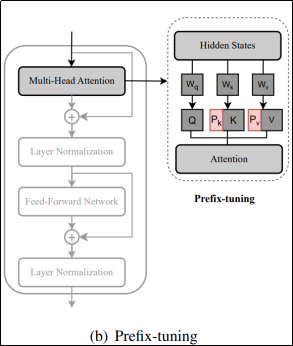

4. 评估

   将前缀微调应用于GPT-2进行表格到文本生成，并应用于BART进行摘要生成。

   试验表明，仅学习0.1%参数量的前缀微调在完整数据场景下可获得与全参数微调相当的性能。再低数据场景下表现优于微调，且具有更好的泛化能力。

   1. 表格到文本生成任务

      在E2E、WebNLP和DART三个数据集上对表格到文本生成任务的评测结果如下所示：

      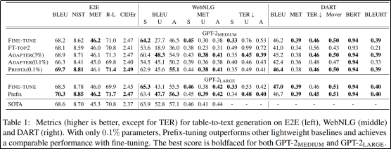

      前缀微调以 0.1% 的参数量，超过了其它高效微调方法，获得了和全参数微调相当的性能。测试的模型为 GPT-2$_{\text{MEDIUM}}$ 和 GPT-2$_{\text{LARGE}}$， **最佳得分用黑体标注。**

   2. 摘要任务

      

      上表是在XSUM数据集上摘要任务的测试结果。前缀微调后面的百分比表示前缀参数占模型总权重的比例。和全参数微调相比，前缀微调的性能略微下降。

   3. 推理任务

      

      上表是在XSUM数据集上推理任务的试验结果，前缀微调优于全参数微调。

   4. 少样本场景

      

      上表是表格到文本任务在不同训练数据规模下，前缀微调和全参数微调在测试集上的输出对比。

   5. 性能随训练数据量的变化对比

      

      上表是摘要任务在ROUGE-1和ROUGE-2指标下的得分随训练数据规模的变化情况，前缀微调全面优于全参数微调，且随训练数据集规模的增长，得分增大。

      

      上表是表格到文本任务在BLEU和ROUGE指标下的得分随训练数据规模的变化情况，前缀微调几乎在所有数据规模下均优于全参数微调，且随训练数据集规模的增长，得分增大。

5. 离散嵌入和连续向量

   token的嵌入是离散的，因为无论词表多大，都不可能覆盖完整的嵌入向量空间（穷尽所有元素所有取值的组合）。

   而前缀微调引入的前缀向量是连续的，因为它们并不对应特定的token，可以通过反向传播任意更改。

6. 完整数据场景和低数据场景

   1. 完整数据场景（Full Data Scenario）

      指任务有充足的、高质量的训练样本可用。通常是指该任务的标准训练数据集的大小。

      在这个场景下，全参数微调通常能取得很好的效果，因为它有足够的数据来调整模型的所有参数以适应特定任务。

   2. 低数据场景（Low-Data Scenario）

      指任务只有非常有限的标注训练样本可用。可能是只有几十个、几百个甚至更少的样本。

      因为预训练模型参数量巨大（数十亿），而可用的训练数据太少，全参数微调极其容易导致模型过拟合。模型会“死记硬背”有限的训练样本，而无法学到泛化能力，导致在验证集或测试集上表现很差。

      论文的核心贡献之一就是证明了**Prefix-Tuning在低数据场景下的显著优势**。由于它只优化非常少量的前缀参数，模型复杂度大大降低。这使得模型：

      ① 更不容易过拟合：需要学习的参数少，模型“容量”相对变小，难以记住有限的噪声数据。

      ② 能更好地泛化： 有限的数据能更有效地用于学习引导模型完成特定任务的关键提示（即前缀），而不是试图调整整个庞大的模型。

      ③ 鲁棒性更强： 对训练数据中的噪声或样本偏差不那么敏感。

7. $P_\theta$ 的重参数化

   研究团队发现直接更新完整的 $P_\theta$ 会导致训练不稳定（容易发散）并导致性能略微下降。

   因此，他们通过一个维度更低的矩阵 $P_\theta \in \mathbb{R}^{|P_{idx}| \times d'}$，其中 $d' \ll \dim(h_i)$，和一个大的前馈层神经网络 $\text{MLP}_\theta$，对 $P_\theta$ 进行了重参数化。数学表示为：  
   $$
   P_\theta[i,:] = \text{MLP}_\theta(P_\theta'[i,:])
   $$
   其中 $P_\theta'[i,:]$ 取 $P_\theta'$ 中的第 $i$ 个行向量，即索引为 $i$ 的前缀向量表示。

   重参数化本质上是将高维空间（$\dim(h_i)$）的前缀向量用低维（$d'$）和多层感知机表示，缓解了维度灾难与鞍点/局部极小值问题。

   因为高维空间中平坦的极小值盆地相对整个空间来说相当稀疏，优化器很容易陷入鞍点或局部极小值点，导致训练震荡或停滞。而重参数化将寻找高维空间的最优解问题转换为一系列低维子问题，大大提升了训练的稳定性。

##### 2.7.5.4 Prompt-Tuning（Additive）

##### 2.7.5.5 P-Tuning（Additive）

##### 2.7.5.6 P-Tuning v2（Additive）

##### 2.7.5.7 Adapter Tuning（Additive）

##### 2.7.5.8 AdapterFusion（Additive）

##### 2.7.5.9 MAM Adapter（Hybrid）

##### 2.7.5.10 总结
